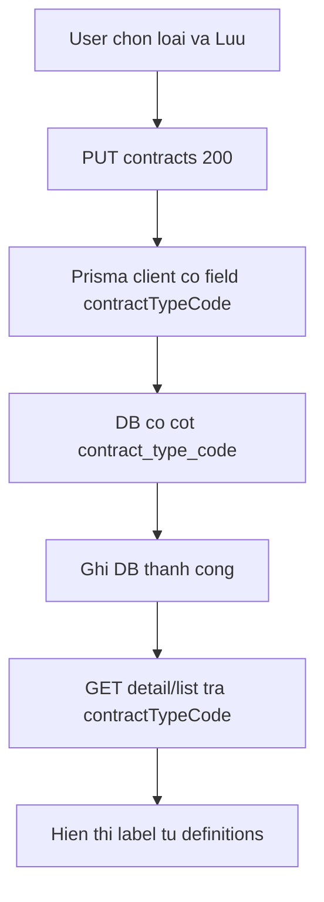

# Sửa lỗi loại hợp đồng không hiện sau khi lưu

## Triệu chứng đã xác nhận

- Bấm **Lưu** có toast thành công, nhưng mở lại form hoặc cột **Loại** trên danh sách vẫn trống (`—`).
- Log dev có `PUT /api/v1/contracts/...` **200** — request cập nhật HĐ chạy, nhưng giá trị không «bám» trên UI (và có thể không ghi DB).

## Nguyên nhân khả dĩ (theo mức ưu tiên)

1. **Hạ tầng chưa đồng bộ** — Migration [`20260512100000_add_contract_type_code`](d:\PJ\asms\backend\prisma\migrations\20260512100000_add_contract_type_code\migration.sql) có thể chưa `deploy` trên PostgreSQL remote; lần trước `prisma generate` lỗi **EPERM** khi `pnpm dev:all` đang chạy → client runtime có thể cũ, field bị bỏ qua dù API vẫn 200.
2. **UI ghi đè state cũ** — [`ContractEditDialog.tsx`](d:\PJ\asms\src\components\details\ContractEditDialog.tsx) `useEffect` phụ thuộc `contract` reset cả form (kể cả `contractTypeCode`) từ object danh sách thường **không có** field này, có thể ghi đè sau khi detail đã hydrate hoặc sau refetch.
3. **Cache / mapping** — [`Contracts.tsx`](d:\PJ\asms\src\pages\Contracts.tsx) dùng `queryKey: ["contracts", typeFilter]` và `staleTime: 60_000`; sau invalidate, `GET` **304** + object `editingContract` cũ khiến cột **Loại** vẫn `—` dù DB đã có mã.
4. **Hiển thị nhãn** — ít gặp hơn: `resolveDefinitionLabel` trả `—` chỉ khi thiếu mã; nếu có mã sẽ fallback hiện `code`.

## Hướng xử lý

### 1. Xác minh hạ tầng (bắt buộc trước khi sửa UI)

- Dừng `pnpm dev:all`, chạy `prisma migrate deploy` (hoặc `migrate dev`) trong [`backend`](d:\PJ\asms\backend), rồi `prisma generate`.
- Kiểm tra DB: bảng `contracts` có cột `contract_type_code`.
- Sau khi lưu một HĐ có loại: query DB hoặc `GET /api/v1/contracts/:id` — response phải có `contractTypeCode`.

### 2. Backend — đảm bảo đọc/ghi nhất quán

- [`contracts/service.ts`](d:\PJ\asms\backend\src\modules\contracts\service.ts): list/detail/update đã `select`/`return` `contractTypeCode`; rà lại `getContractDetailService` (include đủ scalar).
- [`contracts/controller.ts`](d:\PJ\asms\backend\src\modules\contracts\controller.ts): create không xóa `contractTypeCode` khi có trong body (hiện chỉ xóa `warrantyEnd`/`status`/`progress`).
- (Tùy chọn) test API: PUT có `contractTypeCode` hợp lệ → GET detail khớp.

### 3. Frontend — form không bị reset mất loại

- [`ContractEditDialog.tsx`](d:\PJ\asms\src\components\details\ContractEditDialog.tsx):
  - Tách hydrate: **không** reset `contractTypeCode` từ `contract` list khi đã có `detail.contractTypeCode` hoặc user đã chọn.
  - Ưu tiên `detail` cho `contractTypeCode`; chỉ reset khi `open`/`contract.id` đổi.
  - Sau `updateContract` thành công: cập nhật cache detail (`useContractDetail`) hoặc truyền lại `editingContract` có `contractTypeCode` trước khi đóng dialog.

### 4. Frontend — danh sách và cache

- [`Contracts.tsx`](d:\PJ\asms\src\pages\Contracts.tsx): đảm bảo map `contractTypeCode` từ API (đã có); sau lưu, refetch danh sách (invalidate `["contracts"]` hoặc giảm `staleTime` cho key này).
- [`use-contracts-api.ts`](d:\PJ\asms\src\hooks\use-contracts-api.ts): `onSuccess` invalidate mọi query bắt đầu bằng `contracts` (kể cả `["contracts", typeFilter]` và detail).

### 5. Kiểm thử tay (acceptance)

- Thuộc tính › Hợp đồng: có ít nhất một loại **Hoạt động**.
- Sửa HĐ: chọn loại → Lưu → toast OK → cột **Loại** đúng ngay; mở lại form vẫn đúng.
- `GET` detail có `contractTypeCode` khớp mã đã chọn.

## Ngoài phạm vi

- Thêm loại mới ngay trên form Hợp đồng (vẫn quản lý ở Thuộc tính).
- Đổi CRUD trạng thái HĐ sang definitions.
