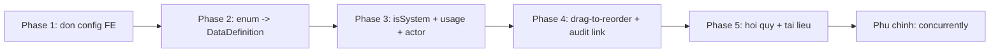

# Cài đặt - Thuộc tính: changelog 5 Phase

Tổng hợp toàn bộ thay đổi đã thực hiện cho màn Cài đặt - Thuộc tính (`/cai-dat/thuoc-tinh`). Kế hoạch chi tiết nằm ở `plans/settings_attributes_completion_d9fcb535.plan.md`. File này chỉ ghi lại "đã làm gì" để dễ tra cứu khi review.

## Sơ đồ tổng quan

## Phase 1 - Dọn config và UX nhanh (FE only)

- Thêm field `code`, `updatedAt`, `updatedBy`, `isSystem` vào `AttributeRow`; bỏ literal `contractStatusEnum`; gỡ section `report_period` và `contract_status` khỏi danh sách module trong [src/lib/attribute-settings-config.ts](src/lib/attribute-settings-config.ts).
- Cập nhật map FE để fallback "Hệ thống" khi không có người tạo/sửa, đồng thời truyền `code`, `updatedAt`, `isSystem` ra UI trong [src/lib/attribute-definition-map.ts](src/lib/attribute-definition-map.ts).
- Bổ sung cột "Mã", search theo `code/name/createdBy/updatedBy`, filter `Tất cả/Hoạt động/Ngừng`, regex validate `^[A-Za-z0-9._-]+$` cho ô mã trong [src/components/settings/attributes/AttributeDefinitionSection.tsx](src/components/settings/attributes/AttributeDefinitionSection.tsx).

## Phase 2 - Schema migration: enum sang DataDefinition

- Thêm cột `*Code` (giữ song song với enum cũ) cho `Warranty.priorityCode/statusCode`, `Task.priorityCode`, `ResearchProject.stageCode`, `TrainingCourse.typeCode`, `Document.categoryCode`, `Handover.typeCode`, `Customer.sourceCode/companyTypeCode` cùng các `@@index` tương ứng trong [backend/prisma/schema.prisma](backend/prisma/schema.prisma).
- Tạo migration SQL `ALTER TABLE` + backfill từ enum sang text + tạo index ở [backend/prisma/migrations/20260513100000_add_attribute_codes_phase1/migration.sql](backend/prisma/migrations/20260513100000_add_attribute_codes_phase1/migration.sql).
- Mở rộng seed cho 10 category mới (`warranty_priority`, `warranty_status`, `task_priority`, `training_type`, `research_stage`, `document_type`, `handover_type`, `customer_source`, `company_type`, `product_category`) đồng thời đánh `isSystem = true` cho mọi mục được seed trong [backend/src/config/seed-definitions.ts](backend/src/config/seed-definitions.ts).
- Mở rộng `assertActiveDefinitionCode` áp dụng cho tất cả entity convert: [backend/src/modules/warranties/service.ts](backend/src/modules/warranties/service.ts), [backend/src/modules/tasks/service.ts](backend/src/modules/tasks/service.ts), [backend/src/modules/research-projects/service.ts](backend/src/modules/research-projects/service.ts), [backend/src/modules/training/service.ts](backend/src/modules/training/service.ts), [backend/src/modules/documents/service.ts](backend/src/modules/documents/service.ts), [backend/src/modules/handovers/service.ts](backend/src/modules/handovers/service.ts), [backend/src/modules/customers/service.ts](backend/src/modules/customers/service.ts), [backend/src/modules/products/service.ts](backend/src/modules/products/service.ts).
- Cập nhật Zod schema/controller các module trên để chấp nhận `*Code` thay enum, đồng thời backfill enum cũ khi `*Code` khớp giá trị enum để giữ tương thích ngược.
- FE đổi payload và select option sang dạng `*Code`: [src/components/details/WarrantyDetailDialog.tsx](src/components/details/WarrantyDetailDialog.tsx), [src/components/details/ContractEditDialog.tsx](src/components/details/ContractEditDialog.tsx), [src/components/details/ProductDetailDialog.tsx](src/components/details/ProductDetailDialog.tsx), [src/pages/Tasks.tsx](src/pages/Tasks.tsx), [src/pages/Documents.tsx](src/pages/Documents.tsx), [src/lib/training-payload.ts](src/lib/training-payload.ts) và các hook tương ứng trong [src/hooks/](src/hooks/).

## Phase 3 - Bảo toàn dữ liệu: isSystem, actor, usage

- Thêm `isSystem`, `createdById`, `updatedById` cùng relation tới `User` cho `DataDefinition` trong [backend/prisma/schema.prisma](backend/prisma/schema.prisma).
- Tạo migration cộng cột + backfill `is_system = TRUE` cho mọi category seed, kèm foreign key `created_by_id` / `updated_by_id` trong [backend/prisma/migrations/20260513110000_data_definitions_meta/migration.sql](backend/prisma/migrations/20260513110000_data_definitions_meta/migration.sql).
- Service ghi nhận actor khi tạo/sửa, chặn đổi `code` khi `isSystem`, kiểm tra `countDefinitionUsage` trước khi xoá; bổ sung `getDefinitionUsageService` và bảng `USAGE_TARGETS` map sang đếm thực tế trong [backend/src/modules/definitions/service.ts](backend/src/modules/definitions/service.ts).
- Endpoint `GET /api/v1/definitions/:id/usage` và truyền `actorId` từ JWT vào service trong [backend/src/modules/definitions/controller.ts](backend/src/modules/definitions/controller.ts) và [backend/src/modules/definitions/route.ts](backend/src/modules/definitions/route.ts).
- FE bổ sung type `DefinitionPersonRef`, `DefinitionUsage`, hook `useDefinitionUsage(id)` trong [src/hooks/use-definitions-api.ts](src/hooks/use-definitions-api.ts) và key `usage` tương ứng trong [src/lib/query-keys.ts](src/lib/query-keys.ts).
- Bảng định nghĩa hiện badge "Hệ thống", cột Người sửa/Ngày sửa, AlertDialog cảnh báo trước khi xoá kèm breakdown các bảng đang dùng, fallback sang "Tắt" khi `isSystem` hoặc `count > 0` trong [src/components/settings/attributes/AttributeDefinitionSection.tsx](src/components/settings/attributes/AttributeDefinitionSection.tsx).

## Phase 4 - Drag-to-reorder và audit linking

- Cài `@dnd-kit/core`, `@dnd-kit/sortable`, `@dnd-kit/utilities` (xem `dependencies` trong [package.json](package.json)).
- Endpoint `PUT /api/v1/definitions/reorder` validate cùng category, batch update trong transaction; controller ghi audit hành động `reorder` qua [backend/src/modules/definitions/service.ts](backend/src/modules/definitions/service.ts), [backend/src/modules/definitions/controller.ts](backend/src/modules/definitions/controller.ts), [backend/src/modules/definitions/route.ts](backend/src/modules/definitions/route.ts) và schema `reorderDefinitionsSchema` trong [backend/src/modules/definitions/schema.ts](backend/src/modules/definitions/schema.ts).
- Bổ sung `"reorder"` vào union `AuditAction` ở [backend/src/lib/audit.ts](backend/src/lib/audit.ts).
- FE tích hợp `DndContext` + `SortableContext`, banner "Lưu thứ tự / Huỷ" khi có thay đổi cục bộ trong [src/components/settings/attributes/AttributeDefinitionSection.tsx](src/components/settings/attributes/AttributeDefinitionSection.tsx); hook mutation `useReorderDefinitions` trong [src/hooks/use-definitions-api.ts](src/hooks/use-definitions-api.ts).
- Action "Lịch sử" trên mỗi dòng trỏ sang `/cai-dat?tab=audit&entity=definition&entityId=<id>`; trang Cài đặt parse `tab/entity/entityId` từ URL, sync khi đổi tab trong [src/pages/SettingsPage.tsx](src/pages/SettingsPage.tsx).
- Tab Nhật ký nhận `initialEntity` / `initialEntityId`, hiển thị chip "Đang lọc theo ID" có nút bỏ lọc, thêm option hành động `reorder` trong [src/components/settings/AuditLogsTab.tsx](src/components/settings/AuditLogsTab.tsx); hook gửi thêm `entityId` trong [src/hooks/use-audit-logs-api.ts](src/hooks/use-audit-logs-api.ts).

## Phase 5 - Hồi quy và tài liệu

- Chạy `pnpm exec prisma generate`, `pnpm --dir backend build`, `pnpm build` (FE), `pnpm tsc --noEmit`, `pnpm lint`, `pnpm test`: tất cả xanh.
- Sửa test cho payload đào tạo theo field mới `typeCode` trong [src/test/training-payload.test.ts](src/test/training-payload.test.ts).
- Cập nhật BR-CD-03 (đầy đủ danh mục, tìm/lọc/kéo thả/lịch sử), thêm BR-CD-03a (cảnh báo xoá/tắt), ràng buộc `isSystem` + usage + reorder + chính sách `<entity>.<field>Code` trong [docs/BRD-ASMS.md](docs/BRD-ASMS.md).
- Bổ sung block UAT cho Settings - Thuộc tính (badge hệ thống, regex, drag-to-reorder, lịch sử) và case chuyển đổi enum cho từng entity trong [docs/uat-checklist.md](docs/uat-checklist.md).

## Phụ chỉnh sau plan

- Khôi phục `concurrently` vào `devDependencies` để `pnpm dev:all` chạy lại (bị mất khi cài thêm `@dnd-kit/*`): [package.json](package.json).

## Trạng thái cuối

- 5 todo trong plan gốc đều `completed`.
- Build FE/BE, lint, vitest xanh; Prisma client tươi.
- `pnpm dev:all` chạy được: FE `http://localhost:8080/`, BE `http://localhost:4001`.
