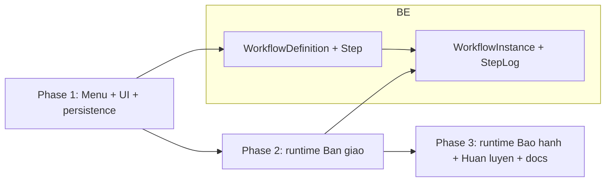

# Module "Quy trình" (Workflow): changelog 3 Phase

Tổng hợp toàn bộ thay đổi đã thực hiện cho menu mới `/quy-trinh` và runtime workflow của 3 module Bàn giao / Bảo hành / Huấn luyện. Kế hoạch chi tiết nằm ở `plans/workflow_module_31178d48.plan.md`.

## Sơ đồ tổng quan

## Phase 1 - Menu /quy-trinh + UI cấu hình + persistence

### Backend

- Thêm 4 model trong [backend/prisma/schema.prisma](backend/prisma/schema.prisma): `WorkflowDefinition`, `WorkflowStep`, `WorkflowInstance`, `WorkflowStepLog` cùng các index `(moduleKey, isActive)`, unique `(workflowId, order)`, FK actor.
- Migration mới `prisma/migrations/20260513120000_workflow_module/migration.sql` và migration phụ `20260513131000_workflow_step_log_actor_fk` thêm FK `workflow_step_logs.actor_id → users.id`.
- Thêm category mới `workflow_step_action` (Trình ký / Ký duyệt / Ký số / Ban hành) vào [backend/src/config/seed-definitions.ts](backend/src/config/seed-definitions.ts).
- Tạo seed 3 workflow hệ thống `WF_HANDOVER_DEFAULT (4 bước)`, `WF_WARRANTY_DEFAULT (3 bước)`, `WF_TRAINING_DEFAULT (3 bước)` trong [backend/src/config/seed-workflows.ts](backend/src/config/seed-workflows.ts); hook seed vào `scripts/bootstrap-auth.ts` và `scripts/seed-demo.ts`.
- Module backend mới `backend/src/modules/workflows/`:
  - [schema.ts](backend/src/modules/workflows/schema.ts) — Zod cho create/update workflow, upsert step, reorder, advance, query.
  - [service.ts](backend/src/modules/workflows/service.ts) — `listWorkflowsService`, `getWorkflowDetailService`, `createWorkflowService`, `updateWorkflowService` (chặn đổi code/moduleKey khi `isSystem`), `softDeleteWorkflowService` (chặn `isSystem` và workflow còn instance `running`), `addStepService`/`updateStepService`/`deleteStepService` (validate `actionCode` qua `assertActiveDefinitionCode` và `roleCode` qua bảng `Role`), `reorderStepsService` (two-phase offset để tránh đụng unique).
  - [controller.ts](backend/src/modules/workflows/controller.ts) + [route.ts](backend/src/modules/workflows/route.ts) mount `/api/v1/workflows`. RBAC: read cho `admin/manager/technician/sales/viewer`, write/reorder cho `admin/manager`.
  - Audit ghi cho từng hành động (`create/update/delete/reorder` trên `workflow` và `workflow_step`).
- Mở rộng [backend/src/lib/audit.ts](backend/src/lib/audit.ts) thêm entity `workflow`, `workflow_step`, `workflow_instance` và action `advance`.

### Frontend

- Sidebar thêm icon `Workflow` + path `/quy-trinh` trong [src/components/layout/AppSidebar.tsx](src/components/layout/AppSidebar.tsx). RBAC trong [src/hooks/use-role.tsx](src/hooks/use-role.tsx) và [src/lib/role-matrix.ts](src/lib/role-matrix.ts) cấp quyền `admin/manager/technician` đọc, `admin/manager` ghi.
- Header subtitle trong [src/components/layout/AppLayout.tsx](src/components/layout/AppLayout.tsx).
- Route mới trong [src/App.tsx](src/App.tsx):
  - `/quy-trinh` → [WorkflowOverviewPage](src/pages/WorkflowOverviewPage.tsx) — 3 thẻ Bàn giao / Bảo hành / Huấn luyện (đếm số workflow).
  - `/quy-trinh/:moduleKey` → [WorkflowListPage](src/pages/WorkflowListPage.tsx) — bảng workflow + dialog tạo nhanh + dialog xoá.
  - `/quy-trinh/:moduleKey/:workflowId` → [WorkflowEditorPage](src/pages/WorkflowEditorPage.tsx) — bố cục 2 cột khớp ảnh: cột trái có card `Thông tin cấu hình` + `Tổng quát`, cột phải `Thiết kế luồng xử lý` với pill `BẮT ĐẦU/KẾT THÚC`, các step có chỉ số tròn, badge action, 4 nút thao tác (Lên/Xuống/Sửa/Xoá).
- Components dùng chung:
  - [WorkflowStepCard](src/components/workflow/WorkflowStepCard.tsx) — card step với badge action màu sắc + dải màu trái.
  - [StepUpsertDialog](src/components/workflow/StepUpsertDialog.tsx) — thêm/sửa step với select action (lấy từ `workflow_step_action`) + select vai trò (lấy từ `useRolesList`).
- React Query hook [use-workflows-api](src/hooks/use-workflows-api.ts) và key trong [src/lib/query-keys.ts](src/lib/query-keys.ts): `useWorkflowsList`, `useWorkflowDetail`, `useCreateWorkflow`, `useUpdateWorkflow`, `useDeleteWorkflow`, `useAddStep`, `useUpdateStep`, `useDeleteStep`, `useReorderSteps`.
- Reorder phase 1 dùng nút Lên/Xuống (không cần drag-to-reorder).

## Phase 2 - Runtime cho Bàn giao

### Backend

- Schema thêm `Handover.workflowInstanceId String?` + index trong [backend/prisma/schema.prisma](backend/prisma/schema.prisma). Migration `prisma/migrations/20260513130000_handover_workflow_instance/migration.sql`.
- Module workflows bổ sung [runtime.ts](backend/src/modules/workflows/runtime.ts):
  - `startInstanceForEntity(moduleKey, entityId, actorId)` — tìm workflow active mặc định (ưu tiên `isSystem desc`), tạo `WorkflowInstance` với step đầu, ghi `WorkflowStepLog(action="start")`.
  - `getInstanceForEntity(moduleKey, entityId)` — trả về instance kèm `workflow.steps`, `currentStep`, `logs.actor`.
  - `getInstanceByIdService` + `advanceInstanceService` — validate actor có `Role.code === step.roleCode || "admin"`, ghi log, đóng instance ở step cuối hoặc trả `cancelled` khi reject. Đồng bộ `Handover.currentStep` (1-based), `Handover.status`, `Handover.completedAt`.
- Endpoint mới:
  - `GET /api/v1/workflows/instances?moduleKey=&entityId=`
  - `GET /api/v1/workflows/instances/:id`
  - `POST /api/v1/workflows/instances/:id/advance` (body `{ action: approve|reject|skip, comment? }`) — audit `workflow_instance.advance`.
- [backend/src/modules/handovers/service.ts](backend/src/modules/handovers/service.ts): khi `createHandoverService` tạo xong record sẽ gọi `startInstanceForEntity("handover", ...)` và set `workflowInstanceId` + `currentStep`. Hành động `startInstance` được catch để không phá luồng tạo handover nếu workflow chưa cấu hình.

### Frontend

- Hook mới trong [use-workflows-api](src/hooks/use-workflows-api.ts): `useInstanceForEntity`, `useAdvanceInstance` (invalidate cả `workflow-instance`, `handovers`, `warranties`, `training-courses` để refresh đồng bộ).
- Panel dùng chung [WorkflowInstancePanel](src/components/workflow/WorkflowInstancePanel.tsx): hiển thị workflow name, danh sách step (đánh dấu bước đã qua / hiện tại / sắp tới với màu sắc), nút `Phê duyệt` + `Trả lại` (chỉ enable khi role khớp), trường ghi chú, nhật ký rút gọn.
- [HandoverUpsertDialog](src/components/handover/HandoverUpsertDialog.tsx) mở rộng width và nhúng `WorkflowInstancePanel` khi sửa.

## Phase 3 - Mở rộng Bảo hành + Huấn luyện + docs

### Backend

- Schema thêm `Warranty.workflowInstanceId String?` và `TrainingCourse.workflowInstanceId String?` cùng index trong [backend/prisma/schema.prisma](backend/prisma/schema.prisma). Migration `prisma/migrations/20260513140000_warranty_training_workflow/migration.sql`.
- [backend/src/modules/warranties/service.ts](backend/src/modules/warranties/service.ts): trong `createWarrantyService`, sau khi `notifyByPreference` chạy thì gọi `startInstanceForEntity("warranty", ...)` để gắn instance + đặt `workflowStep` thành step đầu.
- [backend/src/modules/training/service.ts](backend/src/modules/training/service.ts): trong `createTrainingCourseService`, sau khi tạo course thì gắn instance bằng `startInstanceForEntity("training", ...)`.
- [runtime.ts](backend/src/modules/workflows/runtime.ts) mở rộng `advanceInstanceService`:
  - Module `warranty`: nâng `workflowStep`, đổi `statusCode/status` sang `processing` khi đang chạy, `completed` + `resolvedAt` khi hoàn tất, `cancelled` khi reject.
  - Module `training`: chuyển `TrainingCourse.status` sang `ongoing` khi chạy, `completed` khi hoàn tất.
- Script [scripts/backfill-workflow-instances.ts](backend/scripts/backfill-workflow-instances.ts) backfill `WorkflowInstance` cho các Handover / Warranty / Training đã tồn tại trước khi module ra đời.

### Frontend

- [WarrantyDetailDialog](src/components/details/WarrantyDetailDialog.tsx) nhúng `WorkflowInstancePanel` bên dưới phần "Tiến trình" cũ; hiển thị khi đang sửa (có `apiId`).
- [TrainingDetail](src/pages/TrainingDetail.tsx) hiển thị panel `WorkflowInstancePanel` ở tab `Tổng quan`.

### Tài liệu

- Cập nhật [docs/BRD-ASMS.md](docs/BRD-ASMS.md) thêm §5.14 «Quy trình nghiệp vụ» với BR-QT-01…BR-QT-07 và các ràng buộc.
- Cập nhật [docs/uat-checklist.md](docs/uat-checklist.md) thêm 2 block UAT: `Quy trình` (CRUD workflow + step + reorder + lịch sử) và `Workflow runtime` (auto-init khi tạo entity, advance đúng / sai vai trò, hoàn tất / trả lại).
- Tạo `docs/0003-quy-trinh.md` (file này).

## Build / Lint / Test

- `pnpm --filter backend exec prisma migrate deploy && prisma generate` — 3 migration mới đã apply.
- `pnpm --filter backend build` — TypeScript clean.
- `pnpm tsc --noEmit` (frontend) — clean.
- `pnpm lint` — không có lỗi mới (chỉ warnings react-refresh tồn tại từ trước).
- `pnpm test --run` — 24/24 test pass.
- `pnpm build` — Vite build thành công.

## Lưu ý vận hành

- Sau khi deploy lên môi trường mới, cần chạy `pnpm exec tsx scripts/bootstrap-auth.ts` (hoặc `scripts/seed-demo.ts`) để có 3 workflow hệ thống mặc định.
- Đối với dữ liệu cũ chưa có `WorkflowInstance`, chạy `pnpm exec tsx scripts/backfill-workflow-instances.ts` một lần.
- Khi xoá tuỳ biến `Role`, cần kiểm tra tay xem có step nào đang trỏ tới hay không (chưa tự động lock — TODO cho bản sau).
- Hai cơ chế trạng thái cùng tồn tại: `Handover.status/Warranty.statusCode` enum cũ và workflow mới. Phase 2/3 vẫn cập nhật song song để không phá UI hiện hữu; lộ trình tương lai có thể bỏ status enum khi instance đã thay thế hoàn toàn.
