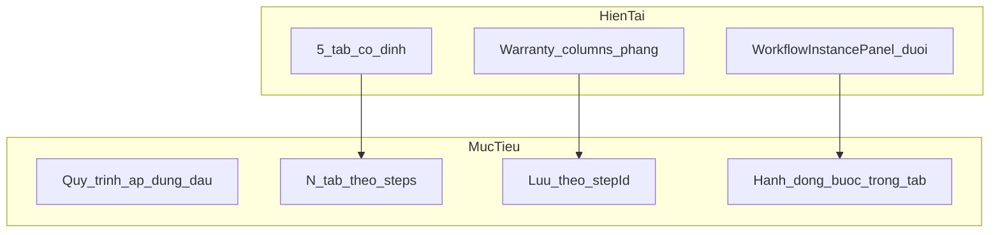

# Nội dung phiếu BH/SC theo Quy trình áp dụng (N bước = N mục)

## Mục tiêu (đã chọn)

- **«Nội dung phiếu» = luồng theo quy trình đang áp dụng**: có **N** bước trên `WorkflowDefinition` thì có **N** tab/section (trái → phải theo `order`).
- **Lưu trữ Phase 2**: nội dung từng mục gắn `**stepId`** (không gắn chỉ số 1..N), để chịu đổi tên/reorder tốt hơn.
- **Quy trình áp dụng** đưa **lên đầu** khối «Nội dung phiếu» (không còn tách ở cuối sheet như hiện tại trong `[WarrantyDetailDialog.tsx](d:/PJ/asms/src/components/details/WarrantyDetailDialog.tsx)`).

## Hiện trạng (gap)

| Thành phần         | Hiện tại                                                                                                                                                                                                            |
| ------------------ | ------------------------------------------------------------------------------------------------------------------------------------------------------------------------------------------------------------------- |
| UI                 | **5 tab cố định** (`warrantyFormTab` = `"1"`…`"5"`) + copy cố định trong `[warranty-process-tree.ts](d:/PJ/asms/src/lib/warranty-process-tree.ts)`                                                                  |
| DB `Warranty`      | Cột **phẳng** (`issue`, `handlingPlan`, `repairDetails`, …) — **không** có payload theo bước                                                                                                                        |
| Engine             | `workflowInstanceId` + `[WorkflowInstancePanel](d:/PJ/asms/src/components/workflow/WorkflowInstancePanel.tsx)` (advance, log, tài liệu theo instance/step)                                                          |
| Danh sách bước API | `[loadWorkflowSnapshotsByInstanceIds](d:/PJ/asms/backend/src/modules/workflows/instance-snapshot.ts)` đọc steps từ **định nghĩa quy trình hiện tại** (`workflowId` của instance), **không đóng băng** lúc tạo phiếu |

---

## Khúc mắc / rủi ro (cần thống nhất trước code)

### 1. Định nghĩa quy trình thay đổi sau khi phiếu đã có dữ liệu

| Thay đổi trên màn Quy trình                       | Hệ quả với payload theo `stepId`                                                                                                                                                                                                                                 |
| ------------------------------------------------- | ---------------------------------------------------------------------------------------------------------------------------------------------------------------------------------------------------------------------------------------------------------------- |
| **Đổi thứ tự** (`reorderStepsService`)            | Dữ liệu **đi theo đúng bước** (key = `stepId`). Chỉ đổi thứ tự tab.                                                                                                                                                                                              |
| **Đổi tên bước**                                  | Chỉ đổi nhãn tab.                                                                                                                                                                                                                                                |
| **Thêm bước**                                     | Tab mới, payload trống.                                                                                                                                                                                                                                          |
| **Xóa bước**                                      | Backend đã **chặn** nếu còn instance `running` đứng ở bước đó (`[deleteStepService](d:/PJ/asms/backend/src/modules/workflows/service.ts)` → 409). Payload cũ với `stepId` đã xóa → **orphan**: cần quy tắc hiển thị (mục «Dữ liệu bước đã gỡ» / ẩn / chỉ admin). |
| **Đổi quy trình** trên phiếu (đã có trong dialog) | Instance reset, **N đổi**, payload cũ **không tự migrate** — policy: giữ orphan theo `warrantyId` hoặc xóa khi confirm đổi QT.                                                                                                                                   |

### 2. Snapshot bước ≠ bản chụp lúc tạo phiếu

API instance/snapshot luôn lấy steps **mới nhất** của `workflowId`. Nếu admin sửa quy trình, phiếu cũ có thể thấy **thêm/bớt tab** so với lúc mở phiếu lần đầu. **Không bug** nếu lưu theo `stepId`; chỉ cần UX cảnh báo khi phát hiện số bước đổi.

*(Tùy chọn sau: lưu `workflowDefinitionVersion` hoặc snapshot `stepIds[]` trên instance — không bắt buộc Phase 2 đầu.)*

### 3. Chưa chọn quy trình / tạo mới

- **Create**: chưa có `workflowInstanceId` → **chưa có N**. UX: chọn **Quy trình áp dụng** trước (hoặc attach ngay sau create) mới render N tab; trước đó chỉ form tối thiểu (KH + mô tả) hoặc thông báo.
- Cần gắn với `[startInstanceForEntity](d:/PJ/asms/backend/src/modules/workflows/runtime.ts)` / `useAttachWorkflow` như hiện tại.

### 4. Schema form từng bước khi N ≠ 5

Các cột phẳng hiện tại map tự nhiên **5 nhóm** (tab 1–5 cũ). Khi quy trình có **6+ bước** hoặc **3 bước**:

- **Bước 1..5** (theo `order` trong danh sách): dùng **template field** tương ứng (map index → nhóm trường cũ trong `buildBhPayload`).
- **Bước thừa** (index ≥ 5): payload generic `{ notes: string }` (hoặc mở rộng sau).
- **Bước thiếu**: nhóm trường không có tab riêng — gom vào tab cuối hoặc tab «Khác» (cần quyết định product; đề xuất: **index 0..4 = template, còn lại = notes**).

`WorkflowStep.phaseCode` hiện seed BH đều là `"warranty"` — **chưa đủ** để map field; Phase 2 dùng **thứ tự bước** + giữ template 5 nhóm; sau có thể thêm `formKey` trên step (màn Quy trình).

### 5. Hai luồng «bước»

- `Warranty.workflowStep` (int) vs `WorkflowInstance.currentStepId`. Runtime đã ưu tiên engine khi có instance. UI mới: **tab active** nên sync với `currentStepId` (highlight tab bước hiện tại); không gửi `workflowStep` thủ công khi `hasEngineSteps`.

### 6. Trùng chức năng với `WorkflowInstancePanel`

Panel hiện: advance, comment, upload tài liệu **theo instance**. Trong mỗi tab nên **nhúng panel con** (hoặc filter theo `stepId`) để «nội dung + hành động bước» cùng một mục — tránh hai khối tách rời như hiện tại.

### 7. Phân quyền

Mỗi step có `roleCode`. Mở rộng (không chặn Phase 2): chỉ role tương ứng (hoặc admin) sửa payload tab đó; viewer chỉ đọc.

---

## Thiết kế dữ liệu (Phase 2)

**Đề xuất bảng** `warranty_step_payloads` (tránh JSON blob lớn trên `warranties`):

- `id`, `warrantyId`, `workflowStepId` (string, **không FK** — step có thể bị xóa)
- `payload` JSON (schema theo template index hoặc `{ notes }`)
- `updatedAt`, unique `(warrantyId, workflowStepId)`

**API** (trong module warranties hoặc sub-route):

- `GET /warranties/:id` trả thêm `stepPayloads: Record<stepId, payload>`
- `PUT /warranties/:id` nhận `stepPayloads` partial merge (validate `stepId` thuộc workflow của instance hiện tại — **cảnh báo** nếu stepId không còn trong definition: vẫn cho lưu orphan hoặc từ chối tùy policy)

**Migration dữ liệu cũ** (script một lần):

- Với phiếu có `workflowInstanceId`: load steps ordered → map cột phẳng vào payload bước 0..4 → insert rows.
- Giữ cột phẳng **đồng bộ ngược** (dual-write) trong giai đoạn chuyển tiếp **hoặc** deprecate sau migration + QA.

---

## Thiết kế UI

File chính: `[WarrantyDetailDialog.tsx](d:/PJ/asms/src/components/details/WarrantyDetailDialog.tsx)`.

1. Khối **«Nội dung phiếu»**
  - **Quy trình áp dụng** (`Select` + mô tả) — **đầu khối**
  - Nếu `liveInstance?.workflow.steps.length > 0`:
    - `TabsList` cuộn ngang: trigger `value={step.id}`, label `{order/10} · {step.name}` (hoặc rút gọn mobile)
    - `TabsContent` mỗi bước: template fields + `WorkflowInstancePanel` scoped step (refactor nhẹ panel nhận `highlightStepId?`)
  - Nếu chưa có instance: placeholder + nút chọn QT / (sau create) attach
2. **Fallback** (không QT): có thể giữ 1 tab «Thông tin chung» với trường bắt buộc tối thiểu — không 5 tab cố định.
3. Gỡ / thu hẹp copy «5 tab cố định» và import `[WARRANTY_PROCESS_PHASES](d:/PJ/asms/src/lib/warranty-process-tree.ts)` chỉ còn **docHints** theo index nếu cần.

**Tách component** (khuyến nghị): `WarrantyStepContentTab.tsx` + `warrantyStepFieldTemplate.ts` (map index → fields).

---

## Kiểm thử bắt buộc

- QT 5 bước mặc định (`[WF_WARRANTY_DEFAULT](d:/PJ/asms/backend/src/config/seed-workflows.ts)`): mở/sửa/lưu từng tab, reload đúng payload.
- Reorder bước trên màn Quy trình → mở lại phiếu: thứ tự tab đổi, **dữ liệu không nhảy bước**.
- Thêm/xóa bước (xóa khi không có phiếu đang đứng ở bước đó).
- Đổi quy trình trên phiếu → confirm + xử lý payload cũ.
- Create: chọn QT → N tab; không QT → fallback.
- `tsc` + smoke create/edit/view.

---

## Thứ tự triển khai đề xuất

1. Prisma migration + service đọc/ghi `warranty_step_payloads` + dual-read legacy columns.
2. Script backfill từ cột phẳng.
3. FE: đưa Quy trình áp dụng lên, tab động theo `liveInstance.workflow.steps`, state payload theo `stepId`.
4. Refactor `WorkflowInstancePanel` (optional prop `stepId`) vào từng tab.
5. QA theo checklist; sau ổn định: ngừng dual-write, deprecate cột phẳng (phase sau).

