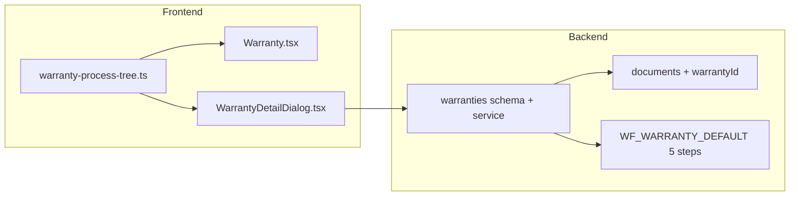

# Kế hoạch: Màn BH/SC theo sơ đồ 5 giai đoạn (đồng bộ sâu)

## Hiện trạng (để neo thay đổi)

- UI dùng **6 bước cố định** (`receive` … `verify`) trùng lặp ở [`src/pages/Warranty.tsx`](src/pages/Warranty.tsx) và [`src/components/details/WarrantyDetailDialog.tsx`](src/components/details/WarrantyDetailDialog.tsx) — **không khớp** sơ đồ 5 giai đoạn.
- [`Warranty`](backend/prisma/schema.prisma) chỉ có: `issue`, `source`, `type`, `priority`/`priorityCode`, `status`/`statusCode`, `workflowStep`, SLA, quan hệ KH/SP — **thiếu** phân loại tiếp nhận, thời điểm phát sinh, phân tích/PA, thuê ngoài/tự làm, nghiệm thu sau SC, bàn giao.
- Luồng engine [`WF_WARRANTY_DEFAULT`](backend/src/config/seed-workflows.ts) hiện chỉ **3 bước**; tiến độ thực tế phiếu có thể đến từ [`WorkflowInstancePanel`](src/components/workflow/WorkflowInstancePanel.tsx) (theo `currentStepId`), tách khỏi “cây” nghiệp vụ 5 nhánh trong sơ đồ.
- [`Document`](backend/prisma/schema.prisma) **chưa có** `warrantyId` — khó gắn BB/phiếu theo từng giai đoạn như sơ đồ.

## Hướng kiến trúc

- **Một nguồn sự thật cho cây 5 bước** (nhãn + gợi ý tài liệu + checklist nhánh): file mới ví dụ [`src/lib/warranty-process-tree.ts`](src/lib/warranty-process-tree.ts) (export mảng 5 phase, mỗi phase: `id`, `title`, `docHints: string[]`, `dataBranches: { label, items[] }[]` — nội dung bám sát sơ đồ bạn gửi).
- **Lưu trữ**: thêm các trường có kiểu rõ (enum) + vài `String`/`Decimal`/`DateTime` để query/filter sau này; tránh một JSON khối duy nhất nếu muốn “full_align” theo nghĩa quản trị dữ liệu.

## 1. Database (Prisma + migration)

Thêm enum (tên có thể tinh chỉnh khi implement, giữ snake_case DB):

| Trường (gợi ý) | Kiểu | Giai đoạn / ý nghĩa |
|----------------|------|---------------------|
| `receipt_category` | enum: `incident` \| `technical_support` | B1 Phân loại |
| `occurred_at` | `DateTime?` | B1 Thời gian phát sinh |
| `product_serial_snapshot` | `String?` | B1 Serial tại tiếp nhận (snapshot) |
| `root_cause` | enum: `manufacturer` \| `customer` \| `unknown` | B2 Đánh giá nguyên nhân |
| `handling_plan` | `String` @db.Text | B2 PA / KH BHSC |
| `planned_hours` | `Int?` | B2 Thời gian xử lý dự kiến |
| `cost_estimate` | `Decimal?` | B2 Chi phí (nếu có) |
| `customer_disagreed_close` | `Boolean` default false | B2 “KH không đồng ý PA → đóng” |
| `execution_mode` | enum: `self` \| `outsource` | B3 |
| `outsource_partner` | `String?` | B3 Đối tác |
| `outsource_budget` | `Decimal?` | B3 Kinh phí thuê ngoài |
| `outsource_timeline` | `String?` | B3 Thời gian (mô tả hoặc ISO range text) |
| `repair_details` | `String?` @db.Text | B3 Nội dung sửa chữa (tự làm) |
| `post_repair_assessment` | `String?` @db.Text | B4 Đánh giá sau SC |
| `handover_notes` | `String?` @db.Text | B5 Ghi chú bàn giao |

- Thêm `warranty_id` (nullable FK) vào `documents` + index; cho phép liên kết tài liệu/BB theo phiếu (upload sau qua màn Tài liệu hoặc mở rộng upload trong dialog BH nếu cần).
- **`workflow_step`**: giữ `Int` nhưng **chuẩn hóa 1–5** theo 5 giai đoạn nghiệp vụ; migration `UPDATE warranties SET workflow_step = LEAST(GREATEST(workflow_step, 1), 5)` (hoặc map 6→5 nếu đang có giá trị 6).
- Cập nhật [`createWarrantySchema` / `updateWarrantySchema`](backend/src/modules/warranties/schema.ts) và [`warranties/service.ts`](backend/src/modules/warranties/service.ts) để đọc/ghi các field mới (validate enum, optional).

## 2. Workflow engine (5 bước khớp sơ đồ)

- Sửa seed [`backend/src/config/seed-workflows.ts`](backend/src/config/seed-workflows.ts): `WF_WARRANTY_DEFAULT` thành **đúng 5** `steps` với `name` khớp sơ đồ:
  1. Tiếp nhận yêu cầu  
  2. Phân tích, đề xuất PA và KH BHSC  
  3. Thực hiện BHSC  
  4. Kiểm tra sau BHSC  
  5. Bàn giao SP cho KH  

- **Dữ liệu đã triển khai**: vì seed `continue` khi đã tồn tại, cần **migration SQL** (hoặc script `tsx` một lần) để:
  - Cập nhật/ thay thế các `workflow_steps` của definition `WF_WARRANTY_DEFAULT`, **hoặc** tạo mã mới `WF_WARRANTY_BHSC_5` và chuyển `startInstanceForEntity` ưu tiên định nghĩa mới (ít phá instance cũ hơn). Kế hoạch triển khai nên chọn **một** hướng và ghi rõ rủi ro instance đang `running`.

- Đồng bộ `startInstanceForEntity` sau tạo phiếu: `workflowStep` trên `warranties` = chỉ số bước hiện tại khớp 5 bước (đã có logic cập nhật trong [`createWarrantyService`](backend/src/modules/warranties/service.ts)).

## 3. Frontend

- **Thay thế** mảng 6 bước cũ bằng import từ [`src/lib/warranty-process-tree.ts`](src/lib/warranty-process-tree.ts) trong:
  - [`src/pages/Warranty.tsx`](src/pages/Warranty.tsx): khu “Quy trình xử lý…” → timeline 5 bước + (tuỳ chọn) accordion/cột “cây” checklist theo từng phase (chỉ đọc từ constant, hoặc đánh dấu đã nhập nếu đã có field API).
  - [`src/components/details/WarrantyDetailDialog.tsx`](src/components/details/WarrantyDetailDialog.tsx): thanh tiến độ 5 bước; form chia **5 section** (Accordion) map sang field mới; `workflowStep` select 1–5 đồng bộ với tên bước.
- Cập nhật [`src/hooks/use-warranties-api.ts`](src/hooks/use-warranties-api.ts) type payload/list row để gồm field mới.
- [`WarrantyTicketUi`](src/components/details/WarrantyDetailDialog.tsx): mở rộng để map từ API (và truyền xuống dialog khi mở từ [`Warranty.tsx`](src/pages/Warranty.tsx)).

## 4. Kiểm thử / rủi ro

- **Phiếu + instance cũ**: sau đổi số bước workflow, instance đang chạy có thể lệch definition — cần quy tắc: chỉ áp dụng definition mới cho phiếu tạo sau ngày X, hoặc script “đóng instance cũ / tạo instance mới” (ghi rõ trong migration note).
- **Định nghĩa thuộc tính** (`warranty_priority`, `warranty_status`) giữ nguyên; không trùng với `receipt_category` / `root_cause` (enum riêng).

## Thứ tự thực hiện đề xuất

1. Migration Prisma + `prisma generate`.  
2. Cập nhật service/schema/controller warranties + documents (nếu thêm `warrantyId` thì cập nhật module documents list/filter nếu cần).  
3. Script/migration workflow 5 bước + quyết định xử lý instance cũ.  
4. `warranty-process-tree.ts` + refactor UI `Warranty` + `WarrantyDetailDialog` + hook types.  
5. Chạy `tsc` frontend/backend, smoke test: tạo phiếu → sửa từng section → upload tài liệu (nếu đã nối `warrantyId`).
