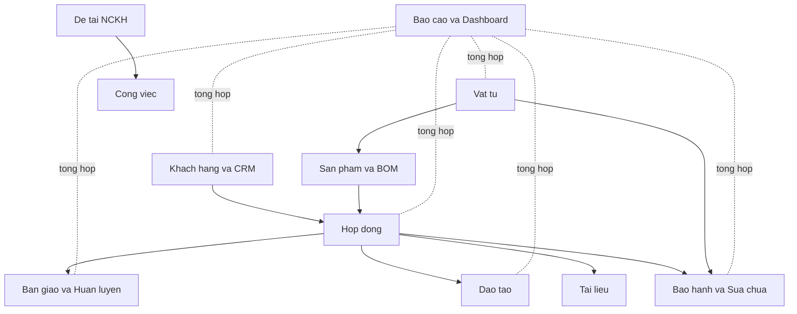
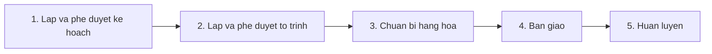
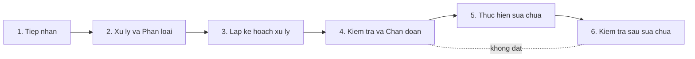

# BRD — Yêu cầu nghiệp vụ tổng thể (ASMS)

> **Tài liệu yêu cầu nghiệp vụ — Hệ thống quản lý hậu mãi (ASMS)**  
> Phiên bản: 1.2 — Khớp với cách hệ thống đang vận hành. Phần kỹ thuật chi tiết xem [SRS-ASMS.md](SRS-ASMS.md).  
> **Cách đọc:** Ưu tiên **tiếng Việt dễ hiểu**. Tên trong `code` (mã màn, tên trường, API) giữ nguyên vì trùng với chương trình.

## Mục lục

1. [Thông tin tài liệu](#1-thông-tin-tài-liệu)
2. [Bối cảnh nghiệp vụ và mục tiêu hệ thống](#2-bối-cảnh-nghiệp-vụ-và-mục-tiêu-hệ-thống)
3. [Đối tượng sử dụng và vai trò](#3-đối-tượng-sử-dụng-và-vai-trò)
4. [Sơ đồ tổng thể nghiệp vụ](#4-sơ-đồ-tổng-thể-nghiệp-vụ)
5. [Yêu cầu nghiệp vụ chi tiết theo nhóm màn](#5-yêu-cầu-nghiệp-vụ-chi-tiết-theo-nhóm-màn)
   - 5.1 Dashboard điều hành
   - 5.2 Hợp đồng và Chi tiết hợp đồng
   - 5.3 Bàn giao và Huấn luyện
   - 5.4 Bảo hành và Sửa chữa
   - 5.5 Khách hàng và CRM
   - 5.6 Sản phẩm và BOM
   - 5.7 Vật tư và Điều chuyển
   - 5.8 Đào tạo và Chi tiết khóa đào tạo
   - 5.9 Tài liệu
   - 5.10 Báo cáo và Thống kê
   - 5.11 Đề tài Nghiên cứu Khoa học
   - 5.12 Công việc
   - 5.13 Cài đặt hệ thống
   - 5.14 Quy trình nghiệp vụ (Workflow)
6. [Quy tắc nghiệp vụ chung](#6-quy-tắc-nghiệp-vụ-chung)
7. [Ma trận liên kết dữ liệu giữa các màn](#7-ma-trận-liên-kết-dữ-liệu-giữa-các-màn)
8. [Tiêu chí nghiệm thu nghiệp vụ](#8-tiêu-chí-nghiệm-thu-nghiệp-vụ)
9. [Phụ lục](#9-phụ-lục)

---

## 1. Thông tin tài liệu

| Thuộc tính | Giá trị |
|------------|---------|
| Tên tài liệu | BRD - Tài liệu Yêu cầu Nghiệp vụ Tổng thể (ASMS) |
| Mã tài liệu | BRD-ASMS-v1.2 |
| Phiên bản | 1.2 |
| Loại tài liệu | Tài liệu yêu cầu nghiệp vụ |
| Phạm vi | Toàn bộ hệ thống ASMS (giao diện + máy chủ) |
| Tài liệu liên quan | [docs/SRS-ASMS.md](SRS-ASMS.md), [docs/BRD-chuc-nang-tung-man-ASMS.md](BRD-chuc-nang-tung-man-ASMS.md), [docs/data-model.md](data-model.md), [docs/ra-soat-chuc-nang-he-thong.md](ra-soat-chuc-nang-he-thong.md), [docs/frontend-backend-mapping.md](frontend-backend-mapping.md), [docs/uat-checklist.md](uat-checklist.md) |
| Mục tiêu | Ghi rõ nghiệp vụ hệ thống quản lý hậu mãi (ngành quốc phòng) để lập trình, kiểm thử và nghiệm thu với người dùng |
| Phạm vi loại trừ | Chi tiết máy chủ production, kế hoạch dự án, kế hoạch đào tạo người dùng cuối |

### 1.1 Cách đọc tài liệu

- Mỗi nhóm màn gồm: **Mục tiêu → Nhu cầu người dùng → Cách thao tác → Đầu vào / Đầu ra → Ràng buộc → Biểu mẫu liên quan**.
- Yêu cầu có mã `BR-<MODULE>-<số>` để tra cứu trong [SRS](SRS-ASMS.md) và [checklist nghiệm thu](uat-checklist.md).
- Tài liệu sử dụng tiếng Việt có dấu, các thuật ngữ chuyên ngành quân đội tham khảo trong mục [9.1 Thuật ngữ và viết tắt](#91-thuật-ngữ-và-viết-tắt).

---

## 2. Bối cảnh nghiệp vụ và mục tiêu hệ thống

### 2.1 Bối cảnh

ASMS giúp đơn vị quân đội và đối tác quốc phòng quản lý **sau khi bàn giao sản phẩm**: ký hợp đồng, bàn giao, huấn luyện, bảo hành, sửa chữa, thanh lý hoặc đưa vào trang bị ổn định. Thay cho giấy tờ và file Excel rời, dữ liệu nằm **một chỗ**, **nối với nhau** và **mỗi vai trò chỉ thấy / làm phần việc của mình**.

### 2.2 Mục tiêu hệ thống

| Mục tiêu | Mô tả |
|----------|-------|
| MT-01 | Quản lý vòng đời hợp đồng tập trung: tạo - thực hiện - bàn giao - thanh lý |
| MT-02 | Quản lý quy trình bàn giao và huấn luyện theo 5 bước nghiệp vụ chuẩn |
| MT-03 | Quản lý phiếu bảo hành và sửa chữa theo 6 bước, có thời hạn xử lý (SLA) |
| MT-04 | Quản lý sản phẩm: định mức vật tư (BOM), thông số kỹ thuật, lịch sử thay đổi |
| MT-05 | Quản lý vật tư, điều chuyển kho; tra cứu bằng serial / mã vạch / QR / RFID |
| MT-06 | Quản lý đào tạo, học viên, lịch buổi học gắn với hợp đồng |
| MT-07 | Quản lý CRM khách hàng: hồ sơ, đầu mối, hoạt động chăm sóc, xếp hạng |
| MT-08 | Màn tổng quan (Dashboard) và báo cáo theo năm, khách hàng, đơn vị |
| MT-09 | Quản lý đề tài nghiên cứu khoa học và công việc tác nghiệp |
| MT-10 | Phân quyền theo vai trò; đăng nhập an toàn (JWT) |

### 2.3 Bốn luồng nghiệp vụ chính

1. **Tiếp nhận hợp đồng** - Tạo hợp đồng, gắn khách hàng, sản phẩm, điều khoản, thời gian thực hiện và bảo hành.
2. **Bàn giao và huấn luyện** - Lập kế hoạch, phê duyệt tờ trình, chuẩn bị hàng, bàn giao, huấn luyện sử dụng.
3. **Bảo hành và sửa chữa** - Tiếp nhận phiếu, phân loại, lập kế hoạch xử lý, kiểm tra chẩn đoán, thực hiện sửa chữa, kiểm tra sau sửa chữa.
4. **Chăm sóc khách hàng** - Theo dõi hoạt động chăm sóc, xếp hạng khách hàng, phục vụ tái ký kết hợp đồng.

### 2.4 Các nhóm hỗ trợ

- **Danh mục gốc:** người dùng, vai trò, danh mục nền (`DataDefinition`), cài đặt thông báo.
- **Báo cáo và Dashboard:** gộp số liệu nhiều phần theo năm.
- **Vật tư và BOM:** kho và định mức vật tư cho từng sản phẩm.
- **Đề tài nghiên cứu**: quản lý đề tài NCKH gắn công việc.

---

## 3. Đối tượng sử dụng và vai trò

Hệ thống có **5 vai trò**. Ai vào được màn nào: [src/hooks/use-role.tsx](../src/hooks/use-role.tsx). Ai gọi được API nào: từng module trên máy chủ.

| Vai trò (`code`) | Tên hiển thị | Mục tiêu sử dụng chính |
|------------------|--------------|------------------------|
| `admin` | Quản trị | Quản trị toàn hệ thống, người dùng, phân quyền, danh mục nền |
| `manager` | Quản lý | Điều hành nghiệp vụ, theo dõi tiến độ, phê duyệt, báo cáo, quản lý khách hàng và hợp đồng |
| `technician` | Kỹ thuật viên | Trực tiếp xử lý bảo hành, vật tư, sản phẩm, bàn giao, đào tạo, công việc tác nghiệp, đề tài |
| `viewer` | Xem | Chỉ xem, không sửa (lãnh đạo, giám sát) |
| `sales` | Nhân viên bán hàng | Quản lý khách hàng, hợp đồng, hoạt động chăm sóc, tài liệu, báo cáo |

### 3.1 Bản đồ truy cập màn hình theo vai trò

| Đường dẫn | Tên màn | admin | manager | technician | viewer | sales |
|-----------|---------|:-----:|:-------:|:----------:|:------:|:-----:|
| `/` | Dashboard | x | x | x | x | x |
| `/hop-dong` | Hợp đồng | x | x | - | x | x |
| `/ban-giao` | Bàn giao và Huấn luyện | x | x | x | - | - |
| `/bao-hanh` | Bảo hành và Sửa chữa | x | x | x | - | - |
| `/san-pham` | Sản phẩm | x | x | x | x | x |
| `/vat-tu` | Vật tư | x | x | x | - | - |
| `/khach-hang` | Khách hàng và CRM | x | x | - | x | x |
| `/bao-cao` | Báo cáo | x | x | - | x | x |
| `/de-tai` | Đề tài NCKH | x | x | x | - | - |
| `/de-tai/:id` | Chi tiết đề tài | x | x | x | - | - |
| `/cong-viec` | Công việc | x | x | x | - | - |
| `/dao-tao` | Đào tạo | x | x | x | - | - |
| `/dao-tao/:id` | Chi tiết khóa đào tạo | x | x | x | - | - |
| `/tai-lieu` | Tài liệu | x | x | x | x | x |
| `/cai-dat` | Cài đặt hệ thống | x | - | - | - | - |

> **Lưu ý:** `x` = được vào màn; `-` = không vào. Ai được **thêm / sửa / xóa** dữ liệu chi tiết hơn ở máy chủ — xem [SRS mục 7 — Ma trận RBAC](SRS-ASMS.md#7-ma-trận-rbac).

### 3.2 Quyền trên màn hình và quyền trên API

- Bảng mục 3.1 theo [`ROUTE_PERMISSIONS`](../src/hooks/use-role.tsx) trên trang web (có **RoleSwitcher** thử vai trò — không thay đăng nhập thật).
- **Đăng nhập (JWT) và phân quyền trên máy chủ** mới là chuẩn: một số API cho `viewer` **đọc** (ví dụ `GET /api/v1/handovers`) dù màn tương ứng không mở cho `viewer`. Client chính thức chỉ nên gọi API đúng vai trò trên token; chi tiết: [SRS mục 7](SRS-ASMS.md#7-ma-trận-rbac).
- Vai trò `sales` thiếu trong vài checklist cũ; đủ năm vai trò: SRS và [uat-checklist.md](uat-checklist.md).

---

## 4. Sơ đồ tổng thể nghiệp vụ

### 4.1 Vòng đời chuẩn của một hợp đồng

### 4.2 Quan hệ chính giữa các loại dữ liệu

- Một khách hàng có nhiều hợp đồng, nhiều đầu mối liên hệ và nhiều hoạt động chăm sóc.
- Một hợp đồng có nhiều đợt bàn giao, nhiều khóa đào tạo, nhiều phiếu bảo hành, nhiều tài liệu.
- Một hợp đồng có nhiều sản phẩm; một sản phẩm có thể nằm trên nhiều hợp đồng (bảng `ContractProduct`), mỗi hợp đồng có `specValues` riêng.
- Một sản phẩm có nhiều vật tư cấu thành (BOM) qua bảng `ProductBom`.
- Một phiếu bảo hành luôn gắn khách hàng, có thể gắn hợp đồng và sản phẩm.
- Một khóa đào tạo có nhiều học viên (`Trainee`) và nhiều buổi học (`ScheduleSession`).
- Một đề tài NCKH có nhiều công việc (`Task`).

---

## 5. Yêu cầu nghiệp vụ chi tiết theo nhóm màn

### 5.1 Dashboard điều hành

**Mã yêu cầu:** `BR-DSH`
**Đường dẫn:** `/`
**Mã màn:** `DSH`
**File giao diện:** [src/pages/Index.tsx](../src/pages/Index.tsx)

#### 5.1.1 Mục tiêu nghiệp vụ

Cho lãnh đạo và quản lý **nhìn nhanh** hợp đồng, bàn giao, bảo hành, sản phẩm, đào tạo, vật tư, doanh thu, khách hàng và **cảnh báo** — số liệu cập nhật theo dữ liệu thật trên hệ thống.

#### 5.1.2 Nhu cầu người dùng chính

| Mã | Nhu cần |
|----|------------|
| BR-DSH-01 | Là người dùng đã đăng nhập, tôi muốn lọc số liệu theo                                                                                                                                                                                                                                                                                                               năm, quý, khách hàng để xem dữ liệu phù hợp nhu cầu báo cáo |
| BR-DSH-02 | Là người dùng, tôi muốn xem 8 nhóm tab dashboard (Tổng quan, Khách hàng, Doanh thu, Dự án, Sản phẩm, Bảo hành, Vật tư, Cảnh báo) |
| BR-DSH-03 | Là lãnh đạo trình chiếu, tôi muốn bật chế độ tự xoay tab theo chu kỳ 10/15/30/60 giây |
| BR-DSH-04 | Là người dùng, tôi muốn vào chế độ toàn màn hình để trình bày trên màn hình lớn |
| BR-DSH-05 | Là người dùng, tôi muốn thấy cảnh báo tự động khi có hợp đồng chậm tiến độ, bàn giao trễ, phiếu bảo hành chờ xử lý hoặc tồn kho cao bất thường |

#### 5.1.3 Quy trình thao tác

1. Người dùng truy cập `/` sau khi đăng nhập.
2. Mặc định hiển thị tab `Tổng quan` với năm hiện tại.
3. Người dùng có thể đổi tab, đổi năm/quý/khách hàng, bật trình chiếu.
4. Mỗi tab tự lấy dữ liệu từ API tổng hợp `/api/v1/reports?year=YYYY` và các API danh sách của từng module thông qua hook `useDashboardData` ([src/hooks/use-dashboard-data.ts](../src/hooks/use-dashboard-data.ts)).

#### 5.1.4 Đầu vào / Đầu ra

| Đầu vào | Đầu ra |
|--------|--------|
| Năm, quý, khách hàng (bộ lọc) | Thẻ chỉ số theo từng nhóm |
| Vai trò người dùng | Biểu đồ xu hướng theo tháng |
|  | Bảng danh sách hợp đồng / sản phẩm / khiếu nại / vật tư |
|  | Bảng tổng hợp cảnh báo |

#### 5.1.5 Ràng buộc

- Dashboard chỉ hiển thị dữ liệu mà vai trò người dùng có quyền xem.
- Cảnh báo **tính trên màn hình** từ số liệu đã gộp; chưa có API cảnh báo riêng.
- Tab `Cảnh báo` luôn hiển thị tối thiểu 1 dòng (kể cả "không có cảnh báo").

#### 5.1.6 Tab Dashboard chi tiết

| Tab | Mục đích | Khối hiển thị chính |
|-----|----------|---------------------|
| Tổng quan | Chỉ số điều hành tổng thể | Thẻ số, tiến độ, biểu đồ tròn / xu hướng, bảng hợp đồng |
| Khách hàng | Sản lượng và doanh thu theo khách hàng | Biểu đồ sản phẩm / doanh thu, bảng tổng hợp |
| Doanh thu | Doanh thu và xu hướng | Thẻ số, biểu đồ doanh thu, bảng chi tiết |
| Dự án | Tiến độ hợp đồng, bàn giao, đào tạo | Tiến độ, biểu đồ, bảng hợp đồng / bàn giao / huấn luyện |
| Sản phẩm | Vòng đời sản phẩm | Thẻ số, biểu đồ trạng thái, bảng sản phẩm |
| Bảo hành | Phiếu bảo hành và thời hạn xử lý | Khối khiếu nại, biểu đồ loại phiếu, bảng khiếu nại |
| Vật tư | Kho và điều chuyển | Thẻ số, khối PAKD, bảng vật tư |
| Cảnh báo | Cảnh báo theo quy tắc | Thẻ cảnh báo, danh sách, bảng tổng hợp |

---

### 5.2 Hợp đồng và Chi tiết hợp đồng

**Mã yêu cầu:** `BR-HD`
**Đường dẫn:** `/hop-dong`
**Mã màn:** `HD`
**File giao diện:** [src/pages/Contracts.tsx](../src/pages/Contracts.tsx), [src/components/details/ContractDetailDialog.tsx](../src/components/details/ContractDetailDialog.tsx), [src/components/details/ContractEditDialog.tsx](../src/components/details/ContractEditDialog.tsx), [src/components/details/ContractProductDetailDialog.tsx](../src/components/details/ContractProductDetailDialog.tsx)

#### 5.2.1 Mục tiêu nghiệp vụ

Quản lý toàn bộ vòng đời hợp đồng: từ tạo mới, điều chỉnh, gắn sản phẩm, gắn tài liệu, gắn khóa đào tạo, theo dõi tiến độ đến thanh lý.

#### 5.2.2 Nhu cầu người dùng chính

| Mã | Nhu cần |
|----|------------|
| BR-HD-01 | Là nhân viên bán hàng, tôi muốn tạo mới hợp đồng với đầy đủ thông tin khách hàng, giá trị, thời gian, bảo hành và điều khoản |
| BR-HD-02 | Là quản lý, tôi muốn xem danh sách hợp đồng theo trạng thái (`Dự thảo`, `Đang thực hiện`, `Hoàn thành`, `Trễ hạn`, `Đã thanh lý`) |
| BR-HD-03 | Là nhân viên bán hàng, tôi muốn gắn nhiều sản phẩm cho một hợp đồng và nhập số lượng, thông số riêng theo hợp đồng (`specValues`) |
| BR-HD-04 | Là quản lý, tôi muốn xem chi tiết một hợp đồng theo 5 tab: Thông tin chung, Điều khoản chính, Danh mục sản phẩm, Tài liệu, Đào tạo và Huấn luyện |
| BR-HD-05 | Là nhân viên bán hàng, tôi muốn chỉnh sửa hợp đồng với toàn bộ thay đổi chỉ được lưu khi nhấn `Lưu` |
| BR-HD-06 | Là quản lý, tôi muốn xóa mềm hợp đồng đã không còn dùng |
| BR-HD-07 | Là người dùng, tôi muốn mở dialog `Chi tiết sản phẩm trong hợp đồng` để xem hoặc chỉnh sửa thông số riêng cho sản phẩm trong hợp đồng đó |

#### 5.2.3 Quy trình thao tác

1. Người dùng truy cập `/hop-dong`.
2. Có thể tìm kiếm theo mã, tiêu đề, lọc theo trạng thái, mở dialog tạo mới.
3. Trong dialog tạo: nhập thông tin khách hàng (chọn từ danh mục gốc), giá trị, ngày bắt đầu, ngày kết thúc, ngày hết bảo hành, điều khoản (textarea), gắn sản phẩm (chọn nhiều), gắn tài liệu, gắn khóa đào tạo.
4. Khi lưu, hệ thống tạo hợp đồng (`POST /contracts`), sau đó đồng bộ danh sách sản phẩm gắn hợp đồng (`PUT /contracts/:id/products`).
5. Người dùng có thể mở chi tiết để xem 5 tab và mở popup chỉnh sửa hoặc xóa.
6. Trong tab `Danh mục sản phẩm`, người dùng nhấn `Chi tiết` để mở `ContractProductDetailDialog` xem 4 tab: Tổng quan (chỉ xem), Linh kiện (BOM, chỉ xem), Thông số (chỉnh sửa `specValues`), Tài liệu (chỉ xem).

#### 5.2.4 Đầu vào / Đầu ra

| Đầu vào | Đầu ra |
|--------|--------|
| `customerId`, tiêu đề, giá trị, ngày bắt đầu / kết thúc / hết bảo hành | Bản ghi `Contract` mới |
| Danh sách sản phẩm với `productId`, `quantity`, `specValues` | Danh sách `ContractProduct` đồng bộ |
| Trạng thái, tiến độ, điều khoản | Cập nhật `Contract.status`, `Contract.progress`, `Contract.terms` |

#### 5.2.5 Ràng buộc

- Mã hợp đồng (`code`) là duy nhất, do hệ thống sinh hoặc người dùng nhập theo quy ước đơn vị.
- `Contract.value` là số dương, tính theo VND.
- `endDate` không được trước `startDate`.
- Khi xóa hợp đồng, mọi liên kết phụ (sản phẩm, bàn giao, đào tạo, tài liệu) vẫn giữ nhưng `Contract.deletedAt` được đánh dấu.
- Một hợp đồng có thể tồn tại không có sản phẩm (chỉ tạo khung), nhưng không thể tạo bàn giao nếu chưa có hợp đồng.

#### 5.2.6 Biểu mẫu nghiệp vụ liên quan

- Tờ trình ký kết hợp đồng (đính kèm dưới dạng tài liệu `category=contract`).
- Phụ lục hợp đồng (đính kèm dưới dạng tài liệu `category=contract`).
- Biên bản nghiệm thu (đính kèm dưới dạng tài liệu `category=contract` hoặc `report`).

---

### 5.3 Bàn giao và Huấn luyện

**Mã yêu cầu:** `BR-BG`
**Đường dẫn:** `/ban-giao`
**Mã màn:** `BG`
**File giao diện:** [src/pages/Handover.tsx](../src/pages/Handover.tsx), [src/components/handover/HandoverUpsertDialog.tsx](../src/components/handover/HandoverUpsertDialog.tsx)

#### 5.3.1 Mục tiêu nghiệp vụ

Quản lý xuyên suốt quy trình bàn giao và huấn luyện đi kèm sản phẩm/hợp đồng theo 5 bước nghiệp vụ chuẩn của ngành quốc phòng.

#### 5.3.2 Quy trình chuẩn 5 bước

#### 5.3.3 Nhu cầu người dùng chính

| Mã | Nhu cần |
|----|------------|
| BR-BG-01 | Là kỹ thuật viên, tôi muốn tạo mới một đợt bàn giao gắn với hợp đồng và khách hàng |
| BR-BG-02 | Là kỹ thuật viên, tôi muốn cập nhật bước hiện tại (1..5) bằng danh sách chọn hiển thị tên bước thay vì số |
| BR-BG-03 | Là quản lý, tôi muốn theo dõi đợt bàn giao theo trạng thái: `Chưa bắt đầu`, `Đang thực hiện`, `Hoàn thành`, `Trễ hạn` |
| BR-BG-04 | Là quản lý, tôi muốn ghi nhận `completedAt` khi đợt chuyển sang `Hoàn thành` |
| BR-BG-05 | Là kỹ thuật viên, tôi muốn quản lý nhanh các khóa huấn luyện liên quan ngay trong màn bàn giao (tạo, sửa, xóa) |

#### 5.3.4 Quy trình thao tác

1. Người dùng truy cập `/ban-giao`.
2. Hai tab chính: `Bàn giao` (HandoverRecord) và `Huấn luyện` (TrainingCourse).
3. Trong tab `Bàn giao`:
   - Bộ lọc theo trạng thái, tìm kiếm, mở dialog tạo/sửa.
   - Form: chọn hợp đồng (từ master), số lượng sản phẩm, bước hiện tại (danh sách chọn), trạng thái, ngày bắt đầu, hạn hoàn thành.
4. Trong tab `Huấn luyện`:
   - Bộ lọc theo trạng thái, tìm kiếm, mở dialog tạo nhanh.
   - Có nút sửa/xóa cho từng dòng đào tạo.
   - Form tạo: chọn hợp đồng, khách hàng, giảng viên, tiêu đề, loại, ngày bắt đầu / kết thúc, số người tham gia, trạng thái.
5. Sơ đồ quy trình ở đầu trang giúp định hình bước đang ở đâu.

#### 5.3.5 Ràng buộc

- `currentStep` phải nằm trong [1..5].
- `dueDate` không trước `startDate`.
- Không bắt buộc đi tuần tự theo bước (cho phép chỉnh ngược trong trường hợp bổ sung hồ sơ).
- Khi xóa đợt bàn giao, các tài liệu đã upload theo hợp đồng vẫn được giữ.

#### 5.3.6 Biểu mẫu nghiệp vụ

- Kế hoạch bàn giao
- Tờ trình kinh phí bàn giao
- Biên bản chuẩn bị hàng
- Biên bản bàn giao kỹ thuật
- Biên bản huấn luyện và đánh giá

---

### 5.4 Bảo hành và Sửa chữa

**Mã yêu cầu:** `BR-BH`
**Đường dẫn:** `/bao-hanh`
**Mã màn:** `BH`
**File giao diện:** [src/pages/Warranty.tsx](../src/pages/Warranty.tsx), [src/components/details/WarrantyDetailDialog.tsx](../src/components/details/WarrantyDetailDialog.tsx)

#### 5.4.1 Mục tiêu nghiệp vụ

Quản lý phiếu bảo hành / sửa chữa / bảo trì từ tiếp nhận đến đóng phiếu; có **thời hạn xử lý (SLA)** và **mức ưu tiên**.

#### 5.4.2 Quy trình chuẩn 6 bước

#### 5.4.3 Nhu cầu người dùng chính

| Mã | Nhu cần |
|----|------------|
| BR-BH-01 | Là kỹ thuật viên, tôi muốn tạo phiếu nhanh, chỉ các ô nhập cần thiết (form tạo **không** hiện 6 bước quy trình) |
| BR-BH-02 | Là kỹ thuật viên, tôi muốn sửa loại phiếu (`Bảo hành`, `Sửa chữa`, `Bảo trì`), mức ưu tiên, bước quy trình |
| BR-BH-03 | Là quản lý, tôi muốn theo dõi danh sách phiếu theo trạng thái và mức độ |
| BR-BH-04 | Là quản lý, tôi muốn gán phiếu cho người xử lý (`assigneeId`) |
| BR-BH-05 | Là quản lý, tôi muốn xóa phiếu lỗi (xóa mềm) |
| BR-BH-06 | Là kỹ thuật viên, tôi muốn ghi nhận thời gian giải quyết (`resolvedAt`) khi đóng phiếu |

#### 5.4.4 Quy trình thao tác

1. Người dùng truy cập `/bao-hanh`.
2. Bộ lọc theo trạng thái, tìm kiếm theo mã/khách hàng/thiết bị.
3. Tạo phiếu mới: form chỉ có các ô nhập (khách hàng, thiết bị, sự cố, nguồn, loại, ưu tiên, số giờ SLA).
4. Mở chi tiết phiếu: hiện 6 bước quy trình, các thẻ thông tin, form sửa.
5. Khi đóng phiếu: chuyển trạng thái `Hoàn thành` và ghi `resolvedAt`.

#### 5.4.5 Ràng buộc

- `customerId` bắt buộc.
- `productId`, `contractId`, `assigneeId` là tùy chọn.
- `workflowStep` phải nằm trong [1..6].
- Khi `status = completed`, hệ thống set `resolvedAt = now()` nếu chưa có.
- Khi `status = cancelled`, không set `resolvedAt`.

#### 5.4.6 Biểu mẫu nghiệp vụ

- Phiếu tiếp nhận yêu cầu bảo hành/sửa chữa
- Biên bản kiểm tra chẩn đoán
- Biên bản kết quả sửa chữa
- Biên bản nghiệm thu sau sửa chữa

---

### 5.5 Khách hàng và CRM

**Mã yêu cầu:** `BR-KH`
**Đường dẫn:** `/khach-hang`
**Mã màn:** `KH`
**File giao diện:** [src/pages/Customers.tsx](../src/pages/Customers.tsx)

#### 5.5.1 Mục tiêu nghiệp vụ

Quản lý hồ sơ khách hàng quân đội, đầu mối liên lạc, hoạt động chăm sóc và xếp hạng (loyalty), phục vụ tái ký kết hợp đồng và chăm sóc lâu dài.

#### 5.5.2 Nhu cầu người dùng chính

| Mã | Nhu cần |
|----|------------|
| BR-KH-01 | Là nhân viên bán hàng, tôi muốn tạo mới khách hàng với mã, tên, liên hệ chính, điện thoại, email, địa chỉ |
| BR-KH-02 | Là nhân viên bán hàng, tôi muốn quản lý nhiều đầu mối liên hệ (Contact) cho mỗi khách hàng và đánh dấu liên hệ chính |
| BR-KH-03 | Là nhân viên bán hàng, tôi muốn ghi nhận hoạt động chăm sóc (gọi điện, email, họp, ghi chú) với trạng thái lên lịch hoặc hoàn thành |
| BR-KH-04 | Là quản lý, tôi muốn xem xếp hạng khách hàng dựa trên tổng giá trị hợp đồng và số hợp đồng đang hoạt động |
| BR-KH-05 | Là quản lý, tôi muốn nhắc lịch các dịp quan trọng (ngày truyền thống đơn vị, sinh nhật lãnh đạo, ngày đón nhận danh hiệu) |

#### 5.5.3 Quy trình thao tác

1. Truy cập `/khach-hang`.
2. 4 tab: `Hoạt động`, `Đầu mối`, `Khách hàng`, `Xếp hạng khách hàng`.
3. thêm / sửa / xóa trên từng tab. Hoạt động và đầu mối có filter theo customer.

#### 5.5.4 Ràng buộc

- `Customer.code` duy nhất.
- `Contact.customerId` bắt buộc; nếu xóa khách hàng (mềm), các contact và activity vẫn còn nhưng được ẩn theo lọc.
- `CrmActivity.activityAt` là thời điểm chăm sóc (có thể là quá khứ hoặc tương lai).

---

### 5.6 Sản phẩm và BOM

**Mã yêu cầu:** `BR-SP`
**Đường dẫn:** `/san-pham`
**Mã màn:** `SP`
**File giao diện:** [src/pages/Products.tsx](../src/pages/Products.tsx), [src/components/details/ProductDetailDialog.tsx](../src/components/details/ProductDetailDialog.tsx), [src/components/details/CreateProductDialog.tsx](../src/components/details/CreateProductDialog.tsx)

#### 5.6.1 Mục tiêu nghiệp vụ

Quản lý danh mục sản phẩm quốc phòng theo vòng đời sản xuất - nghiệm thu - trang bị, kèm BOM, thông số kỹ thuật, tài liệu và lịch sử thay đổi.

#### 5.6.2 Nhu cầu người dùng chính

| Mã | Nhu cần |
|----|------------|
| BR-SP-01 | Là kỹ thuật viên, tôi muốn tạo mới sản phẩm với mã, tên, phân loại, mô tả, đơn vị sử dụng, nhà sản xuất, năm sản xuất |
| BR-SP-02 | Là kỹ thuật viên, tôi muốn định nghĩa thông số kỹ thuật (`specs`: danh sách `{key, label, unit?}`) như khung mẫu cho hợp đồng điền giá trị |
| BR-SP-03 | Là kỹ thuật viên, tôi muốn quản lý BOM của sản phẩm: thêm linh kiện từ kho vật tư, nhập số lượng, danh sách serial |
| BR-SP-04 | Là kỹ thuật viên, tôi muốn upload tài liệu kỹ thuật của sản phẩm |
| BR-SP-05 | Là người dùng, tôi muốn xem chi tiết sản phẩm theo 6 tab: Tổng quan, Linh kiện (BOM), Thông số, Tài liệu, Đào tạo, Lịch sử |
| BR-SP-06 | Là người dùng, tôi muốn xem mục `Đào tạo` của sản phẩm hiển thị các khóa huấn luyện gắn theo từng hợp đồng đã gắn sản phẩm |
| BR-SP-07 | Là người dùng, tôi muốn xem `Lịch sử` ghi nhận tạo, cập nhật, upload tài liệu của sản phẩm |
| BR-SP-08 | Là quản lý, tôi muốn xóa mềm sản phẩm |

#### 5.6.3 Ràng buộc

- `Product.code` duy nhất.
- `Product.specs` là khung định nghĩa, không chứa giá trị.
- `ContractProduct.specValues` chứa giá trị cụ thể theo từng hợp đồng.
- BOM qua bảng `ProductBom`; mỗi cặp sản phẩm–vật tư chỉ một dòng; đổi số lượng = cập nhật hoặc thêm mới.
- Khi xóa sản phẩm (mềm), các BOM và liên kết hợp đồng vẫn giữ.

#### 5.6.4 Vòng đời sản phẩm

---

### 5.7 Vật tư và Điều chuyển

**Mã yêu cầu:** `BR-VT`
**Đường dẫn:** `/vat-tu`
**Mã màn:** `VT`
**File giao diện:** [src/pages/Materials.tsx](../src/pages/Materials.tsx), [src/components/details/MaterialDetailDialog.tsx](../src/components/details/MaterialDetailDialog.tsx), [src/components/scanner/BarcodeScannerDialog.tsx](../src/components/scanner/BarcodeScannerDialog.tsx)

#### 5.7.1 Mục tiêu nghiệp vụ

Quản lý nhập kho, tồn kho, điều chuyển vật tư phục vụ bàn giao, sửa chữa và bảo hành. Hỗ trợ truy vết bằng barcode / QR / RFID / serial.

#### 5.7.2 Nhu cầu người dùng chính

| Mã | Nhu cần |
|----|------------|
| BR-VT-01 | Là kỹ thuật viên, tôi muốn nhập vật tư mới (loại định danh hoặc tiêu hao), nhập tên, mã, số lượng, đơn vị, kho |
| BR-VT-02 | Là kỹ thuật viên, tôi muốn tạo phiếu điều chuyển vật tư từ kho A sang đích B, theo loại (`contract`, `warranty`, `repair`) |
| BR-VT-03 | Là quản lý, tôi muốn theo dõi trạng thái điều chuyển: `Chờ`, `Đang xử lý`, `Hoàn thành` |
| BR-VT-04 | Là kỹ thuật viên, tôi muốn quét barcode/QR/RFID để tra cứu vật tư nhanh |
| BR-VT-05 | Là quản lý, tôi muốn xem chi tiết vật tư: vị trí, lịch sử điều chuyển, lịch sử bảo hành, tỷ lệ hỏng, khấu hao |

#### 5.7.3 Ràng buộc nghiệp vụ tồn kho

- Khi tạo phiếu điều chuyển, hệ thống trừ ngay vào `Material.available`. Nếu không đủ tồn → từ chối tạo phiếu.
- Khi xóa phiếu điều chuyển: nếu phiếu chưa `completed` thì hoàn lại tồn (`available += quantity`); nếu đã `completed` thì giữ nguyên.
- `MaterialTransfer.code` duy nhất.

#### 5.7.4 Loại vật tư

- `identified`: vật tư định danh (có serial), đếm theo từng đơn vị.
- `consumable`: vật tư tiêu hao, đếm theo số lượng tổng.

---

### 5.8 Đào tạo và Chi tiết khóa đào tạo

**Mã yêu cầu:** `BR-DT`
**Đường dẫn:** `/dao-tao`, `/dao-tao/:id`
**Mã màn:** `DT`
**File giao diện:** [src/pages/Training.tsx](../src/pages/Training.tsx), [src/pages/TrainingDetail.tsx](../src/pages/TrainingDetail.tsx)

#### 5.8.1 Mục tiêu nghiệp vụ

Quản lý các khóa huấn luyện đi kèm hợp đồng/bàn giao: kế hoạch, học viên, lịch buổi học, đánh giá kết quả.

#### 5.8.2 Nhu cầu người dùng chính

| Mã | Nhu cần |
|----|------------|
| BR-DT-01 | Là kỹ thuật viên, tôi muốn tạo mới khóa đào tạo gắn hợp đồng và khách hàng |
| BR-DT-02 | Là kỹ thuật viên, tôi muốn quản lý danh sách học viên (`Trainee`): họ tên, đơn vị, cấp bậc, điểm danh, điểm số |
| BR-DT-03 | Là kỹ thuật viên, tôi muốn quản lý lịch buổi học (`ScheduleSession`): ngày, thời gian, chủ đề, địa điểm, trạng thái |
| BR-DT-04 | Là kỹ thuật viên, tôi muốn cập nhật trạng thái khóa: `Kế hoạch`, `Đang diễn ra`, `Hoàn thành`, `Hủy` |
| BR-DT-05 | Là quản lý, tôi muốn xem 3 tab khóa: Tổng quan, Học viên, Lịch học |

#### 5.8.3 Ràng buộc

- `endDate` không trước `startDate`.
- Học viên có 3 trạng thái điểm danh: `present`, `absent`, `pending`.
- Buổi học có 3 trạng thái: `planned`, `done`, `cancelled`.

---

### 5.9 Tài liệu

**Mã yêu cầu:** `BR-TL`
**Đường dẫn:** `/tai-lieu`
**Mã màn:** `TL`
**File giao diện:** [src/pages/Documents.tsx](../src/pages/Documents.tsx)

#### 5.9.1 Mục tiêu nghiệp vụ

Lưu và tìm tài liệu hậu mãi: hợp đồng, kỹ thuật, đào tạo, chính sách, báo cáo. **Tải file lên** (gửi dạng multipart) và **gắn** với hợp đồng, sản phẩm, khóa đào tạo, v.v.

#### 5.9.2 Nhu cầu người dùng chính

| Mã | Nhu cần |
|----|------------|
| BR-TL-01 | Là người dùng, tôi muốn upload tài liệu (PDF/DOC/XLS/IMG) lên hệ thống |
| BR-TL-02 | Là người dùng, tôi muốn gán tài liệu cho thực thể (hợp đồng / sản phẩm / khóa đào tạo / đề tài / khách hàng) |
| BR-TL-03 | Là người dùng, tôi muốn lọc tài liệu theo nhóm (`Hợp đồng`, `Kỹ thuật`, `Đào tạo`, `Chính sách`, `Báo cáo`, `Khác`) |
| BR-TL-04 | Là quản lý, tôi muốn chỉnh sửa thông tin mô tả tài liệu (tên, mô tả, tag) |
| BR-TL-05 | Là quản lý, tôi muốn xóa mềm tài liệu lỗi |

#### 5.9.3 Ràng buộc

- `Document.code` duy nhất.
- `Document.fileType` thuộc enum `pdf|doc|xls|img|other`.
- `Document.tags` là mảng chuỗi.

---

### 5.10 Báo cáo và Thống kê

**Mã yêu cầu:** `BR-BC`
**Đường dẫn:** `/bao-cao`
**Mã màn:** `BC`
**File giao diện:** [src/pages/Reports.tsx](../src/pages/Reports.tsx)

#### 5.10.1 Mục tiêu nghiệp vụ

Báo cáo **gộp theo năm** cho lãnh đạo theo dõi và so sánh chỉ số.

#### 5.10.2 Nhu cầu người dùng chính

| Mã | Nhu cần |
|----|------------|
| BR-BC-01 | Là lãnh đạo, tôi muốn chọn năm và xem các tab: theo khách hàng, theo hợp đồng, theo sản phẩm, theo đơn vị, bảo hành |
| BR-BC-02 | Là lãnh đạo, tôi muốn xem biểu đồ doanh thu theo khách hàng (`customer_breakdown`) |
| BR-BC-03 | Là lãnh đạo, tôi muốn xem xu hướng theo tháng (`trends.monthly`) |
| BR-BC-04 | Là quản lý, tôi muốn xem hiệu quả theo đơn vị/role (`unit_performance`) |
| BR-BC-05 | Là quản lý, tôi muốn xem chỉ số % thay đổi so với năm trước (`summary_delta`) |

#### 5.10.3 Đầu ra

Một API `GET /api/v1/reports?year=YYYY` trả về số liệu gộp: `contracts`, `products`, `handovers`, `training_courses`, `warranties`, `trends.monthly`, `customer_breakdown`, `unit_performance`, `summary_delta`, `meta`.

---

### 5.11 Đề tài Nghiên cứu Khoa học

**Mã yêu cầu:** `BR-RD`
**Đường dẫn:** `/de-tai`, `/de-tai/:id`
**Mã màn:** `RD`
**File giao diện:** [src/pages/ResearchProjects.tsx](../src/pages/ResearchProjects.tsx), [src/pages/ResearchProjectDetail.tsx](../src/pages/ResearchProjectDetail.tsx)

#### 5.11.1 Mục tiêu nghiệp vụ

Quản lý đề tài NCKH: kế hoạch, ngân sách, hội đồng, sản phẩm đầu ra, công việc, hợp tác triển khai.

#### 5.11.2 Nhu cầu người dùng chính

| Mã | Nhu cần |
|----|------------|
| BR-RD-01 | Là quản lý, tôi muốn tạo mới đề tài với mã, tên, chủ nhiệm, đơn vị, nguồn kinh phí, thời gian, mô tả |
| BR-RD-02 | Là quản lý, tôi muốn theo dõi tiến độ và ngân sách đề tài |
| BR-RD-03 | Là kỹ thuật viên, tôi muốn quản lý các công việc (`Task`) thuộc đề tài |
| BR-RD-04 | Là quản lý, tôi muốn xem chi tiết đề tài theo nhiều tab: Tổng quan, Công việc, Sản phẩm đầu ra, Ngân sách, Hội đồng, Cơ sở pháp lý, Triển khai, Hợp tác, Thành viên |

#### 5.11.3 Ràng buộc

- `ResearchProject.code` duy nhất.
- `endDate` không trước `startDate`.
- `progress` thuộc [0..100].
- `budgetSpent` không vượt `budget` (cảnh báo, không chặn cứng).

---

### 5.12 Công việc

**Mã yêu cầu:** `BR-CV`
**Đường dẫn:** `/cong-viec`
**Mã màn:** `CV`
**File giao diện:** [src/pages/Tasks.tsx](../src/pages/Tasks.tsx)

#### 5.12.1 Mục tiêu nghiệp vụ

Quản lý công việc dạng **bảng cột** (Kanban), **danh sách** hoặc **lịch**. Có thể gắn đề tài NCKH.

#### 5.12.2 Nhu cầu người dùng chính

| Mã | Nhu cần |
|----|------------|
| BR-CV-01 | Là kỹ thuật viên, tôi muốn tạo công việc với tiêu đề, mô tả, ưu tiên, loại, trạng thái, ngày bắt đầu, hạn |
| BR-CV-02 | Là kỹ thuật viên, tôi muốn xem theo bảng 4 cột (`todo`, `in_progress`, `review`, `completed`), danh sách hoặc lịch |
| BR-CV-03 | Là kỹ thuật viên, tôi muốn lọc theo ưu tiên, loại, tìm kiếm theo tiêu đề/người nhận/mã |
| BR-CV-04 | Là kỹ thuật viên, tôi muốn xóa công việc không còn dùng |

#### 5.12.3 Ràng buộc

- `Task.code` duy nhất.
- `priority` thuộc enum `low|medium|high|urgent`.
- `status` thuộc enum `todo|in_progress|review|completed|delayed`.
- `type` thuộc enum `research|report|fieldwork|admin|review`.

---

### 5.13 Cài đặt hệ thống

**Mã yêu cầu:** `BR-CD`
**Đường dẫn:** `/cai-dat`
**Mã màn:** `CD`
**File giao diện:** [src/pages/SettingsPage.tsx](../src/pages/SettingsPage.tsx)

#### 5.13.1 Mục tiêu nghiệp vụ

Quản trị dữ liệu nền và bảo mật truy cập: người dùng, vai trò, danh mục thuộc tính, cấu hình hệ thống (SLA, ngưỡng, lịch nhắc), thông báo, nhật ký truy vết và phiên đăng nhập.

#### 5.13.2 Nhu cầu người dùng chính

| Mã | Nhu cầu |
|----|---------|
| BR-CD-01 | Là quản trị viên, tôi muốn tạo mới người dùng với vai trò |
| BR-CD-02 | Là quản trị viên, tôi muốn vô hiệu hóa người dùng (`status = inactive`) hoặc xóa mềm |
| BR-CD-03 | Là quản trị viên / quản lý, tôi muốn quản lý danh mục `DataDefinition` (kho, đơn vị tính, loại hợp đồng, mức ưu tiên, trạng thái bảo hành, loại bàn giao, nguồn khách, loại công ty, nhóm sản phẩm, loại tài liệu, loại đào tạo, giai đoạn đề tài, độ ưu tiên công việc) qua màn Thuộc tính, có khả năng tìm theo mã/tên, lọc Hoạt động/Ngừng, kéo thả sắp xếp và xem lịch sử chỉnh sửa |
| BR-CD-03a | Là quản trị viên / quản lý, tôi muốn được cảnh báo trước khi tắt/xoá một định nghĩa đang được record sử dụng, và bị chặn nếu định nghĩa là `isSystem = true` |
| BR-CD-04 | Là người dùng, tôi muốn cấu hình thông báo cá nhân theo `key` (`contract_expiry`, `new_ticket`, `task_late`, `material_low`) |
| BR-CD-05 | Là quản trị viên, tôi muốn xem ma trận phân quyền theo module (cố định ở mã nguồn) |
| BR-CD-06 | Là quản trị viên, tôi muốn tạo / sửa / vô hiệu hoá vai trò tuỳ biến và xem nhãn của vai trò hệ thống |
| BR-CD-07 | Là quản trị viên, tôi muốn cấu hình `SystemSetting` (SLA mặc định, ngưỡng tồn kho, số ngày nhắc hết hạn hợp đồng, ân hạn nhiệm vụ trễ, giờ chạy cron, kênh thông báo) |
| BR-CD-08 | Là quản trị viên, tôi muốn xem nhật ký hoạt động (`AuditLog`) với lọc theo module / hành động / người thực hiện / khoảng ngày |
| BR-CD-09 | Là người dùng, tôi muốn xem danh sách phiên đăng nhập của mình và thu hồi từng phiên hoặc đăng xuất tất cả thiết bị khác |
| BR-CD-10 | Là người dùng, tôi muốn nhận thông báo trong ứng dụng (chuông trên header) và đánh dấu đã đọc |

#### 5.13.3 Ràng buộc

- Chỉ `admin` mới ghi/xóa người dùng, vai trò, `SystemSetting`; chỉ `admin` xem `AuditLog`.
- `admin` và `manager` đọc `Role` và `SystemSetting`; ghi/xóa `DataDefinition`.
- `DataDefinition.isSystem = true` (do seed `seed-definitions.ts` tạo) không thể đổi `code` và không thể xoá; chỉ có thể đổi `label`, `sortOrder`, `isActive`.
- Trước khi cho xoá một `DataDefinition`, hệ thống đếm số bản ghi đang tham chiếu (`Warranty.priorityCode`, `Task.priorityCode`, `Material.warehouse`, …) qua endpoint `GET /api/v1/definitions/:id/usage`; nếu `count > 0` hoặc `isSystem` thì chỉ cho phép "Tắt", không cho "Xoá".
- Sắp xếp lại các định nghĩa trong cùng `category` được thực hiện qua `PUT /api/v1/definitions/reorder` và ghi `AuditLog` với hành động `reorder`.
- Mọi danh mục mềm dùng cho lọc/hiển thị (loại hợp đồng, loại bàn giao, mức ưu tiên/trạng thái bảo hành, độ ưu tiên công việc, loại đào tạo, loại tài liệu, giai đoạn đề tài, nguồn khách, loại công ty, nhóm sản phẩm, kho, đơn vị vật tư) lưu dưới dạng `<entity>.<field>Code` trỏ vào `DataDefinition`; các enum Prisma cũ (nếu còn) đứng song song để tương thích nhưng không phải nguồn chính.
- Không cho phép đổi `code` hoặc xoá vai trò hệ thống (`admin`, `manager`, `technician`, `viewer`, `sales`).
- Không cho phép xoá vai trò vẫn còn người dùng đang gán.
- `User.email` duy nhất.
- Lịch nhắc tự động (cron) chạy mỗi 24 giờ với 3 luật: `contract_expiry`, `material_low`, `task_late`; phiếu bảo hành mới phát thông báo `new_ticket` ngay khi tạo.

---

### 5.14 Quy trình nghiệp vụ (Workflow)

#### 5.14.1 Mục tiêu nghiệp vụ

- Cho phép admin/manager cấu hình các **quy trình phê duyệt** cho 3 module: Bàn giao, Bảo hành, Huấn luyện thay vì hard-code trong source.
- Khi tạo mới một bàn giao / phiếu bảo hành / khoá đào tạo, hệ thống tự gắn workflow active mặc định và khởi tạo `WorkflowInstance` ở bước đầu.
- Cán bộ có vai trò khớp `WorkflowStep.roleCode` (hoặc `admin`) có thể bấm "Phê duyệt" / "Trả lại" để tiến hoặc đóng tiến trình.

#### 5.14.2 Nhu cầu người dùng chính

- BR-QT-01: Người dùng vào `/quy-trinh` thấy 3 thẻ nhóm (Bàn giao / Bảo hành / Huấn luyện) với số lượng quy trình của mỗi nhóm.
- BR-QT-02: Trong mỗi nhóm có danh sách workflow (Tên, Mã, Số bước, Tổng SLA, Trạng thái, ngày cập nhật). Mỗi workflow có nút Sửa / Xoá / Lịch sử.
- BR-QT-03: Trang chỉnh sửa workflow theo bố cục 2 cột: cột trái «Thông tin cấu hình» + «Tổng quát»; cột phải «Thiết kế luồng xử lý» liệt kê các bước với badge hành động, vai trò, SLA và 4 nút thao tác (lên, xuống, sửa, xoá).
- BR-QT-04: Thêm/sửa bước qua dialog `StepUpsertDialog` với 4 thông tin: tên, hành động (`workflow_step_action`), vai trò (`Role.code`), SLA (giờ), mô tả.
- BR-QT-05: Mỗi tạo mới Handover/Warranty/TrainingCourse → tự khởi tạo `WorkflowInstance` (status `running`, currentStep = step đầu) và ghi `WorkflowStepLog(action="start")`.
- BR-QT-06: Trên dialog/chi tiết của 3 module có panel «Tiến trình xử lý» hiển thị danh sách bước (đánh dấu bước hiện tại / đã qua), nút «Phê duyệt»/«Trả lại» chỉ enable khi `currentRole === step.roleCode || currentRole === "admin"`. Người sai vai trò bấm advance bị 403.
- BR-QT-07: Mỗi hành động advance ghi `WorkflowStepLog` và `AuditLog(action="advance", entity="workflow_instance")`; instance ở bước cuối khi approve → status `completed`, đóng entity (handover.completed, warranty.completed, training.completed); reject → instance `cancelled`.

#### 5.14.3 Ràng buộc

- `WorkflowDefinition.isSystem = true` không thể đổi `code`, đổi `moduleKey`, hoặc xoá; chỉ có thể đổi `name`/`isActive`/`description` và thêm/sửa/xoá step.
- Mỗi workflow chỉ có một workflow `isActive = true` mặc định cho mỗi `moduleKey`; nhiều workflow active cùng module được phép nhưng hệ thống chỉ chọn workflow `isSystem` mặc định khi tạo entity mới (ưu tiên `isSystem desc` rồi `createdAt asc`).
- Không thể xoá `WorkflowDefinition` còn `WorkflowInstance` đang `running`.
- Không thể xoá `WorkflowStep` còn `WorkflowInstance` đang đứng tại bước đó.
- `WorkflowStep.roleCode` bắt buộc trỏ tới một `Role.code` còn hoạt động; `actionCode` bắt buộc thuộc category `workflow_step_action`.
- RBAC: read `/api/v1/workflows*` cho `admin/manager/technician/sales/viewer`; write/reorder/advance cho `admin/manager`; advance cũng cho phép người có role khớp step.

---

## 6. Quy tắc nghiệp vụ chung

### 6.1 Mã nghiệp vụ

| Thực thể | Trường | Quy ước |
|----------|--------|---------|
| Khách hàng | `Customer.code` | Do hệ thống hoặc người nhập, duy nhất |
| Hợp đồng | `Contract.code` | Tự sinh hoặc nhập, duy nhất |
| Bàn giao | `Handover.code` | Tự sinh, duy nhất |
| Phiếu bảo hành | `Warranty.code` | Tự sinh, duy nhất |
| Vật tư | `Material.code` | Tự sinh, duy nhất |
| Sản phẩm | `Product.code` | Do hệ thống hoặc người nhập, duy nhất |
| Đề tài | `ResearchProject.code` | Tự sinh hoặc nhập, duy nhất |
| Công việc | `Task.code` | Tự sinh, duy nhất |
| Khóa đào tạo | `TrainingCourse.code` | Tự sinh, duy nhất |
| Tài liệu | `Document.code` | Tự sinh, duy nhất |

### 6.2 Xóa mềm

- Hầu hết bảng có cột `deleted_at`. Khi “xóa”, hệ thống **đánh dấu thời điểm xóa**, không xóa hẳn; danh sách mặc định **ẩn** bản ghi đã đánh dấu.
- Ngoại lệ:
  - `ProductBom` — xóa hẳn khỏi cơ sở dữ liệu.
  - `UserNotificationPreference` — ghi đè hoặc xóa hẳn theo cặp `(userId, key)`.

### 6.3 Thời gian và người thao tác

- Mỗi bản ghi có `createdAt`, `updatedAt` (tạo / sửa lần cuối).
- Một số loại dữ liệu lưu thêm ai tạo hoặc ai phụ trách: `createdById`, `assigneeId`, `instructorId`, `managerId`, `ownerId` (tùy bảng).
- Chưa có **nhật ký thao tác riêng** — nên bổ sung sau.

### 6.4 Quy ước trạng thái mặc định

| Thực thể | Trạng thái mặc định |
|----------|--------------------|
| Hợp đồng | `draft` |
| Bàn giao | `pending` |
| Bảo hành | `open` |
| Vật tư - điều chuyển | `pending` |
| Sản phẩm | `developing` |
| Đề tài | `planning` |
| Công việc | `todo` |
| Khóa đào tạo | `planned` |
| Học viên | `pending` (điểm danh) |
| Buổi học | `planned` |
| Hoạt động CRM | (không mặc định — phải chọn khi nhập) |
| User | `active` |

### 6.5 Thời hạn xử lý phiếu bảo hành (SLA)

- Khi tạo phiếu có thể nhập `slaHours` (số giờ mục tiêu).
- Có thể so `slaHours` với `createdAt` để biết phiếu trễ (quy tắc cảnh báo — đề xuất bổ sung).
- Phiếu `cancelled` không tính trễ.

### 6.6 Một hợp đồng — nhiều sản phẩm (và ngược lại)

- Một sản phẩm có thể gắn nhiều hợp đồng.
- Mỗi liên kết là một bản ghi `ContractProduct` riêng, có `quantity` và `specValues` riêng theo hợp đồng.
- Khi xóa hợp đồng (mềm), bản ghi `ContractProduct` cũng được đánh dấu xóa mềm.

### 6.7 Đa ngôn ngữ

- Hệ thống hiện ưu tiên tiếng Việt có dấu cho toàn bộ nhãn nghiệp vụ và thông báo người dùng.
- Mã trong cơ sở dữ liệu (code, enum) dùng tiếng Anh không dấu để đồng bộ với phần mềm.

### 6.8 Đăng nhập và phân quyền

- Hầu hết API cần **token đăng nhập** (trừ đăng nhập, đăng ký, làm mới token, đăng xuất).
- Token làm mới có hạn, lưu dạng băm; mỗi lần làm mới thì cấp token mới.
- Phân quyền theo vai trò: giao diện **ẩn menu**; máy chủ **trả 403** nếu không đủ quyền.

---

## 7. Ma trận liên kết dữ liệu giữa các màn

| Màn (BR-X) | Liên kết chính |
|------------|----------------|
| Dashboard | Tổng hợp đa module: hợp đồng, bàn giao, bảo hành, đào tạo, vật tư, khách hàng, sản phẩm, báo cáo |
| Hợp đồng | Khách hàng (n-1), Sản phẩm (n-n qua `ContractProduct`), Bàn giao, Đào tạo, Tài liệu, Bảo hành |
| Chi tiết hợp đồng | Hợp đồng + Sản phẩm trong hợp đồng (`ContractProduct`) + Tài liệu + Khóa đào tạo + Bảo hành |
| Bàn giao | Hợp đồng (n-1), Khách hàng (n-1), Người tạo (User) |
| Bảo hành | Khách hàng (bắt buộc); hợp đồng, sản phẩm, người xử lý (có thể để trống) |
| Khách hàng | Hợp đồng (1-n), Đầu mối (1-n), Hoạt động CRM (1-n), Bàn giao, Bảo hành, Sản phẩm, Đào tạo, Tài liệu |
| Sản phẩm | Hợp đồng (nhiều-nhiều qua `ContractProduct`), khách hàng (tùy chọn), vật tư (BOM), bảo hành, tài liệu |
| Vật tư | Sản phẩm (BOM), phiếu điều chuyển (một vật tư — nhiều phiếu) |
| Đào tạo | Hợp đồng (n-1), Khách hàng (n-1), Giảng viên (User), Học viên (1-n), Lịch buổi học (1-n), Tài liệu |
| Tài liệu | Người sở hữu, khách hàng, hợp đồng, sản phẩm, đề tài, khóa đào tạo (liên kết tùy chọn) |
| Đề tài | Chủ nhiệm, công việc, tài liệu |
| Công việc | Đề tài (tùy chọn), người được giao |
| Cài đặt | User, Role, DataDefinition, UserNotificationPreference, SystemSetting, AuditLog, Notification, RefreshToken (phiên đăng nhập) |

---

## 8. Tiêu chí nghiệm thu nghiệp vụ

Tiêu chí **nghiệm thu với người dùng** từng nhóm chức năng. Mỗi dòng: **điều kiện → thao tác → kết quả mong đợi** (rút gọn).

### 8.1 Hợp đồng

- AC-HD-01 - Có thể tạo mới hợp đồng có khách hàng, giá trị, thời gian, điều khoản, sản phẩm.
- AC-HD-02 - Hợp đồng tạo xong có mã duy nhất, hiển thị trong danh sách.
- AC-HD-03 - Có thể chỉnh sửa hợp đồng và lưu thành công, dữ liệu được cập nhật.
- AC-HD-04 - Có thể xóa mềm hợp đồng - hợp đồng biến mất khỏi danh sách mặc định.
- AC-HD-05 - Có thể gắn nhiều sản phẩm với `quantity` và `specValues` riêng cho từng hợp đồng.
- AC-HD-06 - Mở chi tiết sản phẩm trong hợp đồng cho phép sửa `specValues` mà không sửa các thông tin khác.

### 8.2 Bàn giao

- AC-BG-01 - Có thể tạo đợt bàn giao gắn hợp đồng.
- AC-BG-02 - Có thể đổi bước hiện tại bằng danh sách chọn hiển thị tên bước.
- AC-BG-03 - Sơ đồ quy trình hiển thị đúng vị trí bước hiện tại.
- AC-BG-04 - Khi đổi sang `Hoàn thành`, `completedAt` được ghi lại.

### 8.3 Bảo hành

- AC-BH-01 - Form `Tạo phiếu mới` chỉ có ô nhập, không hiện 6 bước quy trình.
- AC-BH-02 - Trong chi tiết phiếu có thể sửa loại, ưu tiên, bước quy trình.
- AC-BH-03 - Khi đóng phiếu, `resolvedAt` được ghi lại.

### 8.4 Sản phẩm

- AC-SP-01 - Có thể tạo sản phẩm với `specs` và quản lý `BOM`.
- AC-SP-02 - Tab `Đào tạo` của sản phẩm hiển thị khóa đào tạo theo từng hợp đồng đã gắn sản phẩm.
- AC-SP-03 - Tab `Lịch sử` hiển thị nhật ký tạo, cập nhật, upload tài liệu.
- AC-SP-04 - Có thể xóa mềm sản phẩm.

### 8.5 Vật tư

- AC-VT-01 - Có thể tạo phiếu điều chuyển - tồn `available` giảm tương ứng.
- AC-VT-02 - Xóa phiếu chưa hoàn thành hoàn lại tồn.
- AC-VT-03 - Quét barcode/QR/RFID trả về vật tư đúng.

### 8.6 Khách hàng và CRM

- AC-KH-01 - Có thể thêm / sửa / xóa khách hàng, đầu mối, hoạt động.
- AC-KH-02 - Hoạt động chăm sóc lưu đầy đủ thời điểm và người tạo.
- AC-KH-03 - Tab xếp hạng khách hàng hiển thị đúng tổng giá trị hợp đồng.

### 8.7 Đào tạo

- AC-DT-01 - Có thể thêm / sửa / xóa học viên và buổi học trong khóa đào tạo.
- AC-DT-02 - Có thể đổi nhanh trạng thái buổi học và điểm danh học viên.

### 8.8 Báo cáo

- AC-BC-01 - Mỗi tab hiển thị đúng dữ liệu năm đã chọn.
- AC-BC-02 - Tab so sánh năm trước hiển thị `summary_delta` đúng.

### 8.9 Dashboard

- AC-DSH-01 - 8 tab hiển thị dữ liệu thật, không dùng số liệu giả cho `Chi tiết DT theo HĐ`, `Danh sách SP`, `Khiếu nại`.
- AC-DSH-02 - Tab `Cảnh báo` luôn hiển thị danh sách phù hợp với chỉ số tổng hợp.
- AC-DSH-03 - Bộ lọc năm/quý/khách hàng cập nhật toàn bộ tab.

### 8.10 Đề tài và Công việc

- AC-RD-01 - Có thể thêm / sửa / xóa đề tài, gắn công việc, quản lý ngân sách.
- AC-CV-01 - Có thể thêm / sửa / xóa công việc, đổi trạng thái trên bảng cột.

### 8.11 Tài liệu

- AC-TL-01 - Có thể tải file lên (multipart) và sửa thông tin mô tả.
- AC-TL-02 - Có thể gắn tài liệu với hợp đồng / sản phẩm / khóa đào tạo / đề tài.

### 8.12 Cài đặt

- AC-CD-01 - Chỉ `admin` mới tạo/sửa/xóa user.
- AC-CD-02 - `admin` và `manager` mới tạo/sửa danh mục `DataDefinition`.
- AC-CD-03 - Cấu hình thông báo cá nhân được lưu theo `(userId, key)`.

### 8.13 Bảo mật

- AC-SEC-01 - API nghiệp vụ phải có token đăng nhập.
- AC-SEC-02 - Làm mới token (`/auth/refresh`) cấp bộ token mới và huỷ token cũ.
- AC-SEC-03 - Sai vai trò nhận mã 403 khi gọi API không được phép.

---

## 9. Phụ lục

### 9.1 Thuật ngữ và viết tắt

| Thuật ngữ | Nghĩa bằng tiếng Việt |
|-----------|----------------------|
| ASMS | Hệ thống quản lý hậu mãi |
| BRD | Tài liệu yêu cầu nghiệp vụ |
| SRS | Tài liệu yêu cầu phần mềm (kỹ thuật) |
| BOM | Định mức vật tư / linh kiện cho một sản phẩm |
| PAKD | Phụ kiện hoặc phương án kinh doanh (trong báo cáo vật tư) |
| SLA | Thời hạn xử lý đã cam kết |
| RBAC | Phân quyền theo vai trò |
| CRM | Chăm sóc và quản lý quan hệ khách hàng |
| KPI | Chỉ số đo kết quả |
| UAT | Nghiệm thu với người dùng trước khi đưa vào dùng |
| NCKH | Nghiên cứu khoa học |
| TTR | Tờ trình |
| KH | Kế hoạch hoặc Khách hàng (tùy ngữ cảnh) |
| HĐ | Hợp đồng |
| SC | Sửa chữa |
| BH | Bảo hành |
| SP | Sản phẩm |
| BG | Bàn giao |

### 9.2 Danh mục biểu mẫu / biên bản nghiệp vụ

| Biểu mẫu | Module | Lưu vào |
|----------|--------|--------|
| Tờ trình ký kết hợp đồng | Hợp đồng | Document `category=contract` |
| Phụ lục hợp đồng | Hợp đồng | Document `category=contract` |
| Biên bản nghiệm thu | Hợp đồng / Bàn giao | Document `category=report` |
| Kế hoạch bàn giao | Bàn giao | Document `category=contract` |
| Tờ trình kinh phí bàn giao | Bàn giao | Document `category=contract` |
| Biên bản chuẩn bị hàng | Bàn giao | Document `category=technical` |
| Biên bản bàn giao kỹ thuật | Bàn giao | Document `category=technical` |
| Biên bản huấn luyện | Đào tạo | Document `category=training` |
| Phiếu tiếp nhận yêu cầu | Bảo hành | Warranty + Document |
| Biên bản kiểm tra chẩn đoán | Bảo hành | Warranty + Document |
| Biên bản kết quả sửa chữa | Bảo hành | Warranty + Document |
| Phiếu nhập kho | Vật tư | Material |
| Phiếu điều chuyển | Vật tư | MaterialTransfer |
| Hồ sơ đề tài | NCKH | ResearchProject + Document |

### 9.3 Mẫu vai trò và quyền điển hình

| Vai trò | Phạm vi điển hình | Ghi chú |
|---------|-------------------|---------|
| Quản trị | Toàn hệ thống | Cấu hình, người dùng, danh mục, phân quyền |
| Lãnh đạo / Quản lý | Tất cả nghiệp vụ + báo cáo | Phê duyệt, theo dõi |
| Cán bộ kinh doanh | Khách hàng, hợp đồng, tài liệu, báo cáo | Không vận hành kỹ thuật |
| Cán bộ kỹ thuật | Sản phẩm, vật tư, bảo hành, bàn giao, đào tạo, đề tài, công việc | Không quản trị user |
| Cán bộ giám sát / Lãnh đạo cấp trên | Xem dashboard, báo cáo, dữ liệu chính | Chỉ-đọc |

### 9.4 Tham chiếu chéo

| Mã BRD | Tham chiếu SRS |
|--------|----------------|
| BR-DSH | SRS §10 + §3.15 |
| BR-HD | SRS §3.6 + §5 + §6.1 |
| BR-BG | SRS §3.7 + §6.2 |
| BR-BH | SRS §3.8 + §6.3 |
| BR-KH | SRS §3.3 + §3.4 + §3.5 |
| BR-SP | SRS §3.10 + §4 |
| BR-VT | SRS §3.9 + §6.5 |
| BR-DT (đào tạo) | SRS §3.13 + §6.4 |
| BR-TL | SRS §3.14 |
| BR-BC | SRS §3.15 |
| BR-RD | SRS §3.11 + §6.6 |
| BR-CV | SRS §3.12 + §6.6 |
| BR-CD | SRS §3.2 + §3.16 + §3.17 + §8 |

### 9.5 Lịch sử thay đổi tài liệu

| Phiên bản | Ngày | Người soạn | Mô tả |
|-----------|------|------------|-------|
| 1.0 | (theo ngày commit) | Đội phát triển ASMS | Phát hành lần đầu, tổng hợp 13 nhóm màn |
| 1.1 | 07/05/2026 | Đội phát triển ASMS | Đồng bộ tham chiếu chéo § SRS (cấu trúc mục 3.x), sửa anchor RBAC mục 7 |
| 1.2 | 11/05/2026 | Đội phát triển ASMS | Rút gọn từ ngữ, thêm hướng dẫn đọc; sửa mã BR-RD cho đề tài NCKH |

---

> **Kết thúc BRD-ASMS-v1.2.** Chi tiết kỹ thuật (API, cơ sở dữ liệu, phân quyền, đăng nhập, Dashboard): [SRS-ASMS.md](SRS-ASMS.md).
