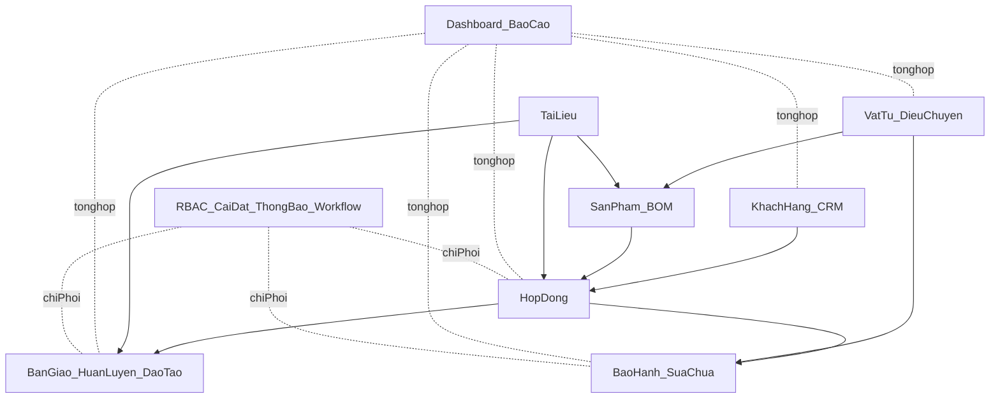

# BRD Tổng Thể ASMS (As-is)

> Tài liệu yêu cầu nghiệp vụ tổng thể cho hệ thống ASMS, mô tả theo hiện trạng triển khai trong code (frontend + backend + database).  
> Phiên bản: 1.0  
> Ngôn ngữ: Tiếng Việt

## 1. Thông tin tài liệu

| Thuộc tính | Giá trị |
|---|---|
| Tên tài liệu | BRD Tổng Thể ASMS (As-is) |
| Mục đích | Thống nhất yêu cầu nghiệp vụ tổng thể để vận hành, kiểm thử, nghiệm thu và mở rộng hệ thống |
| Phạm vi | Toàn bộ nền tảng ASMS: nghiệp vụ hậu mãi + module quản trị + workflow + thông báo + đề tài/công việc |
| Cơ sở tham chiếu | `docs/BRD-ASMS.md`, `docs/SRS-ASMS.md`, `docs/frontend-backend-mapping.md`, `docs/data-model.md` |
| Nguồn sự thật kỹ thuật | `src/App.tsx`, `backend/src/routes/v1/index.ts`, `backend/prisma/schema.prisma`, `backend/src/modules/*` |
| Loại tài liệu | Business Requirements Document (as-is) |

## 2. Tóm tắt điều hành

ASMS là hệ thống quản lý hậu mãi dành cho bối cảnh quốc phòng, bao phủ vòng đời sau bán hàng và sau bàn giao, từ hợp đồng, bàn giao, huấn luyện, bảo hành/sửa chữa, vật tư, sản phẩm, CRM cho đến báo cáo điều hành. Hệ thống vận hành với mô hình RBAC 5 vai trò (`admin`, `manager`, `technician`, `viewer`, `sales`), chạy trên kiến trúc web tập trung dữ liệu, có API chuẩn hóa theo `/api/v1`, lưu trữ trên PostgreSQL, và có cơ chế workflow cấu hình được cho một số nghiệp vụ cốt lõi.

Tài liệu này mô tả yêu cầu nghiệp vụ theo đúng hiện trạng đang chạy, không mô tả mục tiêu tương lai ngoài phạm vi code hiện có.

## 3. Bối cảnh nghiệp vụ và mục tiêu

### 3.1 Bối cảnh

Các đơn vị cần theo dõi tập trung toàn bộ hoạt động hậu mãi thay cho quy trình rời rạc bằng biểu mẫu giấy và file bảng tính. Dữ liệu cần liên thông từ hợp đồng sang vận hành kỹ thuật, chăm sóc khách hàng và báo cáo quản trị.

### 3.2 Mục tiêu nghiệp vụ chính

- Quản lý vòng đời hợp đồng và các nghiệp vụ liên quan sau ký kết.
- Chuẩn hóa quy trình bàn giao, huấn luyện, bảo hành/sửa chữa bằng workflow theo bước.
- Quản lý vật tư và điều chuyển có ràng buộc tồn kho.
- Quản lý sản phẩm, BOM, tài liệu và hồ sơ kỹ thuật.
- Quản lý khách hàng, đầu mối, hoạt động CRM, phản ánh/feedback.
- Cung cấp dashboard và báo cáo điều hành đa chiều.
- Thiết lập quản trị người dùng, vai trò, phân quyền, cấu hình hệ thống, thông báo và audit.

### 3.3 Chỉ số thành công nghiệp vụ (KPI)

- Tỷ lệ hồ sơ hợp đồng có đủ liên kết sản phẩm/tài liệu/đào tạo.
- Tỷ lệ đợt bàn giao và phiếu bảo hành hoàn thành đúng hạn.
- Tỷ lệ điều chuyển vật tư hợp lệ (không âm tồn, không sai lệch kho).
- Tỷ lệ phản hồi/hoạt động CRM được ghi nhận đầy đủ.
- Độ đầy đủ số liệu dashboard/báo cáo so với dữ liệu nghiệp vụ gốc.
- Tỷ lệ tuân thủ phân quyền và truy vết thao tác quan trọng.

## 4. Phạm vi nghiệp vụ

### 4.1 Trong phạm vi

- Xác thực và quản lý phiên đăng nhập.
- Dashboard điều hành.
- Hợp đồng.
- Bàn giao và huấn luyện/coaching.
- Bảo hành/sửa chữa.
- Vật tư và điều chuyển.
- Sản phẩm và BOM.
- Khách hàng, liên hệ, CRM activities, customer feedback.
- Đào tạo (course, trainees, sessions).
- Tài liệu và upload file.
- Đề tài nghiên cứu và công việc.
- Báo cáo tổng hợp và báo cáo chuyên đề.
- Workflow định nghĩa + workflow runtime.
- Người dùng, vai trò, phân quyền, cài đặt hệ thống, thông báo, nhật ký.
- Customer anniversaries và đăng ký nhắc sự kiện.

### 4.2 Ngoài phạm vi

- Thiết kế hạ tầng production chi tiết (HA/DR cụ thể).
- Tích hợp hệ thống ngoài (SSO/ERP/Email gateway/SMS gateway) chưa có trong code.
- Kế hoạch triển khai tổ chức, đào tạo chuyển đổi số, quản trị thay đổi.

## 5. Stakeholders và personas

| Vai trò | Mục tiêu sử dụng chính | Mức can thiệp |
|---|---|---|
| `admin` | Quản trị toàn hệ thống, người dùng, cấu hình, phân quyền, audit | Toàn quyền |
| `manager` | Điều hành nghiệp vụ, phê duyệt, theo dõi hiệu suất, báo cáo | Quản lý nghiệp vụ |
| `technician` | Xử lý vận hành kỹ thuật: bàn giao, bảo hành, vật tư, đào tạo, task | Thực thi kỹ thuật |
| `viewer` | Theo dõi dữ liệu và báo cáo ở chế độ chỉ đọc | Giám sát |
| `sales` | Quản lý khách hàng, hợp đồng, CRM, tài liệu, báo cáo | Kinh doanh |

## 6. Bản đồ năng lực nghiệp vụ (Business Capability Map)

1. Quản trị truy cập và bảo mật.
2. Quản lý hợp đồng và cấu phần thực hiện hợp đồng.
3. Quản lý bàn giao, huấn luyện, đào tạo.
4. Quản lý bảo hành/sửa chữa và chất lượng hậu mãi.
5. Quản lý sản phẩm, vật tư, BOM, điều chuyển.
6. Quản lý khách hàng và quan hệ khách hàng.
7. Quản lý tài liệu nghiệp vụ/kỹ thuật.
8. Quản lý công việc và đề tài.
9. Theo dõi điều hành và báo cáo.
10. Quản trị cấu hình, workflow, quyền động, thông báo và truy vết.

## 7. Kiến trúc nghiệp vụ mức cao

## 8. Luồng nghiệp vụ end-to-end trọng yếu

### 8.1 Luồng hợp đồng đến thực thi hậu mãi

1. Tạo hợp đồng và gắn khách hàng.
2. Gắn sản phẩm theo hợp đồng (`ContractProduct`) và thông số đặc thù (`specValues`).
3. Gắn tài liệu nghiệp vụ và khóa đào tạo/huấn luyện liên quan.
4. Triển khai bàn giao/huấn luyện theo workflow.
5. Phát sinh bảo hành/sửa chữa trong vòng đời sử dụng.
6. Ghi nhận phản ánh khách hàng và tổng hợp báo cáo.

### 8.2 Luồng bảo hành/sửa chữa

1. Tiếp nhận phiếu từ khách hàng.
2. Chuẩn hóa thông tin liên kết hợp đồng-sản phẩm-vật tư.
3. Xử lý theo bước workflow, ghi nhận trạng thái và SLA.
4. Kết thúc phiếu hoặc hủy phiếu theo nghiệp vụ.
5. Dữ liệu đi vào thống kê và cảnh báo.

### 8.3 Luồng vật tư và điều chuyển

1. Quản lý tồn kho vật tư theo kho.
2. Tạo phiếu điều chuyển, hệ thống trừ `available` theo transaction.
3. Theo dõi trạng thái điều chuyển.
4. Nếu xóa phiếu chưa hoàn tất, hệ thống hoàn tồn.

### 8.4 Luồng workflow runtime

1. Chọn workflow active theo `moduleKey`.
2. Khởi tạo `WorkflowInstance` khi record nghiệp vụ được tạo.
3. Người có vai trò hợp lệ thực hiện `approve/reject/skip`.
4. Hệ thống ghi log từng bước và đồng bộ trạng thái thực thể.

## 9. Danh mục yêu cầu chức năng theo phân hệ (FR)

### 9.1 Xác thực và phiên

- Đăng nhập, cấp access token + refresh token.
- Làm mới token, thu hồi token cũ.
- Đăng xuất một phiên hoặc toàn bộ phiên.
- Theo dõi danh sách phiên hoạt động của người dùng.

### 9.2 Dashboard điều hành

- Hiển thị tab tổng hợp đa chiều theo năm/quý/khách hàng.
- Tổng hợp số liệu từ nhiều module nghiệp vụ.
- Cung cấp cảnh báo nghiệp vụ từ dữ liệu hiện có.

### 9.3 Hợp đồng

- CRUD hợp đồng (xóa mềm).
- Gắn/sửa danh sách sản phẩm theo hợp đồng.
- Theo dõi tiến độ và trạng thái vòng đời hợp đồng.
- Liên kết tài liệu, đào tạo, huấn luyện, bảo hành.

### 9.4 Bàn giao và huấn luyện

- CRUD đợt bàn giao theo hợp đồng.
- Theo dõi bước hiện tại và trạng thái thực hiện.
- Quản lý khóa huấn luyện/coaching liên quan.
- Đồng bộ với workflow instance theo module.

### 9.5 Bảo hành/sửa chữa

- CRUD phiếu bảo hành.
- Hỗ trợ loại phiếu, mức ưu tiên, SLA, người xử lý.
- Ràng buộc vật tư theo BOM khi có liên kết sản phẩm.
- Cung cấp thống kê bảo hành (`/warranties/stats`).

### 9.6 Vật tư và điều chuyển

- CRUD vật tư.
- CRUD phiếu điều chuyển.
- Ràng buộc tồn khả dụng khi điều chuyển.
- Cập nhật tồn kho theo trạng thái vòng đời phiếu.

### 9.7 Sản phẩm và BOM

- CRUD sản phẩm.
- Quản lý BOM theo từng sản phẩm.
- Theo dõi trạng thái sản phẩm nhiều pha.
- Liên kết tài liệu, hợp đồng, bảo hành.

### 9.8 Khách hàng và CRM

- CRUD khách hàng.
- CRUD liên hệ đầu mối.
- CRUD hoạt động CRM.
- Ghi nhận phản ánh khách hàng (customer feedback).
- Quản lý anniversaries và đăng ký nhận nhắc.

### 9.9 Đào tạo

- CRUD khóa đào tạo.
- Quản lý học viên (`trainees`).
- Quản lý lịch buổi học (`sessions`).
- Liên kết hợp đồng/khách hàng/giảng viên.

### 9.10 Tài liệu

- Upload tài liệu multipart theo whitelist.
- CRUD metadata tài liệu.
- Liên kết tài liệu với nhiều thực thể nghiệp vụ.

### 9.11 Báo cáo

- Báo cáo tổng hợp theo năm/khoảng thời gian.
- Báo cáo theo dòng sản phẩm.
- Báo cáo phản ánh theo khách hàng/sản phẩm.
- Báo cáo lỗi vật tư và hệ số cảnh báo.

### 9.12 Đề tài và công việc

- CRUD đề tài nghiên cứu.
- CRUD công việc và gán người thực hiện.
- Theo dõi tiến độ, thời hạn và trạng thái.

### 9.13 Cài đặt và quản trị nền tảng

- CRUD người dùng, vai trò, quyền.
- Cấu hình hệ thống (`SystemSetting`).
- Cấu hình danh mục nền (`DataDefinition`).
- Cấu hình thông báo cá nhân.
- Xem audit logs và notifications.

### 9.14 Workflow engine

- CRUD workflow definitions.
- CRUD workflow steps, reorder step.
- Tạo/attach workflow instance cho thực thể.
- Advance workflow và ghi lịch sử xử lý.

## 10. Quy tắc nghiệp vụ trọng yếu (Business Rules)

### 10.1 Quy tắc chung

- API chuẩn theo prefix `/api/v1`.
- Trả dữ liệu theo envelope `{ success, data, message? }`.
- Đa số bảng nghiệp vụ dùng xóa mềm `deletedAt`.
- Các thao tác ghi quan trọng có audit log.

### 10.2 Quy tắc theo module

- Hợp đồng:
  - Trạng thái chuẩn: `draft`, `active`, `completed`, `late`, `liquidated`.
  - Danh sách sản phẩm hợp đồng quản lý qua `ContractProduct`.
- Bàn giao:
  - Ràng buộc logic một số luồng gắn hợp đồng, trạng thái `pending|active|completed|late`.
- Bảo hành:
  - Nếu có `materialIds` thì phải có `productId`.
  - Nếu có `productId` thì phải có liên kết hợp đồng phù hợp.
  - Vật tư gắn bảo hành phải thuộc BOM sản phẩm.
- Vật tư:
  - Điều chuyển bắt buộc đủ `available`.
  - Xóa phiếu chưa `completed` thì hoàn tồn.
- Đào tạo:
  - Tồn tại ràng buộc course kind (`training|coaching`).
  - Một hợp đồng chỉ một khóa `coaching` active.
- Workflow:
  - Người xử lý bước phải khớp `roleCode` hoặc thuộc `assigneeIds` (admin có thể bypass theo runtime).
  - Bước yêu cầu tài liệu sẽ chặn approve nếu thiếu tài liệu.

## 11. Ma trận phân quyền nghiệp vụ

| Phân hệ | admin | manager | technician | viewer | sales |
|---|:---:|:---:|:---:|:---:|:---:|
| Dashboard | x | x | x | x | x |
| Hợp đồng | x | x | - | x(read) | x |
| Bàn giao/Huấn luyện | x | x | x | - | - |
| Bảo hành | x | x | x | - | - |
| Vật tư | x | x | x | - | - |
| Sản phẩm | x | x | x | x(read) | x(read) |
| Khách hàng/CRM | x | x | tùy API đọc/ghi | x(read) | x |
| Báo cáo | x | x | - | x | x |
| Đề tài/Công việc | x | x | x | - | - |
| Đào tạo | x | x | x(đa số ghi, trừ create course tại một số route) | - | - |
| Tài liệu | x | x | x | x(read) | x |
| Cài đặt | x | giới hạn | - | - | - |
| Workflow | x | x | đọc/tiến trình theo vai trò bước | đọc | đọc |

> Ghi chú: ma trận chi tiết cuối cùng thực thi tại backend qua `requireRoles(...)` từng route module.

## 12. Mô hình dữ liệu nghiệp vụ cốt lõi

### 12.1 Nhóm thực thể chính

- Identity & governance: `User`, `Role`, `RolePermission`, `RefreshToken`, `AuditLog`, `SystemSetting`.
- CRM: `Customer`, `Contact`, `CrmActivity`, `CustomerFeedback`, `CustomerAnniversary`, `AnniversarySubscription`.
- Core after-sales: `Contract`, `Handover`, `Warranty`, `TrainingCourse`, `Document`.
- Product-material: `Product`, `ProductBom`, `Material`, `MaterialTransfer`, `ContractProduct`.
- Execution support: `ResearchProject`, `Task`, `Notification`, `UserNotificationPreference`.
- Workflow: `WorkflowDefinition`, `WorkflowStep`, `WorkflowInstance`, `WorkflowStepLog`, `WorkflowInstanceDocument`.

### 12.2 Quan hệ nghiệp vụ cốt lõi

- 1 khách hàng có nhiều hợp đồng, liên hệ, hoạt động CRM, bảo hành, đào tạo, tài liệu.
- 1 hợp đồng liên kết nhiều sản phẩm qua `ContractProduct`.
- 1 sản phẩm có nhiều vật tư thành phần qua `ProductBom`.
- 1 phiếu bảo hành có thể liên kết hợp đồng, sản phẩm và danh sách vật tư.
- 1 khóa đào tạo có nhiều học viên và buổi học.
- 1 workflow definition có nhiều steps và nhiều instances runtime.

### 12.3 Vòng đời trạng thái chính

- Contract: `draft -> active -> completed -> liquidated` (nhánh `late`).
- Handover: `pending -> active -> completed` (nhánh `late`).
- Warranty: `open -> processing -> completed|cancelled`.
- MaterialTransfer: `pending -> processing -> completed`.
- Task: `todo -> in_progress -> review -> completed` (nhánh `delayed`).
- Training: `planned -> ongoing -> completed|cancelled`.

## 13. Yêu cầu phi chức năng (NFR)

### 13.1 Bảo mật và tuân thủ

- JWT cho đa số API nghiệp vụ.
- Refresh token lưu dạng hash.
- Rate limit cho login/refresh/register.
- Header bảo mật cơ bản qua `helmet`.
- CORS cấu hình theo môi trường.

### 13.2 Toàn vẹn dữ liệu

- Validation đầu vào bằng Zod.
- Giao dịch vật tư đảm bảo không âm tồn.
- Ràng buộc uniqueness theo `code` và khóa nghiệp vụ.
- Soft delete để bảo toàn lịch sử nghiệp vụ.

### 13.3 Hiệu năng và khả năng mở rộng

- Caching phía frontend bằng React Query.
- Index cơ sở dữ liệu trên trường tìm kiếm/quan hệ chính.
- Các báo cáo tổng hợp có endpoint chuyên dụng.
- Lưu ý mở rộng: cron nội bộ và lưu file local cần chiến lược scale đa instance.

### 13.4 Quan sát vận hành

- Logging HTTP (`morgan`), audit log nghiệp vụ.
- Health endpoint để giám sát trạng thái dịch vụ.
- Notification scheduler chạy định kỳ 24h.

## 14. Giả định và ràng buộc

### 14.1 Giả định

- Người dùng vận hành theo mô hình vai trò chuẩn.
- Dữ liệu danh mục nền được quản trị đầy đủ trước khi nhập liệu lớn.
- Các module nghiệp vụ dùng chung chuẩn mã (`code`) và chuẩn thời gian ISO.

### 14.2 Ràng buộc

- Một số kiểm soát trạng thái vẫn linh hoạt (không chặn cứng toàn bộ transition ở mọi service).
- Quyền động `role_permissions` đã có dữ liệu nhưng enforcement runtime chính vẫn theo route roles.
- Cơ chế cảnh báo hiện kết hợp logic backend và một phần tính toán frontend.

## 15. Tiêu chí chấp nhận nghiệp vụ tổng thể (UAT-level)

1. Người dùng đăng nhập đúng vai trò chỉ thấy và thao tác được module được cấp quyền.
2. Vòng đời hợp đồng-bàn giao-bảo hành phản ánh đúng dữ liệu liên thông.
3. Điều chuyển vật tư không tạo sai lệch tồn kho trong các tình huống chuẩn.
4. Workflow có thể cấu hình, gắn instance và chạy qua các bước với log đầy đủ.
5. Dashboard và báo cáo phản ánh đúng dữ liệu từ các module nguồn.
6. Thao tác ghi quan trọng có thể truy vết qua nhật ký.
7. Upload tài liệu và liên kết thực thể hoạt động ổn định.

## 16. Phụ lục A - Mapping phân hệ theo route frontend

| Route | Màn hình | Nhóm nghiệp vụ |
|---|---|---|
| `/` | Dashboard | Điều hành |
| `/hop-dong` | Contracts | Hợp đồng |
| `/ban-giao` | Handover | Bàn giao/Huấn luyện |
| `/bao-hanh` | Warranty | Bảo hành |
| `/vat-tu` | Materials | Vật tư |
| `/san-pham` | Products | Sản phẩm |
| `/khach-hang` | Customers | CRM |
| `/bao-cao` | Reports | Báo cáo |
| `/de-tai`, `/de-tai/:id` | Research | Đề tài |
| `/cong-viec` | Tasks | Công việc |
| `/dao-tao`, `/dao-tao/:id` | Training | Đào tạo |
| `/tai-lieu` | Documents | Tài liệu |
| `/quy-trinh*` | Workflows | Workflow |
| `/cai-dat*` | Settings | Quản trị |

## 17. Phụ lục B - Mapping API backend theo nhóm nghiệp vụ

- Auth: `/auth/*`
- Users/Roles/Permissions: `/users`, `/roles`, `/role-permissions`
- Governance: `/audit-logs`, `/system-settings`, `/notifications`, `/notification-preferences`
- CRM: `/customers`, `/contacts`, `/crm-activities`, `/customer-feedbacks`, `/customer-anniversaries`, `/anniversary-subscriptions`
- Core after-sales: `/contracts`, `/handovers`, `/warranties`, `/training`, `/training-courses`
- Product-material: `/products`, `/materials`, `/materials/transfers`
- Documents & reports: `/documents`, `/reports`
- Research & task: `/research-projects`, `/tasks`
- Workflow: `/workflows`, `/workflow-instances`

## 18. Phụ lục C - Thuật ngữ

| Thuật ngữ | Diễn giải |
|---|---|
| ASMS | Hệ thống quản lý hậu mãi |
| RBAC | Phân quyền theo vai trò |
| BOM | Định mức vật tư cho sản phẩm |
| SLA | Thời hạn xử lý cam kết |
| Workflow Instance | Phiên thực thi quy trình trên một bản ghi nghiệp vụ |
| Soft delete | Xóa mềm bằng cột `deletedAt` |

---

Tài liệu BRD tổng thể này là bản as-is theo hiện trạng code tại thời điểm biên soạn, dùng làm chuẩn nghiệp vụ tổng quan cho các hoạt động phân tích, kiểm thử và nghiệm thu.
