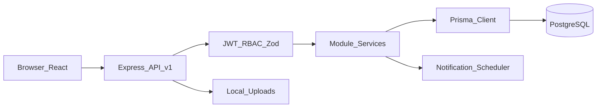
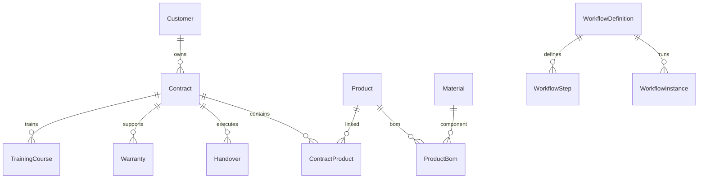

# SRS - Yeu cau chi tiet phan mem ASMS (As-is)

> Tai lieu dac ta yeu cau phan mem cho he thong ASMS, viet theo hien trang code hien tai.  
> Phien ban: 2.0  
> Co so doi chieu: `docs/BRD-TONG-THE-ASMS.md`, `backend/src/routes/v1/index.ts`, `backend/prisma/schema.prisma`.

## Muc luc

1. Gioi thieu
2. Pham vi va gioi han
3. Kien truc tong the
4. Danh sach route frontend
5. Dac ta chuc nang (FR) theo module
6. Dac ta API REST chi tiet
7. Mo hinh du lieu va vong doi trang thai
8. RBAC va mo hinh quyen
9. Bao mat, xac thuc, phien dang nhap
10. NFR, van hanh, trien khai
11. Traceability BRD -> SRS -> API
12. Phu luc

---

## 1. Gioi thieu

### 1.1 Muc dich

Tai lieu nay xac dinh cac yeu cau ky thuat va hanh vi he thong ASMS o muc chi tiet de:
- Dev trien khai/chinh sua khong lech nghiep vu.
- QA/UAT lap test case theo module, API, role.
- Van hanh theo doi duoc rui ro va gioi han he thong.

### 1.2 Dinh nghia ngan

- ASMS: He thong quan ly hau mai.
- FE: React + Vite.
- BE: Express + TypeScript.
- DB: PostgreSQL qua Prisma.
- RBAC: Role-Based Access Control.
- Workflow runtime: phien xu ly buoc phe duyet theo `moduleKey`.

---

## 2. Pham vi va gioi han

### 2.1 Trong pham vi

- Xac thuc, refresh token, session.
- Toan bo nghiep vu: contracts, handovers, warranties, materials, products, customers/CRM, training, documents, reports.
- Module mo rong: workflows, role-permissions, notifications, system-settings, audit-logs, customer-anniversaries, anniversary-subscriptions.
- Research projects va tasks.

### 2.2 Ngoai pham vi

- SSO, ERP integration, message queue ngoai, email gateway chinh thuc.
- Hien thuc HA/DR da node tren production.
- Quan tri CI/CD chi tiet.

---

## 3. Kien truc tong the

### 3.1 Thanh phan

- FE: `src/App.tsx` + `src/pages/*`, goi API qua hooks.
- BE: `backend/src/app.ts`, route prefix `/api/v1`, module pattern `route/controller/service/schema`.
- DB: `backend/prisma/schema.prisma`.
- Upload local: thu muc `uploads`.

### 3.2 So do luong

### 3.3 Quy uoc he thong

- API prefix bat buoc: `/api/v1`.
- Response envelope:
  - Thanh cong: `{ success: true, data, message? }`.
  - That bai: `{ success: false, data?, message }`.
- Input validation: Zod.
- Da so bang nghiep vu su dung soft delete `deletedAt`.

---

## 4. Danh sach route frontend

Nguon: `src/App.tsx`

- `/login`
- `/`
- `/hop-dong`
- `/ban-giao`
- `/bao-hanh`
- `/vat-tu`
- `/san-pham`
- `/khach-hang`
- `/bao-cao`
- `/de-tai`
- `/de-tai/:id`
- `/cong-viec`
- `/dao-tao`
- `/dao-tao/:id`
- `/tai-lieu`
- `/quy-trinh`
- `/quy-trinh/:moduleKey`
- `/quy-trinh/:moduleKey/:workflowId`
- `/cai-dat`
- `/cai-dat/thuoc-tinh`
- `/cai-dat/thuoc-tinh/:moduleKey`

---

## 5. Dac ta chuc nang (FR) theo module

### 5.1 Auth (`FR-AUTH`)

- Login, refresh, logout, session listing, logout-all.
- Access token JWT + refresh token.
- Register mo theo moi truong/cau hinh.
- Rate limit tren auth endpoints.

### 5.2 Users, Roles, RolePermissions (`FR-IAM`)

- Users: CRUD, soft delete, email unique, password hash.
- Roles: quan tri vai tro he thong/tuy bien.
- RolePermissions: luu quyen CRUD theo `moduleKey`.
- Enforcement runtime chinh van dua vao `requireRoles(...)` tren route.

### 5.3 Customers/Contacts/CRM/Feedback (`FR-CRM`)

- Customers: CRUD, search/filter, thong ke contracts count.
- Contacts: CRUD theo customer.
- CRM activities: CRUD hoat dong cham soc (`call|email|meeting|note`).
- Customer feedbacks: CRUD, severity/status, lien ket contract/warranty neu co.
- Customer anniversaries + subscriptions: quan ly su kien va user theo doi.

### 5.4 Contracts (`FR-CT`)

- CRUD hop dong.
- Set danh sach san pham theo hop dong (`ContractProduct`) va `specValues`.
- Quan ly progress/status va lien ket training/handover/warranty/documents.
- Ho tro workflow fields (`workflowId`, `workflowInstanceId`, step payload).

### 5.5 Handovers (`FR-HO`)

- CRUD dot ban giao.
- Quan ly `currentStep`, `status`, due/start/completed dates.
- Luu payload theo buoc workflow (`HandoverStepPayload`).
- Lien ket contract + customer.

### 5.6 Warranties (`FR-WA`)

- CRUD phieu bao hanh/sua chua.
- Rule lien ket: `materialIds` phu thuoc `productId`, product phu thuoc contract trong 1 so case service.
- Quan ly SLA, assignee, workflowStep, workflow instance.
- Co endpoint thong ke: `/warranties/stats`.

### 5.7 Materials (`FR-MAT`)

- CRUD vat tu.
- CRUD phieu dieu chuyen.
- Tao transfer tru `available` theo transaction.
- Xoa transfer chua `completed` se hoan ton.

### 5.8 Products + BOM (`FR-PR`)

- CRUD san pham.
- Quan ly BOM theo material va quantity.
- Specs la JSON schema thong so.
- Lien ket contracts, warranties, documents.

### 5.9 ResearchProjects + Tasks (`FR-RD`, `FR-TK`)

- Research project CRUD + stage/progress/budget fields.
- Task CRUD + assignee/project link + priority/status.
- Task status gom `delayed`.

### 5.10 Training (`FR-TR`)

- Course CRUD (`/training` va alias `/training-courses`).
- Trainees CRUD.
- Sessions CRUD.
- Ho tro `courseKind` (`training|coaching`) va workflow payload.

### 5.11 Documents (`FR-DO`)

- Upload multipart (`/documents/upload`), gioi han kich thuoc, whitelist extension.
- CRUD metadata, lien ket da doi tuong (customer/contract/product/project/training/warranty).

### 5.12 Reports (`FR-RE`)

- Reports summary theo nam/khoang ngay.
- Bao cao bo sung: by-product-line, feedback by customer/product-line, material-defects, badges.
- Phuc vu dashboard va trang reports.

### 5.13 Settings/Governance (`FR-SET`)

- Definitions CRUD + reorder.
- Notification preferences CRUD theo user.
- System settings list/update.
- Notifications read/unread/mark.
- Audit logs read.

### 5.14 Workflow Engine (`FR-WF`)

- Workflow definitions CRUD.
- Workflow steps CRUD/reorder.
- Start/attach/advance workflow instance.
- Workflow documents upload theo step.
- Workflow logs cho runtime.

---

## 6. Dac ta API REST chi tiet

Base URL: `/api/v1`

### 6.1 Nhom endpoint

- Auth: `/auth/*`
- IAM/Governance: `/users`, `/roles`, `/role-permissions`, `/audit-logs`, `/system-settings`, `/notifications`, `/notification-preferences`
- CRM: `/customers`, `/contacts`, `/crm-activities`, `/customer-feedbacks`, `/customer-anniversaries`, `/anniversary-subscriptions`
- Core: `/contracts`, `/handovers`, `/warranties`, `/training`, `/training-courses`
- Product/material: `/products`, `/materials`, `/materials/transfers`
- Docs/reports: `/documents`, `/reports`
- Research/tasks: `/research-projects`, `/tasks`
- Workflow: `/workflows`, `/workflow-instances`

### 6.2 Quy uoc loi

- 400: validation/business rule fail.
- 401: chua auth/invalid token.
- 403: role khong du quyen.
- 404: khong tim thay resource.
- 409: xung dot du lieu (neu service throw tuong ung).
- 500: loi he thong.

### 6.3 API contract muc cao theo module

| Module | Read roles | Write roles | Dac ta them |
|---|---|---|---|
| auth | public | public/guarded | rate limit login/refresh/register |
| users | admin,manager | admin | soft delete |
| roles | admin,manager | admin | role he thong co rang buoc |
| customers | admin,manager,viewer,sales | admin,manager,sales | code unique |
| contacts | admin,manager,technician,viewer,sales (read) | admin,manager,sales | theo customer |
| crm-activities | admin,manager,technician,viewer,sales | admin,manager,technician,sales | co createdBy |
| contracts | admin,manager,viewer,sales | admin,manager,sales | set products endpoint |
| handovers | admin,manager,technician,viewer | admin,manager,technician | workflow payload |
| warranties | admin,manager,technician | admin,manager,technician | stats endpoint |
| materials | admin,manager,technician | admin,manager,technician | transfer transaction |
| products | admin,manager,technician,viewer,sales (read) | admin,manager,technician | BOM APIs |
| research-projects | admin,manager,technician,viewer (read) | admin,manager,technician | stageCode |
| tasks | admin,manager,technician | admin,manager,technician | status lifecycle |
| training | admin,manager,technician (read) | POST mostly admin,manager; PUT/DELETE+subresources co technician | alias training-courses |
| documents | admin,manager,technician,viewer,sales (read) | admin,manager,technician,sales | upload multipart |
| reports | admin,manager,viewer,sales | - | report variants |
| definitions | all authenticated (read) | admin,manager | reorder + usage checks |
| notification-preferences | all authenticated | all authenticated | per user |
| workflows | broad read | admin/manager + step actor runtime | moduleKey scoped |

---

## 7. Mo hinh du lieu va vong doi trang thai

### 7.1 Enum nghiep vu chinh

- User: `active|inactive|suspended`
- Contract: `draft|active|completed|late|liquidated`
- Handover: `pending|active|completed|late`
- Warranty: `open|processing|completed|cancelled`
- MaterialTransfer: `pending|processing|completed`
- ProductStatus: `developing|producing|produced|inspection_submitted|inspecting|inspection_passed|decision_approved|equip_decided|equipped|stopped`
- Task: `todo|in_progress|review|completed|delayed`
- Training: `planned|ongoing|completed|cancelled`
- Attendance: `present|absent|pending`
- Session: `planned|done|cancelled`

### 7.2 Nhom thuc the

- IAM: `Role`, `RolePermission`, `User`, `RefreshToken`
- CRM: `Customer`, `Contact`, `CrmActivity`, `CustomerFeedback`, `CustomerAnniversary`, `AnniversarySubscription`
- Core: `Contract`, `Handover`, `Warranty`, `TrainingCourse`, `Document`
- Inventory/Product: `Material`, `MaterialTransfer`, `Product`, `ProductBom`, `ContractProduct`
- Execution: `ResearchProject`, `Task`
- Governance: `Notification`, `UserNotificationPreference`, `SystemSetting`, `AuditLog`, `DataDefinition`
- Workflow: `WorkflowDefinition`, `WorkflowStep`, `WorkflowInstance`, `WorkflowStepLog`, `WorkflowInstanceDocument`

### 7.3 Quan he chinh

- Customer 1-n Contracts/Contacts/CrmActivities/Warranties/TrainingCourses/Documents.
- Contract n-n Product thong qua `ContractProduct`.
- Product n-n Material thong qua `ProductBom`.
- Warranty co the gan Contract/Product/Assignee + `materialIds`.
- TrainingCourse 1-n Trainee/ScheduleSession.
- WorkflowDefinition 1-n WorkflowStep + 1-n WorkflowInstance.

### 7.4 So do quan he rut gon

### 7.5 Vong doi trang thai (as-is)

- Contract: draft -> active -> completed -> liquidated; co nhanh late.
- Handover: pending -> active -> completed; co nhanh late.
- Warranty: open -> processing -> completed/cancelled.
- Material transfer: pending -> processing -> completed.
- Training: planned -> ongoing -> completed/cancelled.
- Task: todo -> in_progress -> review -> completed; co delayed.

> Luu y: khong phai moi transition deu bi chan cung tai service; mot so luong do FE/nguoi dung dieu khien trong pham vi enum hop le.

---

## 8. RBAC va mo hinh quyen

### 8.1 Vai tro he thong

- `admin`
- `manager`
- `technician`
- `viewer`
- `sales`

### 8.2 Nguon quyen

- FE guard:
  - `src/hooks/use-role.tsx`
  - `ROUTE_PERMISSIONS` fallback
  - co dynamic permission matrix qua API role permissions
- BE enforcement:
  - `requireAuth`
  - `requireRoles([...])` tren tung route

### 8.3 Bieu do quyen tong hop

| Khu vuc | admin | manager | technician | viewer | sales |
|---|:---:|:---:|:---:|:---:|:---:|
| Dashboard | x | x | x | x | x |
| Contracts/CRM/Reports | x | x | gioi han | x(read) | x |
| Handover/Warranty/Materials | x | x | x | - | - |
| Products | x | x | x | x(read) | x(read) |
| Training | x | x | x(phan lon) | - | - |
| Workflows | x | x | role-based runtime | read | read |
| Settings | x | gioi han | - | - | - |

---

## 9. Bao mat, xac thuc, phien dang nhap

### 9.1 Auth flow

1. `POST /auth/login` -> access token + refresh token + user.
2. FE luu token, gan header Bearer.
3. Het han access token -> `POST /auth/refresh`.
4. Logout thu hoi refresh token.

### 9.2 Refresh token policy

- Luu hash SHA-256 trong DB.
- Co han su dung (default 30 ngay theo service env).
- Rotate khi refresh (revoke cu, cap moi).

### 9.3 Upload va du lieu nhay cam

- Upload documents voi gioi han kich thuoc va file ext whitelist.
- Password hash bang bcrypt.
- JWT secret tu env, khong hardcode.

### 9.4 Security middleware

- `helmet`, `cors`, auth middleware, rate limit auth endpoints.
- Error handler khong lo stack trace trong response business.

---

## 10. NFR, van hanh, trien khai

### 10.1 Hieu nang

- FE cache voi React Query (`staleTime` 30s).
- DB indexes tren cac FK/status/date fields.
- Bao cao va thong ke dung endpoint rieng.

### 10.2 Tin cay va toan ven

- Transaction cho material transfer.
- Soft delete giup truy vet va an toan du lieu.
- Audit log cho thao tac quan trong.

### 10.3 Van hanh

- Health endpoint.
- Notification scheduler quet dinh ky 24h.
- Dockerfiles/compose co san cho FE/BE va local DB.

### 10.4 Han che ky thuat as-is

- Role permission dong chua phai nguon enforcement duy nhat.
- Workflow/state transition chua chan cung tat ca nhanh.
- Upload local filesystem chua toi uu cho multi-instance.

---

## 11. Traceability BRD -> SRS -> API

| BRD capability | SRS section | API/Module chinh |
|---|---|---|
| Quan ly hop dong | 5.4, 6 | `/contracts`, `/contracts/:id/products` |
| Ban giao/huan luyen | 5.5, 5.10, 5.14 | `/handovers`, `/training`, `/workflows` |
| Bao hanh/sua chua | 5.6 | `/warranties`, `/warranties/stats` |
| Vat tu/BOM | 5.7, 5.8 | `/materials`, `/materials/transfers`, `/products/:id/bom` |
| CRM/khach hang | 5.3 | `/customers`, `/contacts`, `/crm-activities`, `/customer-feedbacks` |
| Bao cao | 5.12, 6 | `/reports`, `/reports/*` |
| Quan tri he thong | 5.2, 5.13 | `/users`, `/roles`, `/definitions`, `/system-settings`, `/audit-logs` |
| Workflow runtime | 5.14 | `/workflows`, `/workflow-instances` |

---

## 12. Phu luc

### 12.1 Danh sach route backend da dang ky

Nguon: `backend/src/routes/v1/index.ts`

- `/auth`
- `/users`
- `/roles`
- `/audit-logs`
- `/system-settings`
- `/notifications`
- `/customers`
- `/contacts`
- `/crm-activities`
- `/customer-feedbacks`
- `/role-permissions`
- `/contracts`
- `/handovers`
- `/warranties` (+ `/warranties/stats`)
- `/materials`
- `/products`
- `/research-projects`
- `/tasks`
- `/training`
- `/training-courses`
- `/documents`
- `/reports`
- `/definitions`
- `/notification-preferences`
- `/workflows`
- `/workflow-instances`
- `/customer-anniversaries`
- `/anniversary-subscriptions`

### 12.2 Ghi chu tinh nhat quan thuat ngu

- Luon dung `moduleKey` cho workflow/permission context.
- Phan biet `code` (ma nghiep vu) va `id` (internal cuid).
- Thuat ngu "xoa mem" = `deletedAt` khac null.

---

**Ket thuc SRS-ASMS v2.0 (as-is).**
