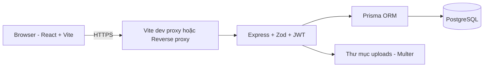
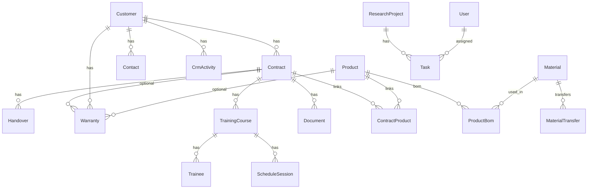
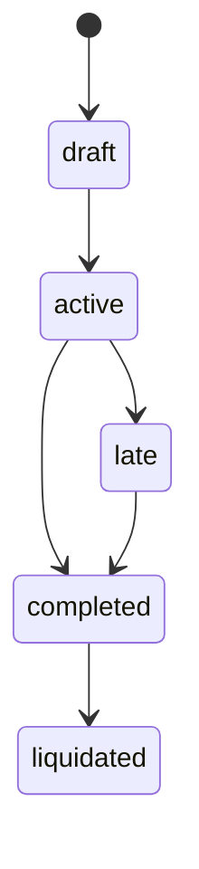
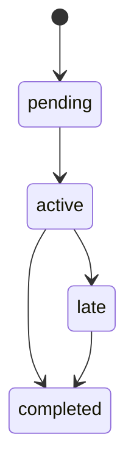
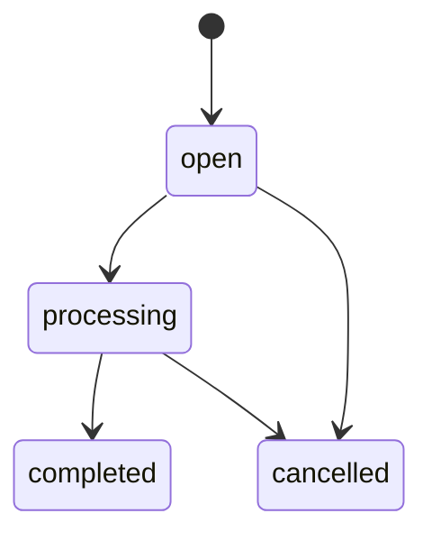
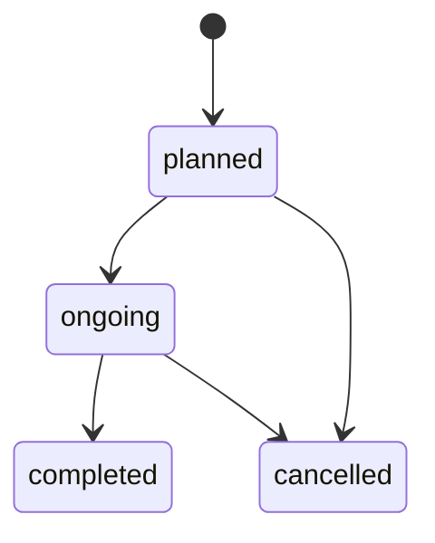
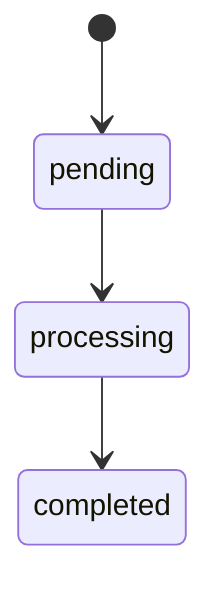
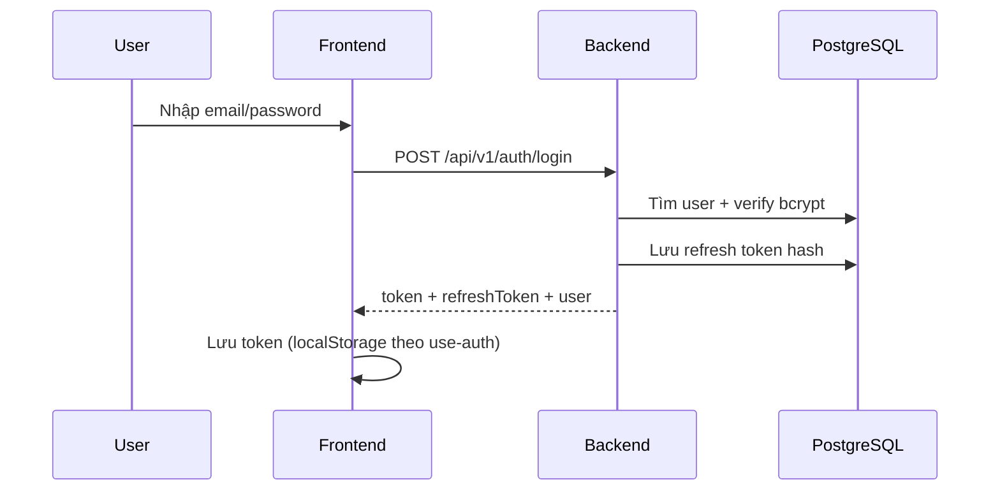
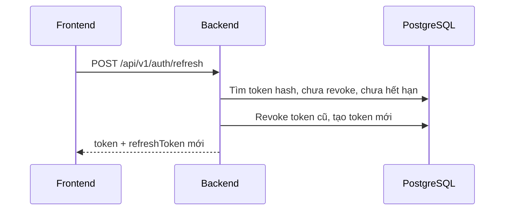

# SRS — Yêu cầu chi tiết phần mềm (ASMS)

> **Tài liệu yêu cầu phần mềm (SRS) — Hệ thống quản lý hậu mãi (ASMS)**  
> Phiên bản: 1.1 — Khớp với mã nguồn hiện tại trong thư mục dự án.  
> Cách viết: theo dạng tài liệu yêu cầu phần mềm (rút gọn), kèm mô tả API, cơ sở dữ liệu và phân quyền đúng như code đang chạy.  
> **Cách đọc:** Cố gắng dùng **tiếng Việt dễ hiểu**. Các từ in `code` (tên API, tên bảng, tên biến) giữ nguyên vì là tên trong chương trình.

## Mục lục

1. [Giới thiệu](#1-giới-thiệu)
2. [Mô tả tổng thể](#2-mô-tả-tổng-thể)
3. [Yêu cầu chức năng chi tiết (FR)](#3-yêu-cầu-chức-năng-chi-tiết-fr)
4. [Mô hình dữ liệu](#4-mô-hình-dữ-liệu)
5. [Đặc tả API REST](#5-đặc-tả-api-rest)
6. [Các trạng thái nghiệp vụ và quy trình](#6-các-trạng-thái-nghiệp-vụ-và-quy-trình)
7. [Ma trận RBAC](#7-ma-trận-rbac)
8. [Luồng đăng nhập và bảo mật](#8-luồng-đăng-nhập-và-bảo-mật)
9. [Hiệu năng, bảo mật và vận hành](#9-hiệu-năng-bảo-mật-và-vận-hành)
10. [Dashboard và nguồn dữ liệu](#10-dashboard-và-nguồn-dữ-liệu)
11. [Cách xếp thư mục mã nguồn](#11-cách-xếp-thư-mục-mã-nguồn)
12. [Hướng cải tiến sau này](#12-hướng-cải-tiến-sau-này)
13. [Phụ lục](#13-phụ-lục)

**Tài liệu nghiệp vụ liên kết:** [docs/BRD-ASMS.md](BRD-ASMS.md)

---

## 1. Giới thiệu

### 1.1 Mục đích

Tài liệu này mô tả **cách hệ thống ASMS hoạt động kỹ thuật**: bố cục phần mềm, đường dẫn màn hình, API `/api/v1`, cách lưu dữ liệu (Prisma + PostgreSQL), **phân quyền theo vai trò (RBAC)**, cách đăng nhập (JWT và token làm mới), cách báo lỗi, và cách màn **Dashboard** lấy số liệu — dùng cho lập trình, kiểm thử và vận hành.

### 1.2 Phạm vi

- **Thuộc tài liệu:** trang web React (Vite) + máy chủ Node.js (Express) + PostgreSQL + Prisma; danh sách API đã đăng ký tại [backend/src/routes/v1/index.ts](../backend/src/routes/v1/index.ts).
- **Không thuộc tài liệu:** chi tiết máy chủ production (Kubernetes, CDN, cơ sở dữ liệu nhiều máy), quy trình CI/CD, đăng nhập một lần (SSO) với hệ thống ngoài.

### 1.3 Định nghĩa và viết tắt


| Thuật ngữ | Ý nghĩa                                        |
| --------- | ---------------------------------------------- |
| ASMS      | Hệ thống quản lý hậu mãi                       |
| API       | REST JSON qua prefix `/api/v1`                 |
| JWT       | JSON Web Token (access token)                  |
| RBAC      | Phân quyền theo vai trò (ai được xem / sửa gì) |
| ORM       | Công cụ Prisma để làm việc với cơ sở dữ liệu   |
| FE        | Phần giao diện (React)                         |
| BE        | Phần máy chủ (Express)                         |


### 1.4 Tài liệu tham chiếu


| Tài liệu                        | Đường dẫn                                                             |
| ------------------------------- | --------------------------------------------------------------------- |
| BRD tổng thể                    | [docs/BRD-ASMS.md](BRD-ASMS.md)                                       |
| BRD theo màn (legacy)           | [docs/BRD-chuc-nang-tung-man-ASMS.md](BRD-chuc-nang-tung-man-ASMS.md) |
| Rà soát chức năng               | [docs/ra-soat-chuc-nang-he-thong.md](ra-soat-chuc-nang-he-thong.md)   |
| Danh sách mô hình dữ liệu (cũ)  | [docs/data-model.md](data-model.md)                                   |
| Quy ước dự án                   | [.cursorrules](../.cursorrules)                                       |
| Cấu trúc cơ sở dữ liệu (Prisma) | [backend/prisma/schema.prisma](../backend/prisma/schema.prisma)       |


### 1.5 Tổng quan tài liệu

Mục [3](#3-yêu-cầu-chức-năng-chi-tiết-fr) nối yêu cầu nghiệp vụ (BRD) với yêu cầu phần mềm có mã `FR-`*. Mục [5](#5-đặc-tả-api-rest) là **chuẩn chính xác** cho từng đường dẫn API (khớp file `route.ts`). Mục [4](#4-mô-hình-dữ-liệu) khớp file cấu hình Prisma.

---

## 2. Mô tả tổng thể

### 2.1 Bối cảnh sản phẩm

ASMS hỗ trợ quản lý hậu mãi: hợp đồng, bàn giao, đào tạo, bảo hành và sửa chữa, vật tư, sản phẩm, chăm sóc khách hàng (CRM), báo cáo — dữ liệu nằm trên **một cơ sở dữ liệu**, có **xóa mềm** (ẩn bản ghi, không xóa hẳn) và **phân quyền theo vai trò**.

### 2.2 Người dùng và vai trò

Các vai trò trong hệ thống (trường `role` trên token JWT khớp cột `Role.code` trong cơ sở dữ liệu): `admin`, `manager`, `technician`, `viewer`, `sales`.  
Phần giao diện dùng [src/hooks/use-role.tsx](../src/hooks/use-role.tsx) để biết ai được vào màn nào; [src/components/layout/ProtectedRoute.tsx](../src/components/layout/ProtectedRoute.tsx) chặn màn không đủ quyền.

### 2.3 Môi trường vận hành điển hình

- **Giao diện:** cần Node.js từ 18 trở lên, cài gói bằng `pnpm` hoặc `npm`, chạy thử bằng Vite; đường `/api` được chuyển tiếp sang máy chủ (xem `vite.config.ts`).
- **Máy chủ:** Node.js, chạy nguồn bằng `tsx` hoặc dịch bằng `tsc`; khi cài đặt mặc định cổng dev thường là `4000`.
- **Cơ sở dữ liệu:** PostgreSQL; chuỗi kết nối đặt trong biến `DATABASE_URL` ở [backend/.env](../backend/.env) (không đưa file này lên git nếu có mật khẩu).

### 2.4 Kiến trúc tổng thể




### 2.5 Ràng buộc thiết kế (bắt buộc)


| ID   | Ràng buộc                                                                                                  | Tham chiếu mã                                                                                                                                      |
| ---- | ---------------------------------------------------------------------------------------------------------- | -------------------------------------------------------------------------------------------------------------------------------------------------- |
| C-01 | Mọi API nghiệp vụ dùng prefix `/api/v1`                                                                    | [backend/src/app.ts](../backend/src/app.ts)                                                                                                        |
| C-02 | Trả lời JSON cùng một dạng `{ success, data, message? }`                                                   | [backend/src/lib/response.ts](../backend/src/lib/response.ts), [backend/src/middleware/errorHandler.ts](../backend/src/middleware/errorHandler.ts) |
| C-03 | Dữ liệu gửi lên (body/query) được kiểm tra bằng thư viện Zod (`validateBody`)                              | [backend/src/middleware/validate.ts](../backend/src/middleware/validate.ts)                                                                        |
| C-04 | Xóa mềm: cột `deletedAt` trên hầu hết bảng nghiệp vụ                                                       | [backend/prisma/schema.prisma](../backend/prisma/schema.prisma)                                                                                    |
| C-05 | Phải có JWT hợp lệ với các route đã bật `router.use(requireAuth)` (trừ các API đăng nhập mở cho mọi người) | Từng file `route.ts` trong từng module                                                                                                             |


---

## 3. Yêu cầu chức năng chi tiết (FR)

Quy ước mã: `FR-<MODULE>-<số>`. Mỗi dòng gồm: **Khi nào** (người dùng / hệ thống làm gì) → **Chương trình làm gì** → **Kiểm tra dữ liệu** → **Khi sai** → **Ai được phép** (RBAC) → **Cần phần nào khác** (nếu có).

### 3.1 Xác thực (`auth`)


| Mã         | Mô tả                                                                                                                                                                         |
| ---------- | ----------------------------------------------------------------------------------------------------------------------------------------------------------------------------- |
| FR-AUTH-01 | Người dùng gửi `POST /auth/login` với email và mật khẩu → máy chủ trả `token`, `refreshToken`, `user` hoặc mã 401 nếu sai. Có giới hạn số lần gọi (rate limit).               |
| FR-AUTH-02 | `POST /auth/refresh` kèm `refreshToken` → cấp bộ token mới và **huỷ** token làm mới cũ. Có rate limit.                                                                        |
| FR-AUTH-03 | `POST /auth/logout` kèm `refreshToken` → huỷ hiệu lực token làm mới; gọi nhiều lần vẫn an toàn (không gây lỗi thừa).                                                          |
| FR-AUTH-04 | `POST /auth/register` — trên môi trường thật thường **tắt** đăng ký công khai; môi trường dev theo biến `AUTH_ALLOW_PUBLIC_REGISTRATION` hoặc chỉ `admin` được tạo tài khoản. |


**Phân quyền:** các API trên **không** bắt buộc đăng nhập trước (`requireAuth`) — xem [backend/src/modules/auth/route.ts](../backend/src/modules/auth/route.ts).

### 3.2 Người dùng (`users`)


| Mã        | Mô tả                                                                                      |
| --------- | ------------------------------------------------------------------------------------------ |
| FR-USR-01 | Thêm / sửa / xóa người dùng: chỉ `admin`; xem danh sách và chi tiết: `admin` và `manager`. |
| FR-USR-02 | Mật khẩu lưu dạng băm bcrypt; email không được trùng.                                      |


### 3.3 Khách hàng (`customers`)


| Mã        | Mô tả                                                                                                          |
| --------- | -------------------------------------------------------------------------------------------------------------- |
| FR-CUS-01 | Khách hàng — xem: `admin, manager, viewer, sales`; thêm/sửa/xóa: `admin, manager, sales`.                      |
| FR-CUS-02 | Mã `code` khách hàng không trùng; các số `contractsCount`, `activeContracts` do tầng service tính và cập nhật. |


### 3.4 Đầu mối liên hệ (`contacts`)


| Mã        | Mô tả                                                                                                      |
| --------- | ---------------------------------------------------------------------------------------------------------- |
| FR-CON-01 | Đầu mối liên hệ theo `customerId` — nhiều vai trò được xem; chỉ `admin, manager, sales` được thêm/sửa/xóa. |


### 3.5 Hoạt động CRM (`crm-activities`)


| Mã        | Mô tả                                               |
| --------- | --------------------------------------------------- |
| FR-CRM-01 | Hoạt động CRM — loại `call                          |
| FR-CRM-02 | Khi có người đăng nhập, lưu `createdById` (ai tạo). |


### 3.6 Hợp đồng (`contracts`)


| Mã       | Mô tả                                                                                                                                                                      |
| -------- | -------------------------------------------------------------------------------------------------------------------------------------------------------------------------- |
| FR-CT-01 | Xem danh sách và chi tiết hợp đồng: `admin, manager, viewer, sales`.                                                                                                       |
| FR-CT-02 | Thêm / sửa / xóa mềm hợp đồng: `admin, manager, sales`.                                                                                                                    |
| FR-CT-03 | `PUT /contracts/:id/products` — thay toàn bộ danh sách sản phẩm gắn hợp đồng (`ContractProduct`, quan hệ nhiều-nhiều); mỗi dòng có `quantity` và `specValues` (dạng JSON). |
| FR-CT-04 | `PUT /contracts/:id/products/:productId` — sửa **một** dòng liên kết; có thể gửi `specValues` và/hoặc `quantity`.                                                          |
| FR-CT-05 | Số `products` (kiểu số nguyên) trên bản ghi `Contract` là số liệu tổng hợp; khi tạo hợp đồng, giao diện cần gửi đúng theo `createContractSchema`.                          |


### 3.7 Bàn giao (`handovers`)


| Mã       | Mô tả                                                                             |
| -------- | --------------------------------------------------------------------------------- |
| FR-HO-01 | Bàn giao — xem thêm vai trò `viewer`; thêm/sửa/xóa: `admin, manager, technician`. |
| FR-HO-02 | `currentStep` 1..5, `status` enum `HandoverStatus`.                               |


### 3.8 Bảo hành / Sửa chữa (`warranties`)


| Mã       | Mô tả                                                         |
| -------- | ------------------------------------------------------------- |
| FR-WA-01 | Phiếu bảo hành / sửa chữa — chỉ `admin, manager, technician`. |
| FR-WA-02 | Bước xử lý `workflowStep` từ 1 đến 6; trạng thái `open        |


### 3.9 Vật tư và điều chuyển (`materials`)


| Mã        | Mô tả                                                                                                                                        |
| --------- | -------------------------------------------------------------------------------------------------------------------------------------------- |
| FR-MAT-01 | Vật tư — xem và sửa: `admin, manager, technician`.                                                                                           |
| FR-MAT-02 | Tạo phiếu điều chuyển trong **một giao dịch** cơ sở dữ liệu: trừ `Material.available` ít nhất bằng `quantity`; không đủ tồn thì trả lỗi 400. |
| FR-MAT-03 | Xóa mềm phiếu điều chuyển: nếu chưa `completed` thì cộng lại `available` đúng bằng `quantity`.                                               |


### 3.10 Sản phẩm và BOM (`products`)


| Mã       | Mô tả                                                                                                                         |
| -------- | ----------------------------------------------------------------------------------------------------------------------------- |
| FR-PR-01 | Sản phẩm — xem thêm `viewer, sales`; thêm/sửa/xóa: `admin, manager, technician`.                                              |
| FR-PR-02 | Trường `specs` (JSON) là danh sách thông số kỹ thuật: mỗi phần tử có `key`, `label`, có thể có `unit`.                        |
| FR-PR-03 | Định mức vật tư (BOM): `POST /products/:id/bom`, `PUT /products/:id/bom/:materialId`, `DELETE /products/:id/bom/:materialId`. |


### 3.11 Đề tài nghiên cứu (`research-projects`)


| Mã       | Mô tả                                                                              |
| -------- | ---------------------------------------------------------------------------------- |
| FR-RP-01 | Đề tài nghiên cứu — xem thêm `viewer`; thêm/sửa/xóa: `admin, manager, technician`. |


### 3.12 Công việc (`tasks`)


| Mã       | Mô tả                                                                                |
| -------- | ------------------------------------------------------------------------------------ |
| FR-TK-01 | Công việc (task); có thể gắn `projectId` (đề tài) và `assigneeId` (người được giao). |


### 3.13 Đào tạo (`training`)


| Mã       | Mô tả                                                                                                                                       |
| -------- | ------------------------------------------------------------------------------------------------------------------------------------------- |
| FR-TR-01 | Khóa đào tạo — xem: `admin, manager, technician`; **tạo khóa mới** chỉ `admin, manager`.                                                    |
| FR-TR-02 | Học viên: `/training/:id/trainees`.                                                                                                         |
| FR-TR-03 | Buổi học: `/training/:id/sessions`.                                                                                                         |
| FR-TR-04 | Đường dẫn `/training-courses` là **cùng một bộ API** với `/training` ([backend/src/routes/v1/index.ts](../backend/src/routes/v1/index.ts)). |


### 3.14 Tài liệu (`documents`)


| Mã       | Mô tả                                                                                                                                             |
| -------- | ------------------------------------------------------------------------------------------------------------------------------------------------- |
| FR-DO-01 | `POST /documents/upload` — gửi file (kiểu multipart), tên trường `file`, tối đa 20MB, chỉ một số đuôi file được phép (chi tiết trong `route.ts`). |
| FR-DO-02 | Thông tin mô tả tài liệu (tên, loại, liên kết…); có thể gắn tới `customer`, `contract`, `product`, `project`, `trainingCourse` hoặc để trống.     |


### 3.15 Báo cáo (`reports`)


| Mã       | Mô tả                                                                                                                             |
| -------- | --------------------------------------------------------------------------------------------------------------------------------- |
| FR-RE-01 | `GET /reports?year=YYYY` — báo cáo tổng hợp theo năm (cách lọc ngày tùy từng loại số liệu); xem: `admin, manager, viewer, sales`. |


### 3.16 Danh mục nền (`definitions`)


| Mã       | Mô tả                                                                                                                   |
| -------- | ----------------------------------------------------------------------------------------------------------------------- |
| FR-DF-01 | Danh mục nền `DataDefinition` (nhóm + mã + nhãn); mọi vai trò đã đăng nhập đều xem được; chỉ `admin, manager` được sửa. |


### 3.17 Cấu hình thông báo (`notification-preferences`)


| Mã       | Mô tả                                                                                               |
| -------- | --------------------------------------------------------------------------------------------------- |
| FR-NP-01 | Xem và cập nhật cài đặt thông báo của chính user; nội dung gửi lên là danh sách `{ key, enabled }`. |


---

## 4. Mô hình dữ liệu

### 4.1 File chuẩn cho cấu trúc dữ liệu

Mọi kiểu liệt kê (enum), bảng (model), quan hệ và chỉ mục đều nằm trong: [backend/prisma/schema.prisma](../backend/prisma/schema.prisma).

### 4.2 Các giá trị cố định (enum) trong hệ thống


| Enum                     | Giá trị                                                          |
| ------------------------ | ---------------------------------------------------------------- |
| `UserStatus`             | `active`, `inactive`, `suspended`                                |
| `ContractStatus`         | `draft`, `active`, `completed`, `late`, `liquidated`             |
| `HandoverStatus`         | `pending`, `active`, `completed`, `late`                         |
| `WarrantyType`           | `warranty`, `repair`, `maintenance`                              |
| `WarrantyPriority`       | `low`, `medium`, `high`, `urgent`                                |
| `WarrantyStatus`         | `open`, `processing`, `completed`, `cancelled`                   |
| `MaterialType`           | `identified`, `consumable`                                       |
| `MaterialTransferType`   | `contract`, `warranty`, `repair`                                 |
| `MaterialTransferStatus` | `pending`, `processing`, `completed`                             |
| `ProductStatus`          | `developing`, `producing`, `equipped`, `stopped`                 |
| `ProjectStatus`          | `planning`, `active`, `completed`, `suspended`                   |
| `TaskPriority`           | `low`, `medium`, `high`, `urgent`                                |
| `TaskStatus`             | `todo`, `in_progress`, `review`, `completed`, `delayed`          |
| `TaskType`               | `research`, `report`, `fieldwork`, `admin`, `review`             |
| `TrainingType`           | `internal`, `external`, `online`                                 |
| `TrainingStatus`         | `planned`, `ongoing`, `completed`, `cancelled`                   |
| `AttendanceStatus`       | `present`, `absent`, `pending`                                   |
| `SessionStatus`          | `planned`, `done`, `cancelled`                                   |
| `DocumentCategory`       | `contract`, `technical`, `policy`, `training`, `report`, `other` |
| `FileType`               | `pdf`, `doc`, `xls`, `img`, `other`                              |
| `CrmActivityType`        | `call`, `email`, `meeting`, `note`                               |
| `CrmActivityStatus`      | `scheduled`, `done`                                              |


### 4.3 Tóm tắt bảng dữ liệu (model) và xóa mềm


| Model                        | Bảng                            | Xóa mềm (`deletedAt`) | Ghi chú                                                                                                               |
| ---------------------------- | ------------------------------- | --------------------- | --------------------------------------------------------------------------------------------------------------------- |
| `Role`                       | `roles`                         | Có                    |                                                                                                                       |
| `User`                       | `users`                         | Có                    | FK `roleId`                                                                                                           |
| `RefreshToken`               | `refresh_tokens`                | Có                    | `tokenHash` không trùng                                                                                               |
| `UserNotificationPreference` | `user_notification_preferences` | **Không**             | Mỗi cặp `(userId, key)` chỉ một dòng                                                                                  |
| `Customer`                   | `customers`                     | Có                    |                                                                                                                       |
| `Contact`                    | `contacts`                      | Có                    | FK `customerId`                                                                                                       |
| `CrmActivity`                | `crm_activities`                | Có                    | FK `customerId`, `createdById?`                                                                                       |
| `Contract`                   | `contracts`                     | Có                    | FK `customerId`, `createdById?`                                                                                       |
| `Handover`                   | `handovers`                     | Có                    | FK `contractId`, `customerId`                                                                                         |
| `Warranty`                   | `warranties`                    | Có                    | Khách `customerId`; có thể có `contractId`, `productId`, `assigneeId`                                                 |
| `Material`                   | `materials`                     | Có                    | `quantity`, `available`                                                                                               |
| `MaterialTransfer`           | `material_transfers`            | Có                    | FK `materialId`                                                                                                       |
| `Product`                    | `products`                      | Có                    | `specs` dạng JSON; có thể có `contractId`, `customerId` (cách cũ); liên kết nhiều hợp đồng qua bảng `ContractProduct` |
| `ContractProduct`            | `contract_products`             | Có                    | `specValues` Json                                                                                                     |
| `ProductBom`                 | `product_boms`                  | **Không**             | Mỗi cặp `(productId, materialId)` chỉ một dòng                                                                        |
| `ResearchProject`            | `research_projects`             | Có                    | `managerId?`                                                                                                          |
| `Task`                       | `tasks`                         | Có                    | `projectId?`, `assigneeId?`                                                                                           |
| `TrainingCourse`             | `training_courses`              | Có                    | `contractId?`, `customerId?`, `instructorId?`                                                                         |
| `Trainee`                    | `trainees`                      | Có                    | FK `trainingCourseId`                                                                                                 |
| `ScheduleSession`            | `schedule_sessions`             | Có                    | FK `trainingCourseId`                                                                                                 |
| `Document`                   | `documents`                     | Có                    | Có thể liên kết tới nhiều đối tượng (tùy chọn)                                                                        |
| `DataDefinition`             | `data_definitions`              | Có                    | `category`, `code`, `label`                                                                                           |


### 4.4 Sơ đồ quan hệ bảng (rút gọn)




### 4.5 Cụm Hợp đồng — Sản phẩm — Thông số theo hợp đồng

- `Product.specs`: **khuôn** thông số chung của sản phẩm.
- `ContractProduct.specValues`: **giá trị thực tế** theo từng hợp đồng (dạng `key → chuỗi`).

---

## 5. Đặc tả API REST

**Base URL:** `/api/v1`  
**Header:** `Authorization: Bearer <access_token>` (trừ auth công khai).

### 5.1 Cách trả lời khi thành công và khi lỗi

- **Thành công:** `{ "success": true, "data": ..., "message?": ... }` ([sendSuccess](../backend/src/lib/response.ts)).
- **Lỗi có mã HTTP rõ:** dùng `HttpError`; nội dung `{ "success": false, "data": <chi tiết kiểm tra Zod hoặc null>, "message": "..." }` ([errorHandler](../backend/src/middleware/errorHandler.ts)).
- **Lỗi kiểm tra dữ liệu (Zod):** thường mã 400, trong `data` có `fieldErrors` hoặc `formErrors` (theo middleware validate).

### 5.2 Bảng API theo từng phần hệ thống

> Ghi chú: `:id` ở nhiều API có thể là **mã nội bộ dạng cuid** hoặc **mã code** tùy từng module (máy chủ tìm theo kiểu “hoặc id hoặc code” — ví dụ phiếu điều chuyển vật tư trong service).

#### Auth — `/auth`


| Phương thức | Đường dẫn        | Dữ liệu (Zod)        | Ai được gọi                            |
| ----------- | ---------------- | -------------------- | -------------------------------------- |
| POST        | `/auth/login`    | `loginSchema`        | Mở cho mọi người + giới hạn số lần gọi |
| POST        | `/auth/register` | `registerSchema`     | Tùy cấu hình môi trường (xem route)    |
| POST        | `/auth/refresh`  | `refreshTokenSchema` | Mở cho mọi người + giới hạn số lần gọi |
| POST        | `/auth/logout`   | `logoutSchema`       | Mở cho mọi người                       |


#### Users — `/users`


| Phương thức | Đường dẫn    | Dữ liệu gửi        | Ai được xem    | Ai được sửa |
| ----------- | ------------ | ------------------ | -------------- | ----------- |
| GET         | `/users`     | —                  | admin, manager | —           |
| GET         | `/users/:id` | —                  | admin, manager | —           |
| POST        | `/users`     | `createUserSchema` | —              | admin       |
| PUT         | `/users/:id` | `updateUserSchema` | —              | admin       |
| DELETE      | `/users/:id` | —                  | —              | admin       |


#### Customers — `/customers`


| Phương thức         | Đường dẫn                      | Dữ liệu gửi                                     | Ai được xem                   | Ai được sửa           |
| ------------------- | ------------------------------ | ----------------------------------------------- | ----------------------------- | --------------------- |
| GET/POST/PUT/DELETE | `/customers`, `/customers/:id` | `createCustomerSchema` / `updateCustomerSchema` | admin, manager, viewer, sales | admin, manager, sales |


#### Contacts — `/contacts`


| Phương thức         | Đường dẫn   | Dữ liệu gửi                                   | Ai được xem                               | Ai được sửa           |
| ------------------- | ----------- | --------------------------------------------- | ----------------------------------------- | --------------------- |
| GET                 | `/contacts` | Tham số lọc trên URL (thường có `customerId`) | admin, manager, technician, viewer, sales | —                     |
| GET/POST/PUT/DELETE | `...`       | `createContactSchema` / `updateContactSchema` | Giống trên                                | admin, manager, sales |


#### CRM Activities — `/crm-activities`


| Phương thức         | Đường dẫn                                | Dữ liệu gửi                                           | Ai được xem                | Ai được sửa        |
| ------------------- | ---------------------------------------- | ----------------------------------------------------- | -------------------------- | ------------------ |
| GET/POST/PUT/DELETE | `/crm-activities`, `/crm-activities/:id` | `createCrmActivitySchema` / `updateCrmActivitySchema` | Xem: có technician, viewer | Sửa: có technician |


#### Contracts — `/contracts`


| Phương thức | Đường dẫn                            | Dữ liệu gửi                   | Ai được xem                   | Ai được sửa           |
| ----------- | ------------------------------------ | ----------------------------- | ----------------------------- | --------------------- |
| GET         | `/contracts`                         | —                             | admin, manager, viewer, sales | —                     |
| GET         | `/contracts/:id`                     | —                             | admin, manager, viewer, sales | —                     |
| POST        | `/contracts`                         | `createContractSchema`        | —                             | admin, manager, sales |
| PUT         | `/contracts/:id`                     | `updateContractSchema`        | —                             | admin, manager, sales |
| PUT         | `/contracts/:id/products`            | `setContractProductsSchema`   | —                             | admin, manager, sales |
| PUT         | `/contracts/:id/products/:productId` | `updateContractProductSchema` | —                             | admin, manager, sales |
| DELETE      | `/contracts/:id`                     | —                             | —                             | admin, manager, sales |


#### Handovers — `/handovers`


| Phương thức         | Đường dẫn                      | Dữ liệu gửi                                     | Ai được xem                        | Ai được sửa                |
| ------------------- | ------------------------------ | ----------------------------------------------- | ---------------------------------- | -------------------------- |
| GET/POST/PUT/DELETE | `/handovers`, `/handovers/:id` | `createHandoverSchema` / `updateHandoverSchema` | admin, manager, technician, viewer | admin, manager, technician |


#### Warranties — `/warranties`


| Phương thức         | Đường dẫn                        | Dữ liệu gửi                                     | Ai được dùng               |
| ------------------- | -------------------------------- | ----------------------------------------------- | -------------------------- |
| GET/POST/PUT/DELETE | `/warranties`, `/warranties/:id` | `createWarrantySchema` / `updateWarrantySchema` | admin, manager, technician |


#### Materials — `/materials`


| Phương thức | Đường dẫn                  | Dữ liệu gửi                    | Ai được xem                | Ai được sửa                |
| ----------- | -------------------------- | ------------------------------ | -------------------------- | -------------------------- |
| GET         | `/materials`               | —                              | admin, manager, technician | —                          |
| GET         | `/materials/transfers`     | —                              | admin, manager, technician | —                          |
| GET         | `/materials/:id`           | —                              | admin, manager, technician | —                          |
| POST        | `/materials`               | `createMaterialSchema`         | —                          | admin, manager, technician |
| PUT/DELETE  | `/materials/:id`           | `updateMaterialSchema`         | —                          | admin, manager, technician |
| POST        | `/materials/transfers`     | `createMaterialTransferSchema` | —                          | admin, manager, technician |
| PUT/DELETE  | `/materials/transfers/:id` | `updateMaterialTransferSchema` | —                          | admin, manager, technician |


#### Products — `/products`


| Phương thức     | Đường dẫn                                            | Dữ liệu gửi                                        | Ai được xem             | Ai được sửa                |
| --------------- | ---------------------------------------------------- | -------------------------------------------------- | ----------------------- | -------------------------- |
| GET/POST        | `/products`                                          | `createProductSchema`                              | Xem: thêm viewer, sales | admin, manager, technician |
| GET/PUT/DELETE  | `/products/:id`                                      | `updateProductSchema`                              | Xem: thêm viewer, sales | admin, manager, technician |
| POST/PUT/DELETE | `/products/:id/bom`, `/products/:id/bom/:materialId` | `upsertProductBomSchema`, `updateProductBomSchema` | Xem: thêm viewer, sales | admin, manager, technician |


#### Research projects — `/research-projects`


| Phương thức         | Đường dẫn                                      | Dữ liệu gửi                                                   | Ai được xem      | Ai được sửa                     |
| ------------------- | ---------------------------------------------- | ------------------------------------------------------------- | ---------------- | ------------------------------- |
| GET/POST/PUT/DELETE | `/research-projects`, `/research-projects/:id` | `createResearchProjectSchema` / `updateResearchProjectSchema` | Xem: thêm viewer | Sửa: admin, manager, technician |


#### Tasks — `/tasks`


| Phương thức         | Đường dẫn              | Dữ liệu gửi                                                              | Ai được dùng               |
| ------------------- | ---------------------- | ------------------------------------------------------------------------ | -------------------------- |
| GET/POST/PUT/DELETE | `/tasks`, `/tasks/:id` | `createTaskSchema` / `updateTaskSchema` (+ tham số lọc danh sách nếu có) | admin, manager, technician |


#### Training — `/training` và `/training-courses`


| Phương thức     | Đường dẫn                                  | Dữ liệu gửi                                                   | Ai được dùng               |
| --------------- | ------------------------------------------ | ------------------------------------------------------------- | -------------------------- |
| GET             | `/training`, `/training/:id`               | —                                                             | admin, manager, technician |
| POST            | `/training`                                | `createTrainingCourseSchema`                                  | **Chỉ** admin, manager     |
| PUT/DELETE      | `/training/:id`                            | `updateTrainingCourseSchema`                                  | admin, manager, technician |
| POST/PUT/DELETE | `/training/:id/trainees`, `.../:traineeId` | `createTraineeSchema` / `updateTraineeSchema`                 | admin, manager, technician |
| POST/PUT/DELETE | `/training/:id/sessions`, `.../:sessionId` | `createScheduleSessionSchema` / `updateScheduleSessionSchema` | admin, manager, technician |


#### Documents — `/documents`


| Phương thức         | Đường dẫn                      | Dữ liệu gửi                                     | Ai được xem      | Ai được sửa                       |
| ------------------- | ------------------------------ | ----------------------------------------------- | ---------------- | --------------------------------- |
| POST                | `/documents/upload`            | Gửi file, trường `file` (định dạng multipart)   | —                | admin, manager, technician, sales |
| GET/POST/PUT/DELETE | `/documents`, `/documents/:id` | `createDocumentSchema` / `updateDocumentSchema` | Xem: thêm viewer | Sửa: thêm sales                   |


#### Reports — `/reports`


| Phương thức | Đường dẫn        | Tham số / dữ liệu                                 | Ai được xem                   |
| ----------- | ---------------- | ------------------------------------------------- | ----------------------------- |
| GET         | `/reports?year=` | `reportsQuerySchema` (năm `year` có thể bỏ trống) | admin, manager, viewer, sales |


**Ví dụ nội dung `data` trả về** (theo [getReportsService](../backend/src/modules/reports/service.ts)):

```json
{
  "contracts": { "total": 0, "byStatus": {} },
  "products": { "deliveredTotal": 0 },
  "handovers": { "total": 0, "byStatus": {} },
  "training_courses": { "total": 0, "byStatus": {} },
  "warranties": { "total": 0, "byStatus": {}, "byType": {} },
  "trends": { "monthly": [ { "month": "T1", "contracts": 0, "complaints": 0, "handovers": 0 } ] },
  "customer_breakdown": [ { "name": "", "contracts": 0, "value": 0 } ],
  "unit_performance": [ { "unit": "", "tasks": 0, "completed": 0, "onTime": 0, "satisfaction": 0 } ],
  "summary_delta": { "contractsPct": 0, "deliveredPct": 0, "warrantiesPct": 0 },
  "meta": { "year": "2026" },
  "customers": { "total": 0 }
}
```

#### Definitions — `/definitions`

| GET/POST/PUT/DELETE | `/definitions`, `/definitions/:id` | `createDefinitionSchema` / `updateDefinitionSchema` | Xem: mọi vai trò đã đăng nhập; Sửa: admin, manager |

#### Notification preferences — `/notification-preferences`

| GET/PUT | `/notification-preferences` | `putNotificationPrefsSchema` | Mọi vai trò đã đăng nhập |

---

## 6. Các trạng thái nghiệp vụ và quy trình

**Lưu ý quan trọng:** Hiện tại máy chủ **chưa** chặn từng bước chuyển trạng thái một cách cứng; các service thường **chấp nhận** giá trị enum hợp lệ do giao diện gửi (ngoại trừ quy tắc tồn kho vật tư). Các sơ đồ dưới đây là **quy trình nghiệp vụ mong muốn** — nên bổ sung bước kiểm tra chuyển trạng thái sau này (xem [mục 12](#12-hướng-cải-tiến-sau-này)).

### 6.1 Hợp đồng (`ContractStatus`)




### 6.2 Bàn giao (`HandoverStatus` + bước 1..5)




`currentStep`: 1..5 (hiển thị FE theo nhãn tiếng Việt).

### 6.3 Bảo hành (`WarrantyStatus` + `workflowStep` 1..6)




### 6.4 Đào tạo (`TrainingStatus`)




### 6.5 Phiếu điều chuyển vật tư (`MaterialTransferStatus`)




**Ảnh hưởng tồn kho:** khi tạo phiếu thì trừ `available` ngay; khi xóa mềm phiếu thì cộng lại kho nếu phiếu chưa ở trạng thái `completed` ([service](../backend/src/modules/materials/service.ts)).

### 6.6 Đề tài & Task

- `ProjectStatus`: `planning` → `active` → `completed` | `suspended`
- `TaskStatus`: `todo` → `in_progress` → `review` → `completed` (nhánh `delayed`)

---

## 7. Ma trận RBAC

### 7.1 Nguyên tắc phân quyền

- **Chuẩn cho API:** dòng `requireRoles([...])` trên từng file `route.ts` của module (đã ghi ở [mục 5](#5-đặc-tả-api-rest)).
- **Giao diện:** chỉ **ẩn menu / chặn đường dẫn** — không thay cho việc kiểm tra quyền trên máy chủ.

### 7.2 Bảng tóm tắt (module × ai được **sửa** dữ liệu)


| Module                                  | admin | manager | technician | viewer | sales |
| --------------------------------------- | ----- | ------- | ---------- | ------ | ----- |
| users (ghi)                             | ✓     | —       | —          | —      | —     |
| customers (ghi)                         | ✓     | ✓       | —          | —      | ✓     |
| contacts (ghi)                          | ✓     | ✓       | —          | —      | ✓     |
| crm-activities (ghi)                    | ✓     | ✓       | ✓          | —      | ✓     |
| contracts (ghi)                         | ✓     | ✓       | —          | —      | ✓     |
| handovers (ghi)                         | ✓     | ✓       | ✓          | —      | —     |
| warranties (ghi)                        | ✓     | ✓       | ✓          | —      | —     |
| materials (ghi)                         | ✓     | ✓       | ✓          | —      | —     |
| products (ghi)                          | ✓     | ✓       | ✓          | —      | —     |
| research-projects (ghi)                 | ✓     | ✓       | ✓          | —      | —     |
| tasks (ghi)                             | ✓     | ✓       | ✓          | —      | —     |
| training POST / (tạo khóa)              | ✓     | ✓       | —          | —      | —     |
| training PUT/DELETE & trainees/sessions | ✓     | ✓       | ✓          | —      | —     |
| documents upload & ghi                  | ✓     | ✓       | ✓          | —      | ✓     |
| reports (đọc)                           | ✓     | ✓       | —          | ✓      | ✓     |
| definitions (ghi)                       | ✓     | ✓       | —          | —      | —     |
| notification-preferences                | ✓     | ✓       | ✓          | ✓      | ✓     |


### 7.3 Gợi ý kiểm tra bảo mật

- Với mỗi API **ghi** (thêm/sửa/xóa): thử bằng tài khoản `viewer` / `sales` / `technician` **không** được phép theo bảng trên → kết quả mong đợi là **403** (cấm).
- Thử **truy cập nhầm dữ liệu người khác** (lỗi IDOR): user A không được sửa/xóa bản ghi của user B nếu không thuộc quyền; nếu code chưa kiểm tra — ghi nhận là **khoảng trống cần xử lý**.

---

## 8. Luồng đăng nhập và bảo mật

### 8.1 Token truy cập và token làm mới

- **Token truy cập (JWT):** ký bằng `JWT_SECRET`, có trường `role`, `sub` là `userId`, hết hạn sau `**7d`** ([ACCESS_TOKEN_EXPIRES_IN](../backend/src/modules/auth/service.ts)).
- **Token làm mới:** chuỗi ngẫu nhiên (32 byte, dạng hex); trong cơ sở dữ liệu chỉ lưu **băm SHA-256**; dùng được **30 ngày**; mỗi lần làm mới thì **cấp token mới và huỷ token cũ** ([auth/service](../backend/src/modules/auth/service.ts)).

### 8.2 Sơ đồ luồng — Đăng nhập




### 8.3 Sơ đồ luồng — Làm mới token




### 8.4 Giới hạn số lần gọi (rate limit)

- Đăng nhập và làm mới token có giới hạn riêng ([auth/route.ts](../backend/src/modules/auth/route.ts), biến môi trường `AUTH_RATE_LIMIT_*`).

### 8.5 Tải file tài liệu lên

- Thư viện Multer lưu file vào thư mục `uploads/documents` (tự tạo thư mục con nếu cần), tối đa **20MB**, chỉ chấp nhận một số đuôi file ([documents/route.ts](../backend/src/modules/documents/route.ts)).

---

## 9. Hiệu năng, bảo mật và vận hành


| ID     | Loại               | Yêu cầu                                                                                                                                                  |
| ------ | ------------------ | -------------------------------------------------------------------------------------------------------------------------------------------------------- |
| NFR-01 | Bảo mật            | Trên môi trường thật dùng HTTPS; không để lộ `JWT_SECRET`; token làm mới chỉ lưu dạng băm                                                                |
| NFR-02 | Đúng dữ liệu       | Tạo phiếu điều chuyển vật tư chạy trong **một giao dịch** cơ sở dữ liệu                                                                                  |
| NFR-03 | Chạy nhanh         | React Query mặc định `staleTime` 30 giây ([App.tsx](../src/App.tsx)); có thể **chia nhỏ file JS** giao diện (bundle lớn — xem `manualChunks` trong Vite) |
| NFR-04 | Ổn định            | Xóa mềm; đăng xuất gọi nhiều lần không gây lỗi                                                                                                           |
| NFR-05 | Theo dõi lỗi       | Lỗi HTTP có `message`; lỗi không rõ nguyên nhân → mã 500 kèm `message`                                                                                   |
| NFR-06 | Ngôn ngữ giao diện | Nhãn nghiệp vụ tiếng Việt trên màn hình                                                                                                                  |
| NFR-07 | Màn hình nhỏ       | Dashboard và các màn chính chỉnh theo kích thước màn hình (theo tiến độ dự án)                                                                           |


---

## 10. Dashboard và nguồn dữ liệu

**File gom dữ liệu:** [src/hooks/use-dashboard-data.ts](../src/hooks/use-dashboard-data.ts)

**Dữ liệu lấy từ đâu:**


| API / Hook                | Dùng trên Dashboard cho                                        |
| ------------------------- | -------------------------------------------------------------- |
| `useContractsList`        | Thống kê hợp đồng, bảng `liveContracts`, KPI                   |
| `useHandoversList`        | Bàn giao, dashboard project tab                                |
| `useTrainingCoursesQuery` | Đào tạo                                                        |
| `useMaterialsList`        | Vật tư, PAKD aggregate `buildPakdFromMaterials`                |
| `useWarrantiesList`       | Bảo hành / khiếu nại                                           |
| `useProductsList`         | Sản phẩm                                                       |
| `useReportsByYear(year)`  | `customerProducts`, `customerRevenue`, `trend` từ `apiReports` |


**Tab Dashboard (FE):** `overview`, `customer`, `revenue`, `project`, `product`, `warranty`, `material`, `alerts` — [src/pages/Index.tsx](../src/pages/Index.tsx).

**Tab Cảnh báo:** quy tắc được **tính trên trình duyệt** từ `DashboardData` đã gom sẵn ([src/components/dashboard/tabs/AlertTab.tsx](../src/components/dashboard/tabs/AlertTab.tsx)); **không** có API `/alerts` riêng trên máy chủ.

---

## 11. Cách xếp thư mục mã nguồn

### 11.1 Phần giao diện


| Thư mục                                             | Nội dung                                             |
| --------------------------------------------------- | ---------------------------------------------------- |
| [src/pages](../src/pages)                           | Từng màn hình theo đường dẫn                         |
| [src/components](../src/components)                 | Khối giao diện dùng lại, cửa sổ chi tiết             |
| [src/hooks/use-*-api.ts](../src/hooks)              | Gọi API + nhớ dữ liệu (TanStack Query)               |
| [src/lib/query-keys.ts](../src/lib/query-keys.ts)   | Tên khóa `qk.`* để nhận biết từng loại dữ liệu cache |
| [src/hooks/use-role.tsx](../src/hooks/use-role.tsx) | Ai được vào route nào                                |


### 11.2 Phần máy chủ


| Thư mục                                             | Nội dung                                                             |
| --------------------------------------------------- | -------------------------------------------------------------------- |
| [backend/src/modules/](../backend/src/modules)[     | `route`, `controller`, `service`, `schema`                           |
| [backend/src/middleware](../backend/src/middleware) | Đăng nhập, phân quyền, kiểm tra dữ liệu, giới hạn gọi API, xử lý lỗi |
| [backend/prisma](../backend/prisma)                 | Mô tả bảng + file migration                                          |


---

## 12. Hướng cải tiến sau này

1. **Chặn chuyển trạng thái sai:** trong service, không cho nhảy trạng thái không đúng quy trình (hợp đồng, bảo hành, đào tạo).
2. **Nhật ký thao tác:** thêm bảng kiểu `audit_events` (ai, lúc nào, đối tượng, thay đổi).
3. **API cảnh báo riêng:** đưa quy tắc tab Cảnh báo lên máy chủ để một nguồn và dễ kiểm thử.
4. **Một bảng phân quyền dùng chung:** sinh ra cả kiểm tra giao diện và máy chủ từ cùng file cấu hình.
5. **Chống đọc/sửa nhầm bản ghi:** kiểm tra từng phiếu bảo hành, công việc, tài liệu có đúng quyền của user không.

---

## 13. Phụ lục

### 13.1 Phụ lục A — Danh sách đầy đủ đường dẫn API (phương thức + path)

Prefix: `/api/v1`

```
POST   /auth/login
POST   /auth/register   (tùy môi trường)
POST   /auth/refresh
POST   /auth/logout

GET    /users
GET    /users/:id
POST   /users
PUT    /users/:id
DELETE /users/:id

GET    /customers
GET    /customers/:id
POST   /customers
PUT    /customers/:id
DELETE /customers/:id

GET    /contacts
GET    /contacts/:id
POST   /contacts
PUT    /contacts/:id
DELETE /contacts/:id

GET    /crm-activities
GET    /crm-activities/:id
POST   /crm-activities
PUT    /crm-activities/:id
DELETE /crm-activities/:id

GET    /contracts
GET    /contracts/:id
POST   /contracts
PUT    /contracts/:id
PUT    /contracts/:id/products
PUT    /contracts/:id/products/:productId
DELETE /contracts/:id

GET    /handovers
GET    /handovers/:id
POST   /handovers
PUT    /handovers/:id
DELETE /handovers/:id

GET    /warranties
GET    /warranties/:id
POST   /warranties
PUT    /warranties/:id
DELETE /warranties/:id

GET    /materials
GET    /materials/transfers
GET    /materials/:id
POST   /materials
PUT    /materials/:id
DELETE /materials/:id
POST   /materials/transfers
PUT    /materials/transfers/:id
DELETE /materials/transfers/:id

GET    /products
POST   /products
GET    /products/:id
PUT    /products/:id
DELETE /products/:id
POST   /products/:id/bom
PUT    /products/:id/bom/:materialId
DELETE /products/:id/bom/:materialId

GET    /research-projects
GET    /research-projects/:id
POST   /research-projects
PUT    /research-projects/:id
DELETE /research-projects/:id

GET    /tasks
GET    /tasks/:id
POST   /tasks
PUT    /tasks/:id
DELETE /tasks/:id

GET    /training
GET    /training/:id
POST   /training
PUT    /training/:id
DELETE /training/:id
POST   /training/:id/trainees
PUT    /training/:id/trainees/:traineeId
DELETE /training/:id/trainees/:traineeId
POST   /training/:id/sessions
PUT    /training/:id/sessions/:sessionId
DELETE /training/:id/sessions/:sessionId

(Tương đương với prefix /training-courses)

POST   /documents/upload
GET    /documents
GET    /documents/:id
POST   /documents
PUT    /documents/:id
DELETE /documents/:id

GET    /reports

GET    /definitions
POST   /definitions
PUT    /definitions/:id
DELETE /definitions/:id

GET    /notification-preferences
PUT    /notification-preferences
```

### 13.2 Phụ lục B — React Query keys (`qk`)

Định nghĩa tại [src/lib/query-keys.ts](../src/lib/query-keys.ts):


| Key                                 | Giá trị / factory                         |
| ----------------------------------- | ----------------------------------------- |
| `qk.users.all`                      | `["users"]`                               |
| `qk.users.detail(id)`               | `["users", id]`                           |
| `qk.customers.all`                  | `["customers"]`                           |
| `qk.contacts.list(customerId)`      | `["contacts","list", customerId | "all"]` |
| `qk.crmActivities.list(customerId)` | `["crm-activities","list", ...]`          |
| `qk.contracts.all`                  | `["contracts"]`                           |
| `qk.contracts.detail(id)`           | `["contracts", id]`                       |
| `qk.handovers.all`                  | `["handovers"]`                           |
| `qk.warranties.all`                 | `["warranties"]`                          |
| `qk.materials.all`                  | `["materials"]`                           |
| `qk.materials.transfers`            | `["materials","transfers"]`               |
| `qk.products.all`                   | `["products"]`                            |
| `qk.tasks.all`                      | `["tasks"]`                               |
| `qk.documents.all`                  | `["documents"]`                           |
| `qk.reports.byYear(year)`           | `["reports", year]`                       |
| `qk.training.all`                   | `["training-courses"]`                    |
| `qk.training.detail(id)`            | `["training-course", id]`                 |
| `qk.researchProjects.all`           | `["research-projects"]`                   |
| `qk.definitions.list(cat, scope)`   | `["definitions", cat, scope]`             |
| `qk.notificationPrefs`              | `["notification-preferences"]`            |


> Một số thao tác ghi dữ liệu vẫn **tự làm mới cache** bằng khóa tự đặt như `["trainingCourses"]` — nên dần chuyển hết sang `qk.training.`* cho đồng bộ.

### 13.3 Phụ lục C — Giải thích nhanh một số từ kỹ thuật


| Thuật ngữ         | Giải thích bằng tiếng Việt                            |
| ----------------- | ----------------------------------------------------- |
| `ContractProduct` | Bảng liên kết hợp đồng với sản phẩm, kèm `specValues` |
| `ProductBom`      | Danh sách vật tư cần cho một sản phẩm (định mức)      |
| `HttpError`       | Lỗi trả về kèm mã HTTP và chi tiết `details`          |
| `requireRoles`    | Lớp kiểm tra “ai được gọi API này” theo vai trò       |


### 13.4 Lịch sử phiên bản tài liệu


| Phiên bản | Mô tả                                                              |
| --------- | ------------------------------------------------------------------ |
| 1.0       | Bản đầu — khớp route, schema Prisma, auth, báo cáo, hook Dashboard |
| 1.1       | Rút gọn từ ngữ, thêm hướng dẫn đọc bằng tiếng Việt dễ hiểu         |


---

**Kết thúc SRS-ASMS.** Tài liệu nghiệp vụ: [docs/BRD-ASMS.md](BRD-ASMS.md).