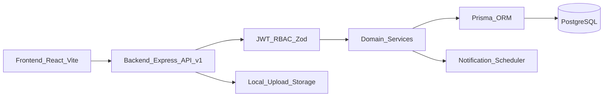

# TECHSPEC Tong The ASMS (As-is)

> Tai lieu dac ta ky thuat tong the cho he thong ASMS, dung cho dev, QA, DevOps, va review kien truc.  
> Phien ban: 1.2  
> Pham vi: Toan bo nen tang hien co trong codebase.

## 1. Muc tieu tai lieu

- Mo ta kien truc va luong xu ly ky thuat cua ASMS.
- Chuan hoa quy uoc implement giua frontend, backend, database.
- Lam baseline cho viec nang cap, toi uu, va chia nho cong viec ky thuat.
- Lam co so cho test plan va van hanh production.

## 2. Tong quan he thong

ASMS la he thong quan ly hau mai gom cac phan he: hop dong, ban giao/huan luyen, bao hanh/sua chua, vat tu, san pham/BOM, CRM, dao tao, tai lieu, bao cao, workflow, va quan tri he thong.

### 2.1 Kien truc logic

### 2.2 Kien truc runtime

- Frontend: React + Vite + TanStack Query.
- Backend: Node.js + Express + TypeScript.
- ORM/DB: Prisma + PostgreSQL.
- Upload: local filesystem (`uploads`).
- Scheduler: job noi bo process backend (notification scan theo chu ky).

## 3. Quy uoc ky thuat bat buoc

### 3.1 API convention

- Prefix tat ca endpoint: `/api/v1`.
- Response envelope:
  - Success: `{ success: true, data, message? }`
  - Error: `{ success: false, data?, message }`
- Validation input: Zod schema + middleware.
- Auth middleware: JWT Bearer.

### 3.2 Data convention

- DB naming: plural + snake_case (qua Prisma map).
- Soft delete: `deletedAt` tren da so bang nghiep vu.
- Code fields (`code`) dung cho ma nghiep vu, `id` dung internal identifier.

### 3.3 Source-of-truth

- Frontend routes: `src/App.tsx`
- Backend routes: `backend/src/routes/v1/index.ts`
- Data model: `backend/prisma/schema.prisma`
- Role guard FE: `src/hooks/use-role.tsx`

## 4. Frontend Technical Design

### 4.1 App composition

- Root providers:
  - `QueryClientProvider`
  - `ThemeProvider`
  - `AuthProvider`
  - `RoleProvider`
- Route gating qua `ProtectedRoute`.
- Layout chinh: `AppLayout`.

### 4.2 State va data fetching

- TanStack Query la co che chinh cho server state.
- Default query behavior:
  - `staleTime: 30000`
  - `refetchOnWindowFocus: false`
  - `retry: 1`
- Mutation retry = 0 de tranh side-effect lap.

### 4.3 Role enforcement o FE

- `ROUTE_PERMISSIONS` fallback map theo path.
- Ho tro dynamic permission matrix qua API role permissions.
- FE chi la lop UX guard; backend moi la enforcement cuoi.

### 4.4 Module UI route map

- Dashboard: `/`
- Contracts: `/hop-dong`
- Handover: `/ban-giao`
- Warranty: `/bao-hanh`
- Materials: `/vat-tu`
- Products: `/san-pham`
- Customers/CRM: `/khach-hang`
- Customer Feedback: `/phan-anh`, `/phan-anh/thong-ke`, `/phan-anh/moi`, `/phan-anh/:id`, `/phan-anh/:id/sua`
- Reports: `/bao-cao`
- Research/Tasks: `/de-tai`, `/cong-viec`
- Training: `/dao-tao`
- Documents: `/tai-lieu`
- Workflow: `/quy-trinh*`
- Settings: `/cai-dat*`

## 5. Backend Technical Design

### 5.1 Module structure

Moi module theo pattern:
- `route.ts`
- `controller.ts`
- `service.ts`
- `schema.ts`

### 5.2 Main API groups

- Auth: `/auth/*`
- IAM/Governance: `/users`, `/roles`, `/role-permissions`, `/audit-logs`, `/system-settings`, `/notifications`, `/notification-preferences`
- CRM: `/customers`, `/contacts`, `/crm-activities`, `/customer-feedbacks`, `/customer-anniversaries`, `/anniversary-subscriptions`
- Core business: `/contracts`, `/handovers`, `/warranties`, `/training`, `/training-courses`
- Product/Inventory: `/products`, `/materials`, `/materials/transfers`
- Execution: `/research-projects`, `/tasks`
- Documents/Reports: `/documents`, `/reports`
- Workflow: `/workflows`, `/workflow-instances`

### 5.3 Middleware chain

- Security headers: `helmet`
- CORS policy theo env
- JSON parser
- AuthN: `requireAuth`
- AuthZ: `requireRoles`
- Validation: Zod middleware
- Error handling trung tam

### 5.4 Operational jobs

- Notification scheduler quet du lieu theo chu ky 24h.
- Logic thong bao ket hop `SystemSetting` + `UserNotificationPreference`.

## 6. Domain Model & Data Design

### 6.1 Core entities

- IAM: `User`, `Role`, `RolePermission`, `RefreshToken`
- CRM: `Customer`, `Contact`, `CrmActivity`, `CustomerFeedback`, `CustomerAnniversary`, `AnniversarySubscription`
- Feedback detail entities: `CustomerFeedbackAssignment`, `CustomerFeedbackTimeline`, `CustomerFeedbackComment`
- Core: `Contract`, `Handover`, `Warranty`, `TrainingCourse`, `Document`
- Product/inventory: `Product`, `ProductBom`, `Material`, `MaterialTransfer`, `ContractProduct`
- Execution: `ResearchProject`, `Task`
- Governance: `Notification`, `SystemSetting`, `AuditLog`, `DataDefinition`
- Workflow: `WorkflowDefinition`, `WorkflowStep`, `WorkflowInstance`, `WorkflowStepLog`, `WorkflowInstanceDocument`

### 6.2 State models

- Contract: `draft|active|completed|late|liquidated`
- Handover: `pending|active|completed|late`
- Warranty: `open|processing|completed|cancelled`
- CustomerFeedback: `new|assigned|in_progress|pending_close|resolved|reopened`
- MaterialTransfer: `pending|processing|completed`
- Task: `todo|in_progress|review|completed|delayed`
- Training: `planned|ongoing|completed|cancelled`

### 6.3 Critical business constraints

- Material transfer phai check `available` trong transaction.
- Warranty co rang buoc lien ket product/material theo rule service.
- Customer feedback su dung assignee model (`assigneeType`, `assignedUserId`, `assignedRoleCode`) va visibility filter theo user/role.
- Comment feedback la entity rieng (`CustomerFeedbackComment`) gom `kind`, `body`, `authorId`, `feedbackId`.
- Contract-product relation luu qua `ContractProduct` va `specValues`.
- Workflow step co role-based advance va optional document requirement.

## 7. RBAC & Security Design

### 7.1 Roles

- `admin`
- `manager`
- `technician`
- `viewer`
- `sales`

### 7.2 Enforcement model

- FE: chong truy cap route/mask action cho UX.
- BE: enforce quyen endpoint-level bang `requireRoles`.
- Role-permission table ton tai de support matrix linh hoat, nhung can tiep tuc dong bo enforcement strategy khi mo rong.

### 7.3 Auth/session

- Access token JWT.
- Refresh token rotate + revoke.
- Session listing/revoke endpoint.
- Rate limiting cho auth endpoints.

### 7.4 Data protection

- Password hashing (bcrypt).
- Refresh token hash (sha256).
- Upload restriction (size + extension whitelist).
- Feedback update voi assignee user duoc cap nhat qua relation `assignedUser.connect/disconnect` de dam bao Prisma compatibility.

## 7.5 Customer Feedback activity feed (implementation notes)

- UI detail page gop 2 nguon thanh 1 feed:
  - System timeline (`CustomerFeedbackTimeline`)
  - User comments (`CustomerFeedbackComment`)
- Composer cho phep 2 loai update:
  - `issue` (su co)
  - `fix` (da sua)
- Quyen post comment:
  - `admin`, `manager`
  - creator ticket
  - assignee user hoac assignee role
- API surface:
  - `POST /api/v1/customer-feedbacks/:id/comments`
  - response detail gom `comments[]` + `canComment`

## 8. Workflow Engine Technical Spec

### 8.1 Design goals

- Tach quy trinh phe duyet khoi hardcoded business flow.
- Cau hinh duoc theo `moduleKey`.
- Co trace log cho moi action runtime.

### 8.2 Runtime lifecycle

1. Tim workflow active theo module.
2. Tao `WorkflowInstance` khi tao business record (hoac attach).
3. Xac dinh step hien tai + actor role.
4. Advance action (`approve/reject/skip`) -> ghi `WorkflowStepLog`.
5. Dong bo status lai entity business khi complete/cancel.

### 8.3 Runtime constraints

- Step co `roleCode` hoac `assigneeIds`.
- Co case bat buoc upload document truoc khi approve.
- Instance running khong duoc pha vo boi cac thao tac xoa/sua trai rule.

## 9. Reports & Analytics Technical Spec

### 9.1 Data aggregation

- Reports tong hop theo nam/khoang ngay.
- Nguon du lieu hop nhat tu contracts, handovers, warranties, products, tasks, customers.

### 9.2 Endpoints chinh

- `/reports`
- `/reports/by-product-line`
- `/reports/feedback/by-customer`
- `/reports/feedback/by-product-line`
- `/reports/material-defects`
- `/reports/badges`

### 9.3 Dashboard feed

- FE dashboard dung tong hop tu nhieu hooks + reports endpoint.
- Alert tab hien tai co thanh phan tinh toan tren FE data aggregate.

### 9.4 Customer Feedback Analytics (`/phan-anh/thong-ke`)

**Tach biet** module `/bao-cao` (reports warranty/contract aggregate). Nguon: `CustomerFeedback.linkage_items` JSON, loc `feedbackAt`, RBAC `buildFeedbackAccessFilter`.

#### Backend

- Module: `backend/src/modules/customer-feedbacks/analytics.ts`
- Aggregates: `aggregateByCustomer`, `aggregateByProduct` (tra `materials[]` day du), `aggregateByMaterial`, `getFeedbackAnalyticsCustomerDetailService`
- Controllers: `feedbackAnalyticsByCustomerController`, `ByProduct`, `ByMaterial`, `feedbackAnalyticsCustomerDetailController`
- Routes (prefix `/api/v1/customer-feedbacks/analytics/...`):
  - `by-customer`, `by-product`, `by-material`
  - `customer/:customerId/detail` — **dang ky truoc** `GET /:id` (xem `backend/src/routes/v1/index.ts` lines analytics mount)

#### Frontend

- Page: `src/pages/FeedbackStatistics.tsx`
- URL: `period` + `tab` (`customer`|`catalog`); `src/lib/feedback-analytics-filters.ts` — `periodToDateRange()`, `parseFeedbackStatsFromSearch()`
- React Query: `useFeedbackStatsCustomerList`, `useFeedbackStatsCatalog` (2 query song song), `useFeedbackCustomerStatsDetail` (khi Sheet mo)
- UI: bang thuan, **khong** Recharts; SP table gop VT: `formatMaterialsInline` -> `code (count) · ...`

#### Query cache keys

- `qk.customerFeedbacks.analyticsByCustomer|ByProduct|ByMaterial|analyticsCustomerDetail`

## 10. NFR (Non-Functional Requirements)

### 10.1 Performance

- Query caching FE 30s.
- DB index theo FK/status/date key fields.
- Han che query full-table cho danh sach lon.

### 10.2 Reliability

- Soft delete tren da so bang.
- Transaction cho inventory transfer.
- Error envelope nhat quan.

### 10.3 Scalability

- Rui ro khi scale multi-instance:
  - Scheduler trung lap.
  - Upload local khong shared.
- Huong khuyen nghi:
  - Tach scheduler sang worker/job system.
  - Doi upload sang object storage.

### 10.4 Observability

- HTTP log.
- Audit log business actions.
- Health endpoint monitoring.

### 10.5 Security

- JWT + refresh rotate.
- CORS/helmet/rate-limit.
- Validation Zod cho input boundary.

## 11. Deployment & Environment

### 11.1 Environments

- Local dev
- Staging
- Production

### 11.2 Config classes

- DB: `DATABASE_URL`
- JWT: secret + expires config
- Auth rate limit config
- Upload path/limits
- CORS allowed origins
- Scheduler settings

### 11.3 Deployment notes

- Co Docker support cho FE/BE.
- Can mount volume uploads neu dung local filesystem.
- Can migration control cho schema Prisma.

## 12. Quality Engineering Plan

### 12.1 Test layers

- Unit test: service logic quan trong (material transfer, workflow runtime, auth refresh).
- Integration test: route + auth + validation + db transaction.
- E2E test: luong hop dong -> ban giao -> bao hanh -> bao cao.

### 12.2 Regression priorities

- RBAC regression theo role.
- Workflow advance regression.
- Reports consistency regression.
- Upload + document link regression.

### 12.3 UAT readiness checklist

- Role matrix dung voi endpoint behavior.
- Core flows pass theo business acceptance.
- Dashboard/report doi so lieu khong sai lech.
- Audit trail co record cho write actions chinh.

## 13. Risks, Gaps, Technical Debt

- Enforcement quyen dong (`role_permissions`) chua la nguon duy nhat.
- Mot so transition status chua enforce day du o service.
- Alert logic phan tan FE/BE.
- Upload local khong toi uu cho horizontal scaling.

## 14. Roadmap ky thuat de xuat (sau as-is)

- Hop nhat policy RBAC (config-driven cho ca FE va BE).
- Dua alert computation ve BE de 1 source of truth.
- Tang do chat data governance cho soft delete + archive.
- Tach worker queue cho notifications/workflows nang.
- Bo sung structured logging + metrics + tracing.

## 15. Traceability map

| Capability | Main modules | Main endpoints | Data entities |
|---|---|---|---|
| Contract lifecycle | contracts, training, handovers | `/contracts`, `/training`, `/handovers` | `Contract`, `ContractProduct`, `TrainingCourse`, `Handover` |
| Warranty ops | warranties, materials, products | `/warranties`, `/materials`, `/products/:id/bom` | `Warranty`, `Material`, `ProductBom` |
| CRM ops | customers, contacts, crm-activities | `/customers`, `/contacts`, `/crm-activities` | `Customer`, `Contact`, `CrmActivity` |
| Customer feedback ops | customer-feedbacks | `/customer-feedbacks`, `/customer-feedbacks/:id/comments`, `/customer-feedbacks/analytics/*` | `CustomerFeedback`, `CustomerFeedbackAssignment`, `CustomerFeedbackTimeline`, `CustomerFeedbackComment` |
| Governance | users, roles, settings, audit | `/users`, `/roles`, `/system-settings`, `/audit-logs` | `User`, `Role`, `SystemSetting`, `AuditLog` |
| Workflow runtime | workflows, workflow-instances | `/workflows`, `/workflow-instances` | `WorkflowDefinition`, `WorkflowStep`, `WorkflowInstance` |

---

Tai lieu nay la baseline tech spec tong the cho ASMS theo hien trang code, co the dung lam tai lieu design review va implementation guide cho cac phase tiep theo.

**Lich su cap nhat:** v1.1 — Customer Feedback assignment + activity comments; v1.2 — Analytics `/phan-anh/thong-ke` (bang 2 tab, API customer detail, `materials[]` day du).
