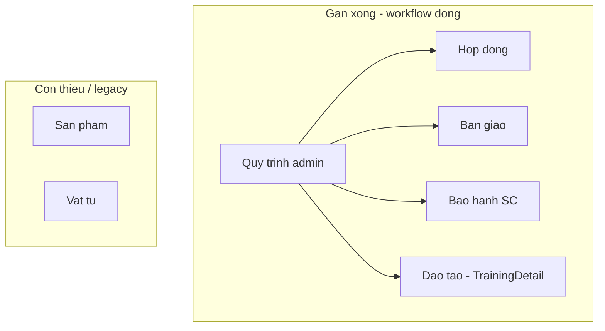

---

# Báo cáo audit: Các màn đã hoàn thiện chưa?

**Kết luận ngắn:** Không phải tất cả màn đều «xong hết». **Quy trình + Bàn giao + Hợp đồng + Bảo hành** đã có luồng form động theo `fieldSchema` và runtime instance ở mức **dùng được production** (sau các sửa gần đây). **Sản phẩm** và **Vật tư** là master data — **không** có workflow bước; CRUD/list **ổn** nhưng **chi tiết / dashboard** còn mock hoặc thiếu nối API. Dưới đây là ma trận chi tiết.

---

## 1. Quy trình — **~90% DONE**

| Hạng mục                                                            | Trạng thái                                                                                                                                |
| ------------------------------------------------------------------- | ----------------------------------------------------------------------------------------------------------------------------------------- |
| Admin list/editor 4 module (contract, handover, warranty, training) | **DONE** — `[WorkflowOverviewPage.tsx](src/pages/WorkflowOverviewPage.tsx)`, `[WorkflowEditorPage.tsx](src/pages/WorkflowEditorPage.tsx)` |
| `fieldSchema` lưu DB                                                | **DONE** — `[workflows/controller.ts](backend/src/modules/workflows/controller.ts)` L122, L145                                            |
| Seed mẫu field / tạo N bước chuẩn                                   | **DONE** — `seed-step-field-schemas.ts`, `getModuleStandardSteps`                                                                         |
| Runtime attach/advance (4 entity)                                   | **DONE** — `[runtime.ts](backend/src/modules/workflows/runtime.ts)` gồm `contract`                                                        |
| `entityFieldSchema` trên editor                                     | **MISSING** — có DB/API, **không** UI cấu hình header phiếu                                                                               |
| `EntityDynamicFormFields`                                           | **MISSING** — component có, **không** gắn màn nào                                                                                         |
| UAT doc                                                             | **PARTIAL** — `[docs/uat-checklist.md](docs/uat-checklist.md)` vẫn ghi «3 thẻ», chưa cập nhật contract + lưu field                        |

---

## 2. Hợp đồng — **~85% DONE** (sau plan gần đây)

| Hạng mục                                    | Trạng thái                                                                                                                                                      |
| ------------------------------------------- | --------------------------------------------------------------------------------------------------------------------------------------------------------------- |
| List / create / edit / delete               | **DONE** — `[Contracts.tsx](src/pages/Contracts.tsx)`, `[ContractEditDialog.tsx](src/components/details/ContractEditDialog.tsx)`                                |
| Tab quy trình **xem** + phê duyệt theo role | **DONE** — `[ContractDetailDialog.tsx](src/components/details/ContractDetailDialog.tsx)` tab `process`, `WorkflowInstancePanel`, `readOnly` ngoài bước hiện tại |
| Tab quy trình **sửa** + panel               | **DONE** — `ContractEditDialog`                                                                                                                                 |
| `stepPayloads` persist                      | **DONE** — `[contracts/service.ts](backend/src/modules/contracts/service.ts)` + `step-payload.ts`                                                               |
| Workflow instance trên HĐ                   | **DONE** — `moduleKey: "contract"`                                                                                                                              |
| Đồng bộ view vs edit                        | **PARTIAL** — view lưu từng bước (`handleSaveCurrentStep`); edit lưu cả HĐ — khác nhau có chủ đích                                                              |
| Cảnh báo `orphanStepPayloads`               | **MISSING** (Warranty có, Contract chưa)                                                                                                                        |
| `workflowEditHref` khi schema rỗng          | **MISSING**                                                                                                                                                     |
| HĐ cũ có `workflowId` chưa instance         | **PARTIAL** — cần mở/sửa HĐ hoặc script backfill (chưa có `backfill-contract-step-payloads`)                                                                    |
| Tab «Lịch sử hoạt động» trên view           | **PARTIAL** — vẫn heuristic theo `progress%`, không audit/workflow log                                                                                          |

---

## 3. Bàn giao & Huấn luyện — **~80% DONE**

### Bàn giao

| Hạng mục                              | Trạng thái                                                                                                                          |
| ------------------------------------- | ----------------------------------------------------------------------------------------------------------------------------------- |
| List + filter + CRUD                  | **DONE** — `[Handover.tsx](src/pages/Handover.tsx)`, `[HandoverUpsertDialog.tsx](src/components/handover/HandoverUpsertDialog.tsx)` |
| Tab bước động + `stepPayloads`        | **DONE**                                                                                                                            |
| `WorkflowInstancePanel` khi sửa       | **DONE**                                                                                                                            |
| Đổi quy trình (attach + confirm)      | **DONE**                                                                                                                            |
| BE dual-write payload ↔ cột phẳng     | **DONE** — `[handovers/service.ts](backend/src/modules/handovers/service.ts)`                                                       |
| Màn **xem** riêng read-only theo bước | **PARTIAL** — một dialog upsert, không tách view như Contract detail                                                                |
| Header phiếu từ `entityFieldSchema`   | **MISSING** — header vẫn cố định                                                                                                    |
| `pruneOrphanStepPayloads` từ FE       | **PARTIAL** — BE có, FE thường không gửi                                                                                            |

### Huấn luyện (trên cùng trang Handover + Training)

| Hạng mục                                                                                        | Trạng thái                                                                                 |
| ----------------------------------------------------------------------------------------------- | ------------------------------------------------------------------------------------------ |
| Tab khóa HL trên Handover                                                                       | **DONE**                                                                                   |
| `[Training.tsx](src/pages/Training.tsx)` + `[TrainingDetail.tsx](src/pages/TrainingDetail.tsx)` | **DONE** — detail có `WorkflowInstancePanel`                                               |
| Form động theo bước HL                                                                          | **PARTIAL** — runtime có; UI training chủ yếu form cố định, không full dynamic tabs như BG |

---

## 4. Bảo hành / SC — **~75% DONE**

| Hạng mục                                         | Trạng thái                                                                                                                         |
| ------------------------------------------------ | ---------------------------------------------------------------------------------------------------------------------------------- |
| List / create / view / edit / delete             | **DONE** — `[Warranty.tsx](src/pages/Warranty.tsx)`, `[WarrantyDetailDialog.tsx](src/components/details/WarrantyDetailDialog.tsx)` |
| Dynamic tabs khi có quy trình + `fieldSchema`    | **DONE**                                                                                                                           |
| `WorkflowInstancePanel`                          | **DONE**                                                                                                                           |
| BE step payload + dual-write cột BH              | **DONE** — `[warranties/service.ts](backend/src/modules/warranties/service.ts)`                                                    |
| Legacy **5 tab cứng** + `WarrantyStepFormFields` | **PARTIAL** — vẫn fallback khi `!hasEngineSteps`                                                                                   |
| Cảnh báo orphan vs thực tế lưu                   | **PARTIAL** — UI nói «sẽ xóa khi lưu» nhưng **không** gửi `pruneOrphanStepPayloads`                                                |
| Đổi quy trình khi edit                           | **MISSING** — không có flow attach như Handover/Contract                                                                           |
| Gộp `buildBhPayload` + `stepPayloads`            | **PARTIAL** — hai đường dữ liệu song song, dễ lệch                                                                                 |

---

## 5. Sản phẩm — **~65% DONE** (không thuộc workflow bước)

| Hạng mục                                                                | Trạng thái                                                                                                                   |
| ----------------------------------------------------------------------- | ---------------------------------------------------------------------------------------------------------------------------- |
| List / CRUD / BOM / soft-delete                                         | **DONE** — `[Products.tsx](src/pages/Products.tsx)`, `[use-products-api.ts](src/hooks/use-products-api.ts)`, BE `products/`* |
| Chi tiết + sửa trong sheet                                              | **DONE** — `[ProductDetailDialog.tsx](src/components/details/ProductDetailDialog.tsx)`                                       |
| Gán SP trên Hợp đồng + specValues                                       | **DONE** — `ContractProductDetailDialog`                                                                                     |
| Dùng trong Bảo hành (SP + BOM)                                          | **DONE**                                                                                                                     |
| Tạo SP: category **hardcode**                                           | **PARTIAL** — `[CreateProductDialog.tsx](src/components/details/CreateProductDialog.tsx)` không dùng definitions             |
| Ảnh SP                                                                  | **PARTIAL** — `localStorage`, không API                                                                                      |
| Tab lịch sử                                                             | **PARTIAL** — pseudo timeline, không audit log                                                                               |
| `[EditProductDialog.tsx](src/components/details/EditProductDialog.tsx)` | **MISSING** — dead code, không import                                                                                        |
| Workflow theo category SP                                               | **MISSING** (đã DROP DB) — module `product-category-workflows` orphan                                                        |
| Dashboard tab SP                                                        | **PARTIAL** — cột khách hàng/ngày giao `—`                                                                                   |

**Kỳ vọng:** Sản phẩm **không** cần `WorkflowInstancePanel` trừ khi product lại gắn quy trình theo category (đã bỏ).

---

## 6. Vật tư — **~60% DONE**

| Hạng mục                         | Trạng thái                                                                                                                                                                   |
| -------------------------------- | ---------------------------------------------------------------------------------------------------------------------------------------------------------------------------- |
| List / nhập / sửa / xóa          | **DONE** — `[Materials.tsx](src/pages/Materials.tsx)`                                                                                                                        |
| Phiếu điều chuyển CRUD + tồn kho | **DONE** — BE + hooks                                                                                                                                                        |
| BOM trên sản phẩm                | **DONE**                                                                                                                                                                     |
| Bảo hành chọn linh kiện theo BOM | **DONE** (BE validate)                                                                                                                                                       |
| **Chi tiết vật tư**              | **PARTIAL / MOCK** — `[MaterialDetailDialog.tsx](src/components/details/MaterialDetailDialog.tsx)` dùng `materialDetails` giả, **không** gọi `GET /materials/:id` (BE đã có) |
| `useMaterialDetail` hook         | **MISSING**                                                                                                                                                                  |
| Báo cáo lỗi vật tư trên UI       | **MISSING** — `use-material-defects.ts` chưa gắn tab                                                                                                                         |
| Scanner barcode                  | **PARTIAL** — match thêm mock                                                                                                                                                |
| Dashboard tab Vật tư             | **PARTIAL** — dữ liệu tối giản                                                                                                                                               |

---

## Ma trận tổng hợp

| Màn               | CRUD/API | Form động + quy trình    | View/Edit đồng nhất | Ghi chú lớn còn thiếu                  |
| ----------------- | -------- | ------------------------ | ------------------- | -------------------------------------- |
| **Quy trình**     | DONE     | DONE                     | N/A                 | `entityFieldSchema` UI; cập nhật UAT   |
| **Hợp đồng**      | DONE     | DONE                     | PARTIAL             | orphan UI; backfill HĐ cũ; lịch sử giả |
| **Bàn giao & HL** | DONE     | DONE (BG) / PARTIAL (HL) | PARTIAL             | header cố định; HL ít dynamic          |
| **Bảo hành/SC**   | DONE     | PARTIAL                  | PARTIAL             | legacy 5 tab; prune orphan; đổi QT     |
| **Sản phẩm**      | DONE     | N/A                      | PARTIAL             | mock ảnh/lịch sử; create category      |
| **Vật tư**        | DONE     | N/A                      | PARTIAL             | **detail mock** — ưu tiên sửa          |

---

## Đã «xong» theo plan Hợp đồng + field quy trình?

Có — các mục trong [plan sửa HĐ và quy trình](c:\Users\quang.cursor\plans\sửa_hđ_và_quy_trình_bc625382.plan.md) **đã có trong code**:

- `fieldSchema` qua controller
- Contract `stepPayloads` + instance `contract`
- `ContractDetailDialog` tab quy trình + panel + role
- `ContractEditDialog` panel + attach workflow

**Chưa nằm trong plan đó** (vẫn thiếu): Product/Material hoàn thiện, Warranty dọn legacy, entity header động, backfill contract, cập nhật UAT.

---

## Đề xuất ưu tiên nếu muốn «hoàn thiện hết»

1. **Vật tư:** Nối `MaterialDetailDialog` → `GET /materials/:id` + transfers thật (impact cao, effort vừa).
2. **Bảo hành:** Bật `pruneOrphanStepPayloads` hoặc bỏ cảnh báo; gỡ/dọn 5 tab legacy khi đã có engine; thêm đổi quy trình khi edit.
3. **Hợp đồng:** Script backfill instance; cảnh báo orphan; (tuỳ chọn) audit log thay timeline giả.
4. **Sản phẩm:** Create dùng definitions; bỏ `EditProductDialog` dead code; ảnh → documents API.
5. **Quy trình / chung:** UI `entityFieldSchema` hoặc xác nhận bỏ hẳn; cập nhật `[docs/uat-checklist.md](docs/uat-checklist.md)`.

---

## Trả lời trực tiếp câu hỏi

**«Đã hoàn thiện tất cả chưa?»** — **Chưa.** Core nghiệp vụ (HĐ, BG, BH, admin quy trình) **đủ để UAT luồng chính**. **Sản phẩm** và **Vật tư** còn khoảng trống rõ (đặc biệt **chi tiết vật tư mock**). **Bảo hành** vẫn mang **hai lớp UI** (engine mới + form 5 bước cũ). Không còn lỗi blocker kiểu «lưu field quy trình không vào DB» nếu build hiện tại đã deploy đủ các file đã sửa.

Nếu bạn muốn triển khai các mục ưu tiên trên, chuyển sang **Agent mode** và chỉ rõ module (ví dụ chỉ Vật tư trước).