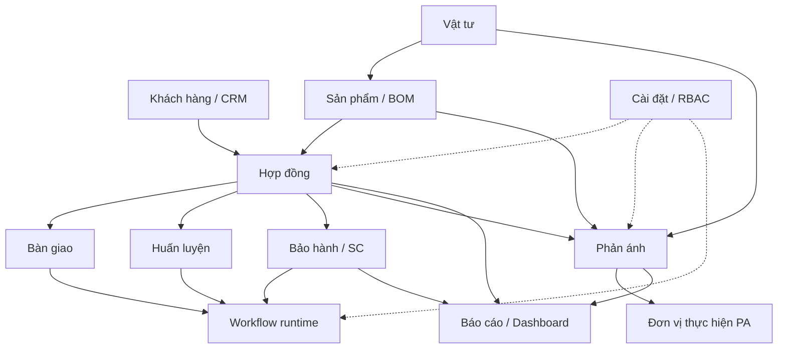
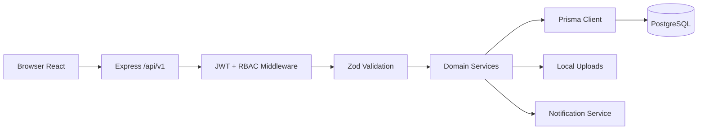
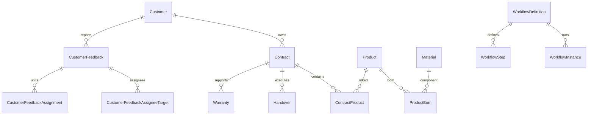
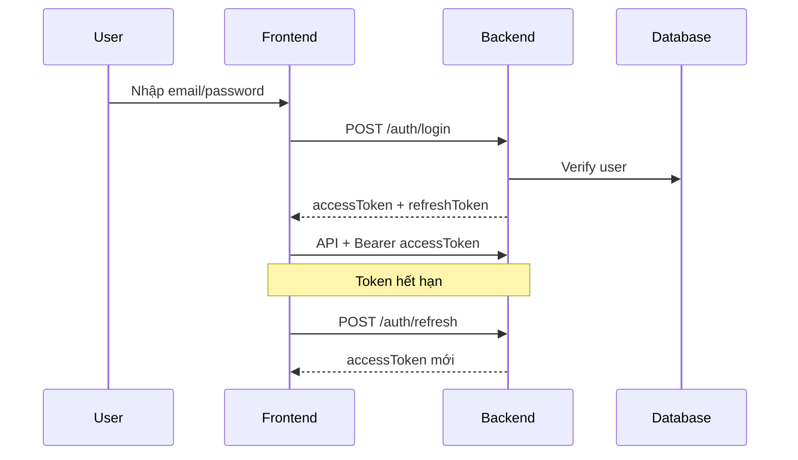

# SRS — Đặc tả yêu cầu phần mềm ASMS

> **Tên đầy đủ:** Software Requirements Specification — Hệ thống Quản lý Hậu mãi (ASMS)  
> **Phiên bản:** 3.0  
> **Ngày cập nhật:** 2026-06-04  
> **Trạng thái:** As-is (mô tả theo hiện trạng triển khai trong codebase)  
> **Ngôn ngữ:** Tiếng Việt

---

## Thông tin tài liệu

| Thuộc tính | Giá trị |
|---|---|
| Mã tài liệu | SRS-ASMS-v3.0 |
| Dự án | ASMS — After-Sales Management System |
| Mục đích | Xác định yêu cầu chức năng, phi chức năng, giao diện, dữ liệu và bảo mật để phát triển, kiểm thử, nghiệm thu |
| Phạm vi | Toàn bộ nền tảng web ASMS (frontend + backend + database) |
| Nguồn sự thật kỹ thuật | `src/App.tsx`, `backend/src/routes/v1/index.ts`, `backend/prisma/schema.prisma`, `backend/src/modules/*` |
| Tài liệu liên quan | [ASMS_BRD.html](./ASMS_BRD.html), [use-case-asms.md](./use-case-asms.md), [../TECHSPEC-TONG-THE-ASMS.md](../TECHSPEC-TONG-THE-ASMS.md), [../data-model.md](../data-model.md) |

### Lịch sử phiên bản

| Phiên bản | Ngày | Mô tả |
|---|---|---|
| 1.0 | 2025 | Bản SRS khởi tạo |
| 2.x | 2026-Q1 | Bổ sung phản ánh, analytics, workflow runtime |
| 3.0 | 2026-06-04 | RBAC theo moduleKey, multi-assignee phản ánh, complete-repair-close, workflow assignee snapshot, cập nhật toàn diện |

### Phân loại yêu cầu

| Ký hiệu | Ý nghĩa |
|---|---|
| **FR-** | Functional Requirement — Yêu cầu chức năng |
| **NFR-** | Non-Functional Requirement — Yêu cầu phi chức năng |
| **IF-** | Interface Requirement — Yêu cầu giao diện |
| **DR-** | Data Requirement — Yêu cầu dữ liệu |
| **SR-** | Security Requirement — Yêu cầu bảo mật |

**Mức ưu tiên:** Bắt buộc (M) / Nên có (S) / Có thể (C)

---

## Mục lục

1. [Giới thiệu](#1-giới-thiệu)
2. [Mô tả tổng quan](#2-mô-tả-tổng-quan)
3. [Kiến trúc hệ thống](#3-kiến-trúc-hệ-thống)
4. [Yêu cầu chức năng theo module](#4-yêu-cầu-chức-năng-theo-module)
5. [Yêu cầu giao diện](#5-yêu-cầu-giao-diện)
6. [Yêu cầu API](#6-yêu-cầu-api)
7. [Yêu cầu dữ liệu](#7-yêu-cầu-dữ-liệu)
8. [RBAC và phân quyền](#8-rbac-và-phân-quyền)
9. [Bảo mật và xác thực](#9-bảo-mật-và-xác-thực)
10. [Yêu cầu phi chức năng](#10-yêu-cầu-phi-chức-năng)
11. [Ràng buộc và giả định](#11-ràng-buộc-và-giả-định)
12. [Ma trận truy vết](#12-ma-trận-truy-vết)
13. [Phụ lục](#13-phụ-lục)

---

## 1. Giới thiệu

### 1.1 Mục đích

Tài liệu SRS này mô tả chi tiết các yêu cầu mà hệ thống ASMS phải đáp ứng, phục vụ:

- Đội phát triển triển khai và bảo trì không lệch nghiệp vụ.
- QA/UAT lập test case theo module, API, vai trò.
- Quản trị dự án theo dõi phạm vi và rủi ro.
- Stakeholder nắm được hành vi hệ thống as-is.

### 1.2 Phạm vi sản phẩm

ASMS là hệ thống web quản lý hậu mãi trong bối cảnh quốc phòng/công nghiệp quốc phòng, bao phủ vòng đời sau ký kết hợp đồng: bàn giao, huấn luyện, bảo hành/sửa chữa, vật tư, sản phẩm, CRM, phản ánh khách hàng, báo cáo điều hành và quản trị hệ thống.

### 1.3 Định nghĩa và thuật ngữ

| Thuật ngữ | Định nghĩa |
|---|---|
| ASMS | After-Sales Management System — Hệ thống quản lý hậu mãi |
| HĐ | Hợp đồng |
| BG | Bàn giao |
| BH/SC | Bảo hành / Sửa chữa |
| HL | Huấn luyện (coaching) |
| PA | Phản ánh khách hàng (customer feedback) |
| RBAC | Role-Based Access Control — Kiểm soát truy cập theo vai trò |
| moduleKey | Khóa module dùng cho phân quyền và menu (vd. `hop-dong`, `phan-anh`) |
| Workflow runtime | Phiên xử lý quy trình theo từng bước trên entity nghiệp vụ |
| Soft delete | Xóa mềm — đặt `deletedAt`, không xóa vật lý |
| Assignee | Người hoặc vai trò được phân công xử lý |

### 1.4 Tài liệu tham chiếu

- BRD tổng thể: [ASMS_BRD.html](./ASMS_BRD.html), [../BRD-TONG-THE-ASMS.md](../BRD-TONG-THE-ASMS.md)
- Use case: [use-case-asms.md](./use-case-asms.md)
- Tech spec: [../TECHSPEC-TONG-THE-ASMS.md](../TECHSPEC-TONG-THE-ASMS.md)
- UAT checklist: [../uat-checklist.md](../uat-checklist.md)

---

## 2. Mô tả tổng quan

### 2.1 Bối cảnh nghiệp vụ

Các đơn vị cần theo dõi tập trung hoạt động hậu mãi, thay thế quy trình rời rạc bằng giấy tờ và bảng tính. Dữ liệu phải liên thông từ hợp đồng → bàn giao/huấn luyện → bảo hành → phản ánh → báo cáo.

### 2.2 Mục tiêu hệ thống

| STT | Mục tiêu | Chỉ số thành công |
|---|---|---|
| 1 | Quản lý vòng đời hợp đồng và thực thi | HĐ có đủ SP, tài liệu, quy trình |
| 2 | Chuẩn hóa BG/HL/BH bằng workflow | Phiếu hoàn thành đúng bước, có audit |
| 3 | Quản lý vật tư có ràng buộc tồn kho | Không âm tồn khi điều chuyển |
| 4 | CRM và phản ánh tập trung | PA được phân công, theo dõi SLA |
| 5 | Dashboard và báo cáo đa chiều | Số liệu khớp nguồn nghiệp vụ |
| 6 | RBAC linh hoạt | Tuân thủ ma trận quyền cấu hình |

### 2.3 Stakeholders và personas

| Vai trò (`roleCode`) | Persona | Mục tiêu chính |
|---|---|---|
| `admin` | Quản trị hệ thống | Toàn quyền, cấu hình, audit |
| `manager` | Trưởng phòng / Lãnh đạo | Phê duyệt, điều hành, báo cáo |
| `technician` | Kỹ thuật viên | Thực thi BG, BH, vật tư, PA |
| `sales` | Kinh doanh | KH, HĐ, CRM, tài liệu |
| `viewer` | Giám sát | Chỉ đọc dashboard/báo cáo |

### 2.4 Phạm vi

#### 2.4.1 Trong phạm vi (v3.0)

- Xác thực JWT, refresh token, quản lý phiên.
- 17+ module nghiệp vụ (xem mục 4).
- Workflow định nghĩa + runtime (handover, warranty, training, coaching, product).
- RBAC động theo `moduleKey` + CRUD (`read/create/update/delete`).
- Thông báo in-app + preference + scheduler.
- Upload tài liệu local filesystem.
- Audit log, system settings, definitions (danh mục thuộc tính).

#### 2.4.2 Ngoài phạm vi

- SSO, tích hợp ERP/Email gateway/SMS bên ngoài.
- HA/DR multi-node production chi tiết.
- Mobile app native.
- Message queue / microservices.

### 2.5 Luồng nghiệp vụ tổng quan



---

## 3. Kiến trúc hệ thống

### 3.1 Thành phần

| Tầng | Công nghệ | Mô tả |
|---|---|---|
| Frontend | React 18 + Vite + TypeScript | SPA, TanStack Query, shadcn/ui |
| Backend | Node.js + Express + TypeScript | REST API `/api/v1`, pattern route/controller/service/schema |
| ORM/DB | Prisma + PostgreSQL | Schema tại `backend/prisma/schema.prisma` |
| Storage | Local `uploads/` | Tài liệu, workflow documents |
| Job | In-process scheduler | Quét thông báo định kỳ (~24h) |

### 3.2 Sơ đồ luồng request



### 3.3 Quy ước kỹ thuật bắt buộc

| Quy ước | Chi tiết |
|---|---|
| API prefix | `/api/v1` |
| Response envelope | Thành công: `{ success: true, data, message? }`; Lỗi: `{ success: false, message, data? }` |
| Validation | Zod schema + middleware; message lỗi ưu tiên tiếng Việt |
| ID nội bộ | `cuid` — dùng trong API nội bộ |
| Mã nghiệp vụ | Trường `code` — hiển thị cho người dùng |
| Xóa dữ liệu | Soft delete `deletedAt` trên hầu hết bảng nghiệp vụ |

---

## 4. Yêu cầu chức năng theo module

> Mỗi FR có: **Mô tả**, **Tác nhân**, **moduleKey**, **Điều kiện/Ràng buộc**, **API/UI** chính.  
> Chi tiết use case đầy đủ: [use-case-asms.md](./use-case-asms.md).

### 4.1 Xác thực và phiên (`AUTH`)

| Mã | Yêu cầu | M | Tác nhân | API |
|---|---|:---:|---|---|
| FR-AUTH-01 | Đăng nhập email/mật khẩu, nhận access + refresh token | M | Mọi user | `POST /auth/login` |
| FR-AUTH-02 | Làm mới access token | M | Mọi user | `POST /auth/refresh` |
| FR-AUTH-03 | Đăng xuất, thu hồi refresh token | M | Mọi user | `POST /auth/logout` |
| FR-AUTH-04 | Xem danh sách phiên đăng nhập | M | Mọi user | `GET /auth/sessions` |
| FR-AUTH-05 | Thu hồi một phiên | S | Mọi user | `DELETE /auth/sessions/:id` |
| FR-AUTH-06 | Đăng xuất tất cả phiên | S | Mọi user | `POST /auth/logout-all` |
| FR-AUTH-07 | Tạo tài khoản (bootstrap/admin) | M | Admin | `POST /users` |

**Ràng buộc:** Rate limit trên endpoint auth; mật khẩu hash bcrypt; JWT secret từ biến môi trường.

---

### 4.2 Bảng điều khiển (`dashboard`)

| Mã | Yêu cầu | M |
|---|---|:---:|
| FR-DASH-01 | Hiển thị KPI tổng quan: HĐ, BG, BH, SP, vật tư, PAKD | M |
| FR-DASH-02 | Tab theo khách hàng, doanh thu, dự án, sản phẩm, bảo hành, vật tư, cảnh báo | M |
| FR-DASH-03 | Lọc theo năm, quý, khách hàng | M |
| FR-DASH-04 | Auto-rotate tab, fullscreen | S |
| FR-DASH-05 | Badge menu sidebar (HĐ trễ, BH mở, CV trễ…) | M |

**Route UI:** `/`  
**API:** `GET /reports/*`, `GET /reports/badges`

---

### 4.3 Hợp đồng (`hop-dong`)

| Mã | Yêu cầu | Quyền | M |
|---|---|---|:---:|
| FR-HD-01 | CRUD hợp đồng, soft delete | CRUD theo module | M |
| FR-HD-02 | Gán danh sách sản phẩm (`ContractProduct`) + `specValues` | update | M |
| FR-HD-03 | Quản lý tiến độ/trạng thái HĐ | update | M |
| FR-HD-04 | Tab điều khoản — chọn mẫu, điền nội dung riêng | read/update | M |
| FR-HD-05 | Tab phản ánh, tài liệu liên quan HĐ | read | M |
| FR-HD-06 | Gắn và xử lý workflow HĐ (nếu có instance) | update | S |
| FR-HD-07 | Upload tài liệu theo bước workflow | update | M |

**Submodule:** `hop-dong.thong-tin`, `hop-dong.dieu-khoan`, `hop-dong.san-pham`, `hop-dong.tai-lieu`, `hop-dong.phan-anh`  
**Route UI:** `/hop-dong`  
**API:** `/contracts`, `/contract-clauses`, `/contract-clause-groups`

**Trạng thái HĐ:** `draft` → `active` → `completed` / `late` / `liquidated`

---

### 4.4 Bàn giao & Huấn luyện (`ban-giao`)

| Mã | Yêu cầu | M |
|---|---|:---:|
| FR-BG-01 | CRUD phiếu bàn giao, gắn HĐ/KH | M |
| FR-BG-02 | Lưu payload theo từng bước workflow (`HandoverStepPayload`) | M |
| FR-BG-03 | Xử lý quy trình BG: trình ký, ký duyệt, ban hành, trả lại | M |
| FR-BG-04 | CRUD khóa huấn luyện (`courseKind=coaching`) trên cùng màn | M |
| FR-BG-05 | Mục **Cần xử lí** — chỉ hiện phiếu khi user được phân công bước hiện tại | M |
| FR-BG-06 | Đính kèm tài liệu workflow theo bước | M |

**Submodule:** `ban-giao.ban-giao`, `ban-giao.huan-luyen`  
**Route UI:** `/ban-giao`  
**API:** `/handovers`, `/training`  
**Trạng thái BG:** `pending` → `active` → `completed` / `late`

---

### 4.5 Bảo hành / Sửa chữa (`bao-hanh`)

| Mã | Yêu cầu | M |
|---|---|:---:|
| FR-BH-01 | CRUD phiếu BH/SC (warranty, repair, maintenance) | M |
| FR-BH-02 | Liên kết HĐ, SP, VT, KH; validate quan hệ | M |
| FR-BH-03 | Form động theo bước workflow (`fieldSchema`) | M |
| FR-BH-04 | Mục **Cần xử lí** — lọc theo phân công bước workflow (user hoặc role) | M |
| FR-BH-05 | Xem chi tiết ở chế độ read-only; phê duyệt qua panel workflow | M |
| FR-BH-06 | Thống kê phiếu: `GET /warranties/stats` | S |
| FR-BH-07 | Tab phản ánh liên quan trên phiếu BH | S |

**Route UI:** `/bao-hanh`  
**Trạng thái:** `open` → `processing` → `completed` / `cancelled`

**Ràng buộc phân công workflow (FR-BH-04, FR-BH-05):**

- Nếu bước có `assigneeIds` → chỉ user trong danh sách mới thấy trong «Cần xử lí» và được phê duyệt.
- Nếu bước không chỉ định người → mọi user có `roleCode` khớp bước được phép.
- Admin bypass mọi kiểm tra phân công.

---

### 4.6 Sản phẩm (`san-pham`)

| Mã | Yêu cầu | Submodule | M |
|---|---|---|:---:|
| FR-SP-01 | CRUD sản phẩm | — | M |
| FR-SP-02 | Quản lý BOM (ProductBom) | `san-pham.linh-kien` | M |
| FR-SP-03 | Thông số kỹ thuật (JSON specs) | `san-pham.thong-so` | M |
| FR-SP-04 | Serial linh kiện | `san-pham.linh-kien` | S |
| FR-SP-05 | Tài liệu SP | `san-pham.tai-lieu` | M |
| FR-SP-06 | Lịch sử thay đổi | `san-pham.lich-su` | S |
| FR-SP-07 | Workflow sản phẩm | — | S |
| FR-SP-08 | Tab đào tạo trên SP | `san-pham.dao-tao` | S |

**Route UI:** `/san-pham`

---

### 4.7 Vật tư (`vat-tu`)

| Mã | Yêu cầu | M |
|---|---|:---:|
| FR-VT-01 | CRUD vật tư, quản lý tồn kho (`quantity`, `available`) | M |
| FR-VT-02 | CRUD phiếu điều chuyển | M |
| FR-VT-03 | Trừ `available` trong transaction khi tạo điều chuyển | M |
| FR-VT-04 | Hoàn tồn khi xóa phiếu chưa `completed` | M |

**Submodule:** `vat-tu.kho`, `vat-tu.dieu-chuyen`  
**Route UI:** `/vat-tu`  
**Trạng thái điều chuyển:** `pending` → `processing` → `completed`

---

### 4.8 Khách hàng / CRM (`khach-hang`)

| Mã | Yêu cầu | Submodule | M |
|---|---|---|:---:|
| FR-KH-01 | CRUD khách hàng | `khach-hang.khach-hang` | M |
| FR-KH-02 | CRUD liên hệ | `khach-hang.lien-he` | M |
| FR-KH-03 | CRUD hoạt động CRM (call/email/meeting/note) | `khach-hang.hoat-dong` | M |
| FR-KH-04 | Kỷ niệm KH + đăng ký nhận thông báo | `khach-hang.loyalty` | S |

**Route UI:** `/khach-hang`  
**API:** `/customers`, `/contacts`, `/crm-activities`, `/customer-anniversaries`, `/anniversary-subscriptions`

---

### 4.9 Phản ánh khách hàng (`phan-anh`)

| Mã | Yêu cầu | M |
|---|---|:---:|
| FR-PA-01 | CRUD phản ánh qua wizard thu thập 3 bước | M |
| FR-PA-02 | Phân công **nhiều người + nhiều vai trò** (`assignees: { userIds[], roleCodes[] }`) | M |
| FR-PA-03 | Liên kết HĐ → SP → VT (linkage items) | M |
| FR-PA-04 | Routing tự động tới đơn vị thực hiện theo SP | M |
| FR-PA-05 | Cập nhật trạng thái đơn vị xử lý (`assignments`) | M |
| FR-PA-06 | Ghi sự cố / ghi kết quả sửa (comment `issue`/`fix`) | M |
| FR-PA-07 | **Hoàn thành sửa chữa và đóng** (`POST .../complete-repair-close`) | M |
| FR-PA-08 | Yêu cầu đóng / đóng (creator) / mở lại | M |
| FR-PA-09 | Timeline sự kiện hệ thống | M |
| FR-PA-10 | SLA (`slaDueAt`), cảnh báo quá hạn | M |
| FR-PA-11 | Thống kê theo KH, SP, VT | M |
| FR-PA-12 | Visibility filter — non-admin chỉ thấy PA được phân công hoặc tạo | M |

**Route UI:** `/phan-anh`, `/phan-anh/moi`, `/phan-anh/:id`, `/phan-anh/:id/sua`, `/phan-anh/thong-ke`

**Trạng thái PA:** `new` → `assigned` → `in_progress` → `pending_close` → `resolved` / `reopened`

**Quy tắc phân công (FR-PA-02):**

- Lưu bảng `customer_feedback_assignee_targets` (targetKey: `user:<id>` | `role:<code>`).
- Đồng bộ cột legacy (`assigneeType`, `assignedUserId`, `assignedRoleCode`) cho tương thích.

**Quy tắc bình luận (FR-PA-06):**

- `canComment`: admin/manager; người tạo; user/role trong danh sách phân công.
- PA `resolved`: chỉ admin/manager ghi thêm.

**Quy tắc đóng sửa chữa (FR-PA-07):**

- Người được phân công, người tạo, hoặc admin/manager có thể gọi API.
- Đặt trạng thái `resolved`, ghi timeline, đánh dấu assignments `done`.

**Cấu hình:** Cài đặt → Đơn vị phản ánh, quy tắc routing (`/feedback-execution-units`)

---

### 4.10 Báo cáo (`bao-cao`)

| Mã | Yêu cầu | M |
|---|---|:---:|
| FR-BC-01 | Báo cáo theo khách hàng, hợp đồng, dòng SP | M |
| FR-BC-02 | Báo cáo phản ánh, đơn vị thực hiện | M |
| FR-BC-03 | Báo cáo lỗi vật tư (`material-defects`) | S |
| FR-BC-04 | Lọc năm/khoảng ngày; xuất Excel; in | M |

**Route UI:** `/bao-cao`

---

### 4.11 Đề tài nghiên cứu (`de-tai`) — ẩn menu

| Mã | Yêu cầu | M |
|---|---|:---:|
| FR-DT-01 | CRUD đề tài, stage, budget, members | S |

**Route UI:** `/de-tai`, `/de-tai/:id`

---

### 4.12 Công việc (`cong-viec`) — ẩn menu

| Mã | Yêu cầu | M |
|---|---|:---:|
| FR-CV-01 | Kanban / danh sách / lịch công việc | S |
| FR-CV-02 | CRUD task, gắn project, assignee | S |

**Route UI:** `/cong-viec`

---

### 4.13 Đào tạo (`dao-tao`) — ẩn menu

| Mã | Yêu cầu | M |
|---|---|:---:|
| FR-DTao-01 | CRUD khóa đào tạo, học viên, lịch học | S |
| FR-DTao-02 | Workflow module `training` | S |

**Route UI:** `/dao-tao`, `/dao-tao/:id`  
**Ghi chú:** Khóa huấn luyện (`coaching`) quản lý chính tại `/ban-giao`.

---

### 4.14 Tài liệu (`tai-lieu`)

| Mã | Yêu cầu | M |
|---|---|:---:|
| FR-TL-01 | Upload multipart, whitelist extension, giới hạn kích thước | M |
| FR-TL-02 | CRUD metadata, liên kết HĐ/SP/đề tài/khóa HL/BH | M |
| FR-TL-03 | Lọc theo loại tài liệu | M |

**Route UI:** `/tai-lieu`  
**Submodule:** `tai-lieu.hop-dong`, `tai-lieu.ky-thuat`, `tai-lieu.chinh-sach`, `tai-lieu.dao-tao`, `tai-lieu.bao-cao`, `tai-lieu.khac`

---

### 4.15 Quy trình (`quy-trinh`)

| Mã | Yêu cầu | M |
|---|---|:---:|
| FR-QT-01 | CRUD workflow definition theo `moduleKey` | M |
| FR-QT-02 | CRUD bước: tên, `actionCode`, `roleCode`, `assigneeIds`, SLA, `fieldSchema` | M |
| FR-QT-03 | Sắp xếp lại thứ tự bước | M |
| FR-QT-04 | Gắn workflow cho entity (attach instance) | M |
| FR-QT-05 | Advance instance: approve / reject | M |
| FR-QT-06 | Upload/xóa tài liệu instance theo bước | M |
| FR-QT-07 | Snapshot list: `currentStepRoleCode`, `currentStepAssigneeIds` | M |

**Route UI:** `/quy-trinh`, `/quy-trinh/:moduleKey`, `/quy-trinh/:moduleKey/:workflowId`

**Module workflow:**

| moduleKey | Áp dụng |
|---|---|
| `handover` | Bàn giao |
| `coaching` | Huấn luyện |
| `training` | Đào tạo |
| `warranty` | Bảo hành/SC |
| `product` | Sản phẩm |
| `contract` | Hợp đồng (ẩn UI) |

**Quy tắc phê duyệt bước:**

```text
if admin → allowed
else if step.assigneeIds.length > 0 → userId in assigneeIds
else → user.roleCode === step.roleCode
```

---

### 4.16 Cài đặt (`cai-dat`)

| Mã | Yêu cầu | Submodule | M |
|---|---|---|:---:|
| FR-CD-01 | CRUD người dùng | `cai-dat.nguoi-dung` | M |
| FR-CD-02 | CRUD vai trò | `cai-dat.vai-tro` | M |
| FR-CD-03 | Ma trận phân quyền CRUD theo moduleKey | `cai-dat.phan-quyen` | M |
| FR-CD-04 | Cấu hình thông báo cá nhân | `cai-dat.thong-bao` | M |
| FR-CD-05 | Cấu hình hệ thống | `cai-dat.he-thong` | M |
| FR-CD-06 | Nhật ký audit (read-only) | `cai-dat.nhat-ky` | M |
| FR-CD-07 | Danh mục thuộc tính (definitions) | `cai-dat.thuoc-tinh` | M |
| FR-CD-08 | Quản lý phiên đăng nhập | `cai-dat.phien` | S |

**Route UI:** `/cai-dat`, `/cai-dat/thuoc-tinh`, `/cai-dat/thuoc-tinh/:moduleKey`

---

### 4.17 Thông báo

| Mã | Yêu cầu | M |
|---|---|:---:|
| FR-TB-01 | Danh sách thông báo in-app | M |
| FR-TB-02 | Đánh dấu đọc / đọc tất cả | M |
| FR-TB-03 | Deep link tới entity (PA, HĐ, BH…) | M |
| FR-TB-04 | Scheduler tạo TB theo preference (HĐ hết hạn, SLA PA, CV trễ…) | M |

**Route UI:** `/thong-bao`  
**Loại:** `feedback_new`, `feedback_assigned`, `feedback_pending_close`, …

---

## 5. Yêu cầu giao diện

### 5.1 Route frontend (IF-UI-01)

Nguồn: `src/App.tsx`

| Route | Màn hình | moduleKey |
|---|---|---|
| `/login` | Đăng nhập | — |
| `/` | Dashboard | `dashboard` |
| `/hop-dong` | Hợp đồng | `hop-dong` |
| `/ban-giao` | Bàn giao & HL | `ban-giao` |
| `/bao-hanh` | Bảo hành/SC | `bao-hanh` |
| `/vat-tu` | Vật tư | `vat-tu` |
| `/san-pham` | Sản phẩm | `san-pham` |
| `/khach-hang` | Khách hàng/CRM | `khach-hang` |
| `/phan-anh` | Danh sách PA | `phan-anh` |
| `/phan-anh/moi` | Tạo PA (wizard) | `phan-anh` |
| `/phan-anh/:id` | Chi tiết PA | `phan-anh` |
| `/phan-anh/:id/sua` | Sửa PA | `phan-anh` |
| `/phan-anh/thong-ke` | Thống kê PA | `phan-anh` |
| `/bao-cao` | Báo cáo | `bao-cao` |
| `/de-tai`, `/de-tai/:id` | Đề tài NC | `de-tai` |
| `/cong-viec` | Công việc | `cong-viec` |
| `/dao-tao`, `/dao-tao/:id` | Đào tạo | `dao-tao` |
| `/tai-lieu` | Tài liệu | `tai-lieu` |
| `/quy-trinh/*` | Quy trình | `quy-trinh` |
| `/cai-dat/*` | Cài đặt | `cai-dat` |
| `/thong-bao` | Thông báo | — |

### 5.2 Menu ẩn (IF-UI-02)

Các route vẫn tồn tại nhưng ẩn khỏi menu (`src/lib/nav-visibility.ts`):

- Đề tài NC (`/de-tai`)
- Công việc (`/cong-viec`)
- Đào tạo (`/dao-tao`)

### 5.3 Quy ước UX (IF-UI-03)

| Quy ước | Mô tả |
|---|---|
| Ngôn ngữ UI | Tiếng Việt |
| Thông báo lỗi | Toast qua `toastApiError`, message từ API |
| Form PA/BH | Panel nền thống nhất `bg-card/30`, section phân cách |
| Phân công PA | Multi-select user (dropdown) + multi-select role (dropdown) |
| Phê duyệt workflow | Panel workflow trong chế độ xem chi tiết |
| Responsive | Hỗ trợ desktop và tablet; mobile best-effort |

### 5.4 Guard frontend (IF-UI-04)

- `ProtectedRoute` — yêu cầu đăng nhập.
- `useModulePermissions` + `canDo(moduleKey, action)` — ẩn/hiện nút CRUD.
- FE guard chỉ là lớp UX; backend là enforcement cuối.

---

## 6. Yêu cầu API

### 6.1 Danh sách mount API (IF-API-01)

Nguồn: `backend/src/routes/v1/index.ts`

| Prefix | Module nghiệp vụ |
|---|---|
| `/auth` | Xác thực |
| `/users`, `/roles`, `/role-permissions` | IAM |
| `/customers`, `/contacts`, `/crm-activities` | CRM |
| `/customer-feedbacks`, `/feedback-execution-units` | Phản ánh |
| `/contracts`, `/contract-clauses`, `/contract-clause-groups` | Hợp đồng |
| `/handovers` | Bàn giao |
| `/warranties` | Bảo hành |
| `/materials` | Vật tư |
| `/products` | Sản phẩm |
| `/training`, `/training-courses` | Đào tạo/HL |
| `/documents` | Tài liệu |
| `/reports` | Báo cáo |
| `/research-projects`, `/tasks` | Đề tài/CV |
| `/workflows`, `/workflow-instances` | Quy trình |
| `/definitions` | Danh mục |
| `/notifications`, `/notification-preferences` | Thông báo |
| `/system-settings`, `/audit-logs` | Quản trị |
| `/customer-anniversaries`, `/anniversary-subscriptions` | Loyalty |

### 6.2 Quy ước HTTP (IF-API-02)

| HTTP | Ý nghĩa CRUD |
|---|---|
| GET/HEAD | read |
| POST | create |
| PUT/PATCH | update |
| DELETE | delete |

### 6.3 Mã lỗi (IF-API-03)

| Status | Ý nghĩa |
|---|---|
| 400 | Validation / vi phạm rule nghiệp vụ |
| 401 | Chưa xác thực |
| 403 | Không đủ quyền module/action |
| 404 | Không tìm thấy resource |
| 409 | Trùng mã / xung đột |
| 500 | Lỗi hệ thống |

### 6.4 API Phản ánh — chi tiết (IF-API-04)

| Method | Path | Mô tả |
|---|---|---|
| GET | `/customer-feedbacks` | Danh sách + filter |
| GET | `/customer-feedbacks/:id` | Chi tiết + timeline + comments + canComment |
| POST | `/customer-feedbacks` | Tạo (body: `assignees` hoặc legacy `assignee`) |
| PUT | `/customer-feedbacks/:id` | Cập nhật |
| DELETE | `/customer-feedbacks/:id` | Soft delete |
| POST | `/customer-feedbacks/:id/comments` | Ghi issue/fix |
| PATCH | `/customer-feedbacks/:id/assignments/:assignmentId` | Cập nhật đơn vị |
| POST | `/customer-feedbacks/:id/request-close` | Chuyển chờ đóng |
| POST | `/customer-feedbacks/:id/close` | Đóng (creator/admin) |
| POST | `/customer-feedbacks/:id/complete-repair-close` | Hoàn thành SC & đóng |
| POST | `/customer-feedbacks/:id/reopen` | Mở lại |
| GET | `/customer-feedbacks/analytics/*` | Thống kê KH/SP/VT |

**Query list:** `customerId`, `contractId`, `status`, `assignedToMe`, `myUnits`, `search`, `feedbackFrom`, `feedbackTo`

---

## 7. Yêu cầu dữ liệu

### 7.1 Thự thể chính (DR-01)

| Nhóm | Bảng/Model |
|---|---|
| IAM | `User`, `Role`, `RolePermission`, `RefreshToken` |
| CRM | `Customer`, `Contact`, `CrmActivity`, `CustomerFeedback`, `CustomerFeedbackAssigneeTarget`, `CustomerFeedbackAssignment`, `CustomerFeedbackTimeline`, `CustomerFeedbackComment` |
| Core | `Contract`, `ContractProduct`, `Handover`, `Warranty`, `TrainingCourse` |
| SP/VT | `Product`, `ProductBom`, `Material`, `MaterialTransfer` |
| Execution | `ResearchProject`, `Task` |
| Docs | `Document` |
| Workflow | `WorkflowDefinition`, `WorkflowStep`, `WorkflowInstance`, `WorkflowStepLog`, `WorkflowInstanceDocument` |
| Governance | `Notification`, `UserNotificationPreference`, `SystemSetting`, `AuditLog`, `DataDefinition` |

### 7.2 Enum trạng thái (DR-02)

| Entity | Giá trị |
|---|---|
| User | `active`, `inactive`, `suspended` |
| Contract | `draft`, `active`, `completed`, `late`, `liquidated` |
| Handover | `pending`, `active`, `completed`, `late` |
| Warranty | `open`, `processing`, `completed`, `cancelled` |
| CustomerFeedback | `new`, `assigned`, `in_progress`, `pending_close`, `resolved`, `reopened` |
| MaterialTransfer | `pending`, `processing`, `completed` |
| Task | `todo`, `in_progress`, `review`, `completed`, `delayed` |
| TrainingCourse | `planned`, `ongoing`, `completed`, `cancelled` |

### 7.3 Quan hệ chính (DR-03)



### 7.4 Ràng buộc toàn vẹn (DR-04)

| Ràng buộc | Mô tả |
|---|---|
| DR-04-01 | Email user unique (active) |
| DR-04-02 | Code HĐ/KH/SP unique trong phạm vi soft-delete |
| DR-04-03 | Material transfer không âm `available` |
| DR-04-04 | PA linkage: SP/VT phải thuộc HĐ/KH đã chọn |
| DR-04-05 | Feedback assignee target unique `(feedbackId, targetKey)` |
| DR-04-06 | Workflow step order unique trong definition |

---

## 8. RBAC và phân quyền

### 8.1 Vai trò hệ thống (SR-RBAC-01)

`admin`, `manager`, `technician`, `viewer`, `sales`

### 8.2 Mô hình quyền (SR-RBAC-02)

- Ma trận CRUD theo `moduleKey` lưu tại `RolePermission`.
- Admin có toàn quyền mọi module (bypass cache).
- Default permissions seed từ `DEFAULT_ROLE_PERMISSIONS`.

### 8.3 Enforcement backend (SR-RBAC-03)

| Thành phần | File | Mô tả |
|---|---|---|
| `requireModulePermission(moduleKey, action)` | `backend/src/middleware/rbac.ts` | Kiểm tra CRUD trên module |
| `requireHttpModulePermission()` | `backend/src/middleware/rbac.ts` | Map HTTP method → action, map route → moduleKey |
| `API_MODULE_MAP` | `backend/src/config/api-module-map.ts` | Prefix API → moduleKey |
| `roleCanPerformAction()` | `role-permissions/service.ts` | Logic + cache |

**Ngoại lệ:** Route `/auth/*` — public/guarded riêng; admin-only endpoints giữ `requireRoles(['admin'])` nếu cần.

### 8.4 Enforcement frontend (SR-RBAC-04)

| Thành phần | File |
|---|---|
| `useModulePermissions(moduleKey)` | `src/hooks/use-module-permissions.ts` |
| `canDo(action)` | Pattern guard nút/trang |
| `ROUTE_PERMISSIONS` | Fallback map path → module |
| Dynamic matrix | API `GET /role-permissions` |

### 8.5 Quyền theo ngữ cảnh nghiệp vụ (SR-RBAC-05)

| Ngữ cảnh | Quy tắc bổ sung |
|---|---|
| Phản ánh — xem | `buildFeedbackAccessFilter`: assignee, creator, đơn vị xử lý |
| Phản ánh — comment | `canCommentOnFeedback` |
| Workflow — phê duyệt | `canUserActOnWorkflowStep` (assigneeIds ưu tiên role) |
| PA — sửa | Creator hoặc admin/manager; trạng thái sớm |

---

## 9. Bảo mật và xác thực

| Mã | Yêu cầu | M |
|---|---|:---:|
| SR-01 | JWT Bearer cho API protected | M |
| SR-02 | Refresh token hash SHA-256, rotate khi refresh | M |
| SR-03 | bcrypt password hash | M |
| SR-04 | Helmet security headers | M |
| SR-05 | CORS theo env | M |
| SR-06 | Rate limit auth endpoints | M |
| SR-07 | Upload whitelist extension + max size | M |
| SR-08 | Không lộ stack trace trong response business | M |
| SR-09 | Audit log thao tác quan trọng | S |

### 9.1 Luồng xác thực



---

## 10. Yêu cầu phi chức năng

### 10.1 Hiệu năng (NFR-PERF)

| Mã | Yêu cầu | M |
|---|---|:---:|
| NFR-PERF-01 | FE cache TanStack Query staleTime 30s | M |
| NFR-PERF-02 | Index DB trên FK, status, date fields | M |
| NFR-PERF-03 | API list hỗ trợ filter server-side | M |
| NFR-PERF-04 | Upload giới hạn kích thước file | M |

### 10.2 Khả dụng (NFR-AVAIL)

| Mã | Yêu cầu | M |
|---|---|:---:|
| NFR-AVAIL-01 | Health check endpoint | M |
| NFR-AVAIL-02 | Docker compose cho dev/local | S |

### 10.3 Khả bảo trì (NFR-MAINT)

| Mã | Yêu cầu | M |
|---|---|:---:|
| NFR-MAINT-01 | Module pattern đồng nhất BE | M |
| NFR-MAINT-02 | TypeScript strict trên FE/BE | M |
| NFR-MAINT-03 | Prisma migration cho schema change | M |

### 10.4 Khả sử dụng (NFR-USAB)

| Mã | Yêu cầu | M |
|---|---|:---:|
| NFR-USAB-01 | UI tiếng Việt | M |
| NFR-USAB-02 | Thông báo lỗi rõ ràng, không im lặng | M |
| NFR-USAB-03 | Confirm trước thao tác phá hủy (đóng PA, xóa…) | S |

### 10.5 Giới hạn kỹ thuật as-is (NFR-LIM)

| Hạn chế | Ghi chú |
|---|---|
| Upload local filesystem | Chưa tối ưu multi-instance |
| Workflow transition | Một số nhánh chưa khóa cứng ở service |
| Notification | In-process, không queue bên ngoài |

---

## 11. Ràng buộc và giả định

### 11.1 Ràng buộc

- PostgreSQL là DB duy nhất.
- Triển khai monolith FE + BE.
- Trình duyệt hiện đại (Chrome, Edge, Firefox).

### 11.2 Giả định

- Người dùng có kết nối mạng ổn định tới server.
- Admin thiết lập ma trận quyền trước khi vận hành.
- Dữ liệu master (KH, SP, VT) được nhập trước nghiệp vụ phát sinh.

---

## 12. Ma trận truy vết

| Năng lực nghiệp vụ | FR chính | moduleKey | API | Route UI |
|---|---|---|---|---|
| Quản lý HĐ | FR-HD-* | `hop-dong` | `/contracts` | `/hop-dong` |
| Bàn giao/HL | FR-BG-* | `ban-giao` | `/handovers`, `/training` | `/ban-giao` |
| BH/SC | FR-BH-* | `bao-hanh` | `/warranties` | `/bao-hanh` |
| Vật tư | FR-VT-* | `vat-tu` | `/materials` | `/vat-tu` |
| Sản phẩm | FR-SP-* | `san-pham` | `/products` | `/san-pham` |
| CRM | FR-KH-* | `khach-hang` | `/customers`, … | `/khach-hang` |
| Phản ánh | FR-PA-* | `phan-anh` | `/customer-feedbacks` | `/phan-anh/*` |
| Báo cáo | FR-BC-* | `bao-cao` | `/reports` | `/bao-cao` |
| Quy trình | FR-QT-* | `quy-trinh` | `/workflows` | `/quy-trinh/*` |
| Cài đặt | FR-CD-* | `cai-dat` | `/users`, `/roles`, … | `/cai-dat/*` |
| Use case | UC-* | — | — | [use-case-asms.md](./use-case-asms.md) |

---

## 13. Phụ lục

### 13.1 Tổng hợp module và số FR

| Module | moduleKey | Số FR ước lượng | Menu |
|---|---|---:|---|
| Xác thực | AUTH | 7 | Login |
| Dashboard | `dashboard` | 5 | Hiển thị |
| Hợp đồng | `hop-dong` | 7+ | Hiển thị |
| Bàn giao & HL | `ban-giao` | 6 | Hiển thị |
| BH/SC | `bao-hanh` | 7 | Hiển thị |
| Sản phẩm | `san-pham` | 8 | Hiển thị |
| Vật tư | `vat-tu` | 4 | Hiển thị |
| CRM | `khach-hang` | 4 | Hiển thị |
| Phản ánh | `phan-anh` | 12 | Hiển thị |
| Báo cáo | `bao-cao` | 4 | Hiển thị |
| Đề tài | `de-tai` | 1 | Ẩn |
| Công việc | `cong-viec` | 2 | Ẩn |
| Đào tạo | `dao-tao` | 2 | Ẩn |
| Tài liệu | `tai-lieu` | 3 | Hiển thị |
| Quy trình | `quy-trinh` | 7 | Hiển thị |
| Cài đặt | `cai-dat` | 8 | Hiển thị |
| Thông báo | — | 4 | Hiển thị |

### 13.2 Checklist UAT tham chiếu

Xem [../uat-checklist.md](../uat-checklist.md) — bao gồm:

- RBAC theo moduleKey trên từng trang CRUD.
- PA multi-assignee, complete-repair-close.
- Workflow assignee trên BH/BG «Cần xử lí».
- Analytics PA `/phan-anh/thong-ke`.

### 13.3 Thuật ngữ đồng bộ

| Dùng trong SRS | Không dùng |
|---|---|
| Phản ánh | Complaint, ticket (trong UI chính) |
| Hợp đồng | Contract (trong UI) |
| moduleKey | permission key |
| Soft delete | Hard delete (trừ refresh token revoke) |

---

**Kết thúc SRS-ASMS v3.0**

*Tài liệu mô tả hiện trạng hệ thống tại thời điểm cập nhật. Mọi thay đổi code cần đồng bộ lại SRS, use-case và UAT checklist.*
