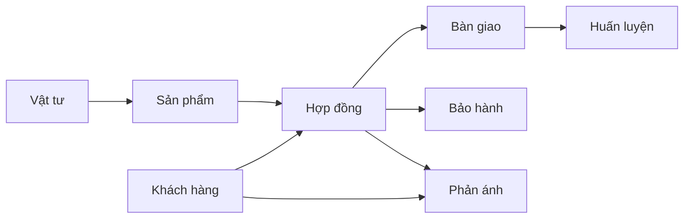

# Use Case — Hệ thống ASMS

> Cập nhật: 2026-06-04  
> Phạm vi: module, route, API và màn hình hiện có trong codebase.

## Quy ước

| Ký hiệu | Ý nghĩa |
|---------|---------|
| `UC-<MODULE>-<STT>` | Mã use case (ví dụ `UC-HD-01`) |
| **Admin** | Vai trò quản trị |
| **Quản lý** | Manager |
| **Kỹ thuật** | Technician |
| **Sales** | Nhân viên bán hàng |
| **Viewer** | Chỉ xem |
| **Hệ thống** | Tự động (job, thông báo, SLA) |

**Phân quyền:** Mỗi UC gắn module key trong `src/lib/route-module-map.ts` và `backend/src/config/api-module-map.ts`. Admin có toàn quyền; vai trò khác theo ma trận Cài đặt → Phân quyền.

**Màn ẩn menu** (route vẫn tồn tại, chặn qua `src/lib/nav-visibility.ts`): Đề tài NC, Công việc, Đào tạo & HL.

**Quy trình ẩn UI:** Nhóm «Hợp đồng (tổng hợp)» (`contract`) — xem `src/lib/workflow-visibility.ts`.

---

## 1. Xác thực & Phiên (`AUTH`)

| Mã UC | Use Case | Tác nhân | Mô tả |
|-------|----------|----------|-------|
| UC-AUTH-01 | Đăng nhập | Mọi user | Email/mật khẩu → JWT (`POST /api/v1/auth/login`) |
| UC-AUTH-02 | Đăng xuất | Mọi user | Thu hồi refresh token |
| UC-AUTH-03 | Làm mới phiên | Mọi user | Refresh access token |
| UC-AUTH-04 | Xem danh sách phiên | Mọi user | Thiết bị/phiên đang đăng nhập |
| UC-AUTH-05 | Thu hồi phiên | Mọi user | Đăng xuất một phiên cụ thể |
| UC-AUTH-06 | Đăng xuất tất cả | Mọi user | Hủy mọi phiên |
| UC-AUTH-07 | Tạo tài khoản | Admin | Bootstrap hoặc `POST /api/v1/users` |

**Route UI:** `/login`  
**Cài đặt liên quan:** Cài đặt → Phiên đăng nhập (`cai-dat.phien`)

---

## 2. Bảng điều khiển (`dashboard`)

| Mã UC | Use Case | Tác nhân | Mô tả |
|-------|----------|----------|-------|
| UC-DASH-01 | Xem tổng quan | Theo quyền | Tab Overview: HĐ, bàn giao, BH, SP, vật tư, PAKD |
| UC-DASH-02 | Xem theo khách hàng | Theo quyền | Tab Khách hàng |
| UC-DASH-03 | Xem doanh thu | Theo quyền | Tab Doanh thu |
| UC-DASH-04 | Xem dự án / tiến độ | Theo quyền | Tab Dự án (HĐ, BG, HL) |
| UC-DASH-05 | Xem sản phẩm | Theo quyền | Tab Sản phẩm |
| UC-DASH-06 | Xem bảo hành | Theo quyền | Tab Bảo hành / phản ánh |
| UC-DASH-07 | Xem vật tư | Theo quyền | Tab Vật tư / PAKD |
| UC-DASH-08 | Xem cảnh báo | Theo quyền | Tab Alerts, KPI quá hạn |
| UC-DASH-09 | Lọc theo năm / quý / KH | Theo quyền | Bộ lọc dashboard |
| UC-DASH-10 | Luân chuyển tab tự động | Theo quyền | Auto-rotate, fullscreen |
| UC-DASH-11 | Xem badge menu | Theo quyền | HĐ trễ, BH mở, CV trễ… (`GET /reports/badges`) |

**Route UI:** `/`

---

## 3. Hợp đồng (`hop-dong`)

| Mã UC | Use Case | Tác nhân | Mô tả |
|-------|----------|----------|-------|
| UC-HD-01 | Xem danh sách HĐ | Theo quyền | Lọc, tìm kiếm, phân trang |
| UC-HD-02 | Xem chi tiết HĐ | Theo quyền | Thông tin, tiến độ, quy trình |
| UC-HD-03 | Tạo HĐ | create | Nhập hợp đồng mới |
| UC-HD-04 | Sửa HĐ | update | Cập nhật thông tin chung |
| UC-HD-05 | Xóa HĐ | delete | Soft delete |
| UC-HD-06 | Gán danh mục SP | update | `PUT /contracts/:id/products` |
| UC-HD-07 | Sửa SP trong HĐ | update | Số lượng, cấu hình từng SP |
| UC-HD-08 | Xem SP thuộc HĐ | read | Danh sách sản phẩm trên HĐ |
| UC-HD-09 | Chọn điều khoản mẫu | read/update | Tab điều khoản |
| UC-HD-10 | Điền nội dung điều khoản | update | Nội dung riêng từng HĐ |
| UC-HD-11 | Xem phản ánh liên quan | read | Tab phản ánh trên HĐ |
| UC-HD-12 | Xem tài liệu HĐ | read | Tab tài liệu |
| UC-HD-13 | Xử lý quy trình HĐ | update | Duyệt / từ chối bước workflow |
| UC-HD-14 | Đính kèm tài liệu bước QT | update | Upload file theo bước workflow |

**Route UI:** `/hop-dong`  
**Submodule:** `hop-dong.thong-tin`, `hop-dong.dieu-khoan`, `hop-dong.san-pham`, `hop-dong.tai-lieu`, `hop-dong.phan-anh`

### 3.1 Điều khoản (`hop-dong.dieu-khoan`)

| Mã UC | Use Case | Tác nhân |
|-------|----------|----------|
| UC-HD-DK-01 | Xem danh sách điều khoản mẫu | read |
| UC-HD-DK-02 | Tạo / sửa / xóa điều khoản | create / update / delete |
| UC-HD-DK-03 | Sắp xếp điều khoản | update |
| UC-HD-DK-04 | Xem nhóm điều khoản | read |
| UC-HD-DK-05 | Tạo / sửa / xóa nhóm | create / update / delete |
| UC-HD-DK-06 | Gán điều khoản vào nhóm | update |
| UC-HD-DK-07 | Kiểm tra điều khoản đang dùng | read |

**API:** `/api/v1/contract-clauses`, `/api/v1/contract-clause-groups`

---

## 4. Bàn giao & Huấn luyện (`ban-giao`)

| Mã UC | Use Case | Tác nhân | Mô tả |
|-------|----------|----------|-------|
| UC-BG-01 | Xem danh sách bàn giao | read | Tab Bàn giao |
| UC-BG-02 | Xem chi tiết phiếu BG | read | Sheet / dialog chi tiết |
| UC-BG-03 | Tạo phiếu bàn giao | create | Gắn HĐ, khách hàng |
| UC-BG-04 | Sửa phiếu bàn giao | update | Header, payload từng bước |
| UC-BG-05 | Xóa phiếu bàn giao | delete | |
| UC-BG-06 | Xử lý quy trình bàn giao | update | Trình ký / ký duyệt / ban hành |
| UC-BG-07 | Đính kèm tài liệu bước BG | update | Workflow documents |
| UC-BG-08 | Xem danh sách khóa HL | read | Tab Huấn luyện |
| UC-BG-09 | Tạo khóa huấn luyện | create | Gắn HĐ, `courseKind=coaching` |
| UC-BG-10 | Sửa / xóa khóa HL | update / delete | |
| UC-BG-11 | Xử lý quy trình HL | update | Module workflow `coaching` |
| UC-BG-12 | Điền payload từng bước HL | update | Kế hoạch, tờ trình, báo cáo… |

**Route UI:** `/ban-giao`  
**Submodule:** `ban-giao.ban-giao`, `ban-giao.huan-luyen`

---

## 5. Bảo hành / Sửa chữa (`bao-hanh`)

| Mã UC | Use Case | Tác nhân | Mô tả |
|-------|----------|----------|-------|
| UC-BH-01 | Xem danh sách phiếu BH/SC | read | |
| UC-BH-02 | Xem chi tiết phiếu | read | |
| UC-BH-03 | Tạo phiếu BH/SC | create | |
| UC-BH-04 | Sửa phiếu | update | |
| UC-BH-05 | Xóa phiếu | delete | |
| UC-BH-06 | Xử lý quy trình BH | update | Tiếp nhận → xử lý → nghiệm thu |
| UC-BH-07 | Điền form động theo bước | update | Field schema từng bước |
| UC-BH-08 | Đính kèm tài liệu bước BH | update | Workflow documents |

**Route UI:** `/bao-hanh`  
**Submodule:** `bao-hanh.danh-sach`

---

## 6. Sản phẩm (`san-pham`)

| Mã UC | Use Case | Submodule | Quyền |
|-------|----------|-----------|-------|
| UC-SP-01 | Xem danh sách SP | — | read |
| UC-SP-02 | Xem chi tiết SP | `san-pham.tong-quan` | read |
| UC-SP-03 | Tạo SP | — | create |
| UC-SP-04 | Sửa SP | — | update |
| UC-SP-05 | Xóa SP | — | delete |
| UC-SP-06 | Quản lý BOM / linh kiện | `san-pham.linh-kien` | update |
| UC-SP-07 | Quản lý thông số kỹ thuật | `san-pham.thong-so` | update |
| UC-SP-08 | Quản lý serial linh kiện | `san-pham.linh-kien` | update |
| UC-SP-09 | Xem / gắn tài liệu SP | `san-pham.tai-lieu` | read / update |
| UC-SP-10 | Xem lịch sử thay đổi | `san-pham.lich-su` | read |
| UC-SP-11 | Xử lý quy trình SP | — | update |
| UC-SP-12 | Tab đào tạo trên SP | `san-pham.dao-tao` | read |

**Route UI:** `/san-pham`

---

## 7. Vật tư (`vat-tu`)

| Mã UC | Use Case | Submodule | Quyền |
|-------|----------|-----------|-------|
| UC-VT-01 | Xem danh sách vật tư | `vat-tu.kho` | read |
| UC-VT-02 | Xem chi tiết vật tư | `vat-tu.kho` | read |
| UC-VT-03 | Nhập vật tư mới | `vat-tu.kho` | create |
| UC-VT-04 | Sửa vật tư | `vat-tu.kho` | update |
| UC-VT-05 | Xóa vật tư | `vat-tu.kho` | delete |
| UC-VT-06 | Xem phiếu điều chuyển | `vat-tu.dieu-chuyen` | read |
| UC-VT-07 | Tạo phiếu điều chuyển | `vat-tu.dieu-chuyen` | create |
| UC-VT-08 | Sửa / xóa phiếu điều chuyển | `vat-tu.dieu-chuyen` | update / delete |

**Route UI:** `/vat-tu`

---

## 8. Khách hàng / CRM (`khach-hang`)

| Mã UC | Use Case | Submodule | Quyền |
|-------|----------|-----------|-------|
| UC-KH-01 | Xem danh sách KH | `khach-hang.khach-hang` | read |
| UC-KH-02 | Xem chi tiết KH | `khach-hang.khach-hang` | read |
| UC-KH-03 | Tạo KH | `khach-hang.khach-hang` | create |
| UC-KH-04 | Sửa KH | `khach-hang.khach-hang` | update |
| UC-KH-05 | Xóa KH | `khach-hang.khach-hang` | delete |
| UC-KH-06 | Quản lý liên hệ | `khach-hang.lien-he` | CRUD |
| UC-KH-07 | Quản lý hoạt động CRM | `khach-hang.hoat-dong` | CRUD |
| UC-KH-08 | Quản lý kỷ niệm KH | `khach-hang.loyalty` | CRUD |
| UC-KH-09 | Đăng ký nhận TB kỷ niệm | `khach-hang.loyalty` | create |

**Route UI:** `/khach-hang`  
**API:** `customers`, `contacts`, `crm-activities`, `customer-anniversaries`, `anniversary-subscriptions`

---

## 9. Phản ánh khách hàng (`phan-anh`)

| Mã UC | Use Case | Tác nhân | Ghi chú |
|-------|----------|----------|---------|
| UC-PA-01 | Xem danh sách phản ánh | Theo quyền | Admin: tất cả; khác: chỉ được phân công |
| UC-PA-02 | Xem chi tiết phản ánh | Theo quyền | Timeline, bình luận |
| UC-PA-03 | Tạo phản ánh | create | `/phan-anh/moi` |
| UC-PA-04 | Sửa phản ánh | update | Người tạo / quản lý, trạng thái sớm |
| UC-PA-05 | Xóa phản ánh | delete | |
| UC-PA-06 | Phân công người / vai trò | update | Multi-assignee |
| UC-PA-07 | Phân luồng theo SP / đơn vị | Hệ thống + user | Routing preview, assignments |
| UC-PA-08 | Cập nhật xử lý đơn vị | update | `PATCH assignments/:id` |
| UC-PA-09 | Bình luận phản ánh | update | Issue / fix / note |
| UC-PA-10 | Yêu cầu đóng | update | `request-close` |
| UC-PA-11 | Đóng phản ánh | update | `close` |
| UC-PA-12 | Hoàn tất sửa chữa & đóng | update | `complete-repair-close` |
| UC-PA-13 | Mở lại phản ánh | update | `reopen` |
| UC-PA-14 | Xem tóm tắt công việc PA | read | `/summary` |
| UC-PA-15 | Thống kê theo KH / SP / VT | read | `/phan-anh/thong-ke`, analytics API |
| UC-PA-16 | Lọc theo đơn vị của tôi | read | Query `myUnits` |
| UC-PA-17 | Cấu hình đơn vị thực hiện | Admin / quản lý | Cài đặt → Đơn vị PA |
| UC-PA-18 | Cấu hình quy tắc routing | Admin / quản lý | Routing rules |

**Route UI:** `/phan-anh`, `/phan-anh/moi`, `/phan-anh/:id`, `/phan-anh/:id/sua`, `/phan-anh/thong-ke`

---

## 10. Báo cáo (`bao-cao`)

| Mã UC | Use Case | Tab / API |
|-------|----------|-----------|
| UC-BC-01 | Báo cáo theo khách hàng | `bao-cao.khach-hang` |
| UC-BC-02 | Báo cáo theo hợp đồng | `bao-cao.hop-dong` |
| UC-BC-03 | Báo cáo theo dòng SP | `bao-cao.dong-sp` |
| UC-BC-04 | Báo cáo phản ánh | `bao-cao.phan-anh` |
| UC-BC-05 | Báo cáo đơn vị thực hiện | `bao-cao.don-vi` |
| UC-BC-06 | Báo cáo lỗi vật tư | `material-defects` |
| UC-BC-07 | Lọc báo cáo | Năm, từ–đến |
| UC-BC-08 | Xuất Excel | UI export |
| UC-BC-09 | In báo cáo | Print |

**Route UI:** `/bao-cao`

---

## 11. Đề tài nghiên cứu (`de-tai`) — ẩn menu

| Mã UC | Use Case | Quyền |
|-------|----------|-------|
| UC-DT-01 | Xem danh sách đề tài | read |
| UC-DT-02 | Xem chi tiết đề tài | read |
| UC-DT-03 | Tạo đề tài | create |
| UC-DT-04 | Sửa đề tài | update |
| UC-DT-05 | Xóa đề tài | delete |

**Route UI:** `/de-tai`, `/de-tai/:id`  
**Submodule (UI chi tiết):** `de-tai.tong-quan`, `de-tai.cong-viec`, `de-tai.san-pham`, `de-tai.chi-phi`, `de-tai.hoi-dong`, `de-tai.so-cu`, `de-tai.trien-khai`, `de-tai.hop-tac`, `de-tai.thanh-vien`

---

## 12. Công việc (`cong-viec`) — ẩn menu

| Mã UC | Use Case | Quyền |
|-------|----------|-------|
| UC-CV-01 | Xem Kanban | read |
| UC-CV-02 | Xem danh sách | read |
| UC-CV-03 | Xem lịch | read |
| UC-CV-04 | Tạo công việc | create |
| UC-CV-05 | Sửa công việc | update |
| UC-CV-06 | Xóa công việc | delete |
| UC-CV-07 | Lọc theo ưu tiên / loại | read |

**Route UI:** `/cong-viec`  
**Submodule:** `cong-viec.kanban`, `cong-viec.danh-sach`, `cong-viec.lich`

---

## 13. Đào tạo & Huấn luyện (`dao-tao`) — ẩn menu

| Mã UC | Use Case | Quyền |
|-------|----------|-------|
| UC-DTao-01 | Xem danh sách khóa | read |
| UC-DTao-02 | Xem chi tiết khóa | read |
| UC-DTao-03 | Tạo khóa (đào tạo / huấn luyện) | create |
| UC-DTao-04 | Sửa / xóa khóa | update / delete |
| UC-DTao-05 | Quản lý học viên | update |
| UC-DTao-06 | Quản lý lịch học | create / update / delete |
| UC-DTao-07 | Xử lý quy trình khóa | update |

**Route UI:** `/dao-tao`, `/dao-tao/:id`  
**Submodule:** `dao-tao.tong-quan`, `dao-tao.hoc-vien`, `dao-tao.lich-hoc`  
**Ghi chú:** Khóa huấn luyện thực tế còn quản lý qua màn Bàn giao & HL (tab Huấn luyện).

---

## 14. Tài liệu (`tai-lieu`)

| Mã UC | Use Case | Quyền |
|-------|----------|-------|
| UC-TL-01 | Xem danh sách tài liệu | read |
| UC-TL-02 | Xem chi tiết / tải file | read |
| UC-TL-03 | Tạo metadata tài liệu | create |
| UC-TL-04 | Upload file | create |
| UC-TL-05 | Sửa tài liệu | update |
| UC-TL-06 | Xóa tài liệu | delete |
| UC-TL-07 | Lọc theo loại | read |
| UC-TL-08 | Liên kết HĐ / SP / đề tài / khóa HL | create / update |

**Route UI:** `/tai-lieu`  
**Loại tài liệu (submodule):** `tai-lieu.hop-dong`, `tai-lieu.ky-thuat`, `tai-lieu.chinh-sach`, `tai-lieu.dao-tao`, `tai-lieu.bao-cao`, `tai-lieu.khac`

---

## 15. Quy trình (`quy-trinh`)

| Mã UC | Use Case | Nhóm QT |
|-------|----------|---------|
| UC-QT-01 | Xem tổng quan nhóm QT | — |
| UC-QT-02 | Xem danh sách QT theo module | handover, warranty, training, coaching, product |
| UC-QT-03 | Tạo quy trình | create |
| UC-QT-04 | Sửa thông tin QT | update |
| UC-QT-05 | Xóa quy trình | delete |
| UC-QT-06 | Thêm / sửa / xóa bước | update |
| UC-QT-07 | Sắp xếp lại bước | update |
| UC-QT-08 | Cấu hình trường nhập bước | update |
| UC-QT-09 | Tạo bộ bước chuẩn | update |
| UC-QT-10 | Gắn QT cho entity | update |
| UC-QT-11 | Chuyển bước QT | update |
| UC-QT-12 | Xem lịch sử bước | read |
| UC-QT-13 | Đính kèm tài liệu instance | create / delete |

**Route UI:** `/quy-trinh`, `/quy-trinh/:moduleKey`, `/quy-trinh/:moduleKey/:workflowId`

**Nhóm workflow module:**

| Module key | Tên hiển thị | Áp dụng cho |
|------------|--------------|-------------|
| `handover` | Bàn giao | Phiếu bàn giao |
| `coaching` | Huấn luyện | Khóa HL |
| `training` | Đào tạo | Khóa đào tạo |
| `warranty` | Bảo hành | Phiếu BH/SC |
| `product` | Sản phẩm | Sản phẩm |
| `contract` | Hợp đồng (tổng hợp) | **Ẩn UI** |

**Seed quy trình huấn luyện mặc định:**

| Mã | Tên |
|----|-----|
| `WF_COACHING_DEFAULT` | Luồng huấn luyện thực hành (3 bước) |
| `WF_COACHING_HANDOVER_H` | Huấn luyện sau bàn giao loại H (4 bước) |

---

## 16. Cài đặt (`cai-dat`)

| Mã UC | Use Case | Tab / submodule |
|-------|----------|-----------------|
| UC-CD-01 | Quản lý người dùng | `cai-dat.nguoi-dung` |
| UC-CD-02 | Quản lý vai trò | `cai-dat.vai-tro` |
| UC-CD-03 | Cấu hình ma trận phân quyền | `cai-dat.phan-quyen` |
| UC-CD-04 | Cấu hình thông báo cá nhân | `cai-dat.thong-bao` |
| UC-CD-05 | Cấu hình đơn vị PA & routing | Đơn vị PA |
| UC-CD-06 | Cấu hình hệ thống | `cai-dat.he-thong` |
| UC-CD-07 | Quản lý phiên đăng nhập | `cai-dat.phien` |
| UC-CD-08 | Xem nhật ký audit | `cai-dat.nhat-ky` |
| UC-CD-09 | Quản lý danh mục thuộc tính | `cai-dat.thuoc-tinh` |
| UC-CD-10 | Sắp xếp danh mục | Reorder definitions |
| UC-CD-11 | Kiểm tra danh mục đang dùng | Usage check |

**Route UI:** `/cai-dat`, `/cai-dat/thuoc-tinh`, `/cai-dat/thuoc-tinh/:moduleKey`

---

## 17. Thông báo (`thong-bao`)

| Mã UC | Use Case | Tác nhân |
|-------|----------|----------|
| UC-TB-01 | Xem danh sách thông báo | Mọi user |
| UC-TB-02 | Đánh dấu đã đọc | Mọi user |
| UC-TB-03 | Đánh dấu tất cả đã đọc | Mọi user |
| UC-TB-04 | Điều hướng từ thông báo | Mọi user |
| UC-TB-05 | Nhận thông báo tự động | Hệ thống |

**Route UI:** `/thong-bao`  
**Loại thông báo (preference):** HĐ hết hạn, SLA, PA mới, CV trễ, vật tư thấp, BH, HL sắp tới…

---

## Tổng hợp theo module

| Module | Mã module | Số UC | Menu |
|--------|-----------|-------|------|
| Xác thực | AUTH | 7 | Login |
| Bảng điều khiển | `dashboard` | 11 | Hiển thị |
| Hợp đồng | `hop-dong` | 21 | Hiển thị |
| Bàn giao & HL | `ban-giao` | 12 | Hiển thị |
| Bảo hành | `bao-hanh` | 8 | Hiển thị |
| Sản phẩm | `san-pham` | 12 | Hiển thị |
| Vật tư | `vat-tu` | 8 | Hiển thị |
| Khách hàng | `khach-hang` | 9 | Hiển thị |
| Phản ánh | `phan-anh` | 18 | Hiển thị |
| Báo cáo | `bao-cao` | 9 | Hiển thị |
| Đề tài NC | `de-tai` | 5 | Ẩn |
| Công việc | `cong-viec` | 7 | Ẩn |
| Đào tạo & HL | `dao-tao` | 7 | Ẩn |
| Tài liệu | `tai-lieu` | 8 | Hiển thị |
| Quy trình | `quy-trinh` | 13 | Hiển thị |
| Cài đặt | `cai-dat` | 11 | Hiển thị |
| Thông báo | — | 5 | Hiển thị |
| **Tổng** | | **~171** | |

---

## Luồng nghiệp vụ chính (tham chiếu)

---

## Tài liệu liên quan

- [SRS-ASMS.md](./SRS-ASMS.md) — đặc tả yêu cầu
- [chuc-nang-sua-va-moi-sau-hop.md](./chuc-nang-sua-va-moi-sau-hop.md) — chức năng sau họp
- [chuc-nang-hoan-thanh.md](./chuc-nang-hoan-thanh.md) — chức năng hoàn thành
- [ra-soat-chuc-nang-he-thong.md](./ra-soat-chuc-nang-he-thong.md) — rà soát hệ thống
