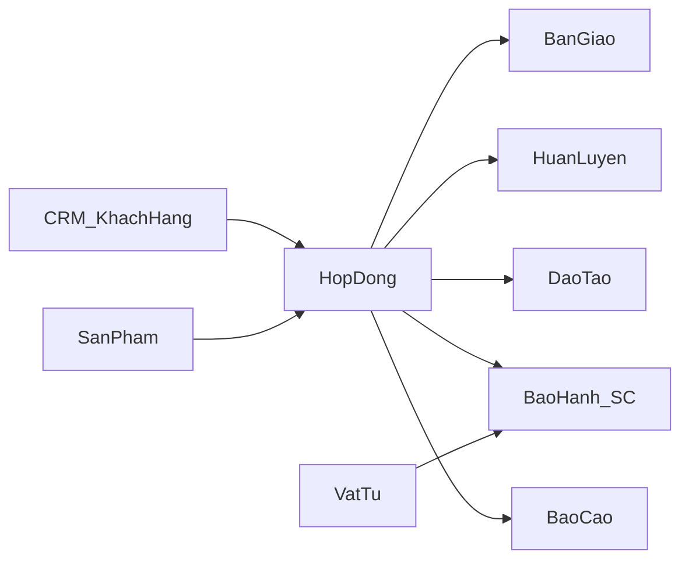
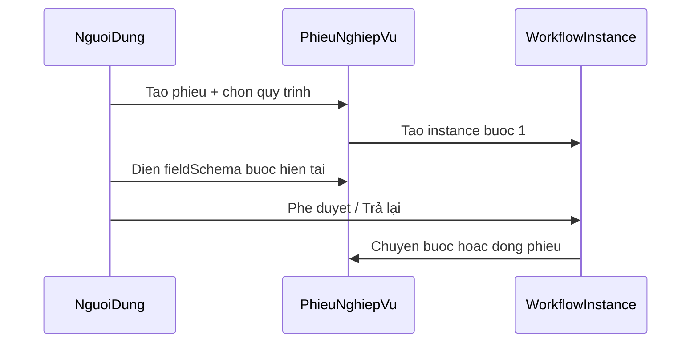

# Hướng dẫn sử dụng hệ thống ASMS

| Thuộc tính | Nội dung |
|---|---|
| **Tên hệ thống** | ASMS — Hệ thống quản lý hậu mãi (ERP) |
| **Phiên bản tài liệu** | 1.0 |
| **Ngày cập nhật** | 21/05/2026 |
| **Phạm vi** | Theo hiện trạng phần mềm đang chạy (as-is) |
| **Đối tượng** | Người dùng nghiệp vụ, quản lý, quản trị viên |

**Tài liệu liên quan:** [BRD tổng thể](BRD-TONG-THE-ASMS.md) · [SRS kỹ thuật](SRS-ASMS.md) · [Checklist UAT](uat-checklist.md) · [Rà soát chức năng](ra-soat-chuc-nang-he-thong.md)

---

## Mục lục

1. [Giới thiệu và truy cập](#1-giới-thiệu-và-truy-cập)
2. [Vai trò và quyền](#2-vai-trò-và-quyền)
3. [Giao diện chung](#3-giao-diện-chung)
4. [Hướng dẫn theo từng module](#4-hướng-dẫn-theo-từng-module)
5. [Quy trình (Workflow)](#5-quy-trình-workflow)
6. [Cài đặt hệ thống](#6-cài-đặt-hệ-thống)
7. [Phụ lục](#7-phụ-lục)

---

## 1. Giới thiệu và truy cập

### 1.1 ASMS là gì?

ASMS (After-Sales Management System) là hệ thống web quản lý **vòng đời hậu mãi** sau ký hợp đồng, gồm:

- Hợp đồng, sản phẩm, vật tư
- Bàn giao, huấn luyện, đào tạo
- Bảo hành / sửa chữa (phiếu phản ánh)
- Khách hàng & CRM
- Báo cáo điều hành
- Quy trình phê duyệt theo bước (workflow)

### 1.2 Yêu cầu truy cập

| Hạng mục | Khuyến nghị |
|---|---|
| Trình duyệt | Chrome, Edge, Firefox (phiên bản mới) |
| Mạng | Nội bộ hoặc VPN tới máy chủ ứng dụng |
| Tài khoản | Do quản trị viên cấp (email + mật khẩu) |

### 1.3 Đăng nhập

**Đường dẫn:** `/login`

| Bước | Thao tác | Kết quả |
|:---:|---|---|
| 1 | Mở địa chỉ ứng dụng (ví dụ `https://<máy-chủ>/login`) | Hiện form **Đăng nhập hệ thống** |
| 2 | Nhập **Email** và **Mật khẩu** | — |
| 3 | Bấm **Đăng nhập** | Thông báo thành công → chuyển **Dashboard** (`/`) |

**Lưu ý:**

- Sai thông tin đăng nhập → thông báo **Đăng nhập thất bại**.
- Phiên hết hạn: hệ thống tự làm mới token; nếu refresh thất bại → quay lại `/login`.
- **Đăng xuất:** menu tài khoản góc phải header → **Đăng xuất**.

### 1.4 Luồng nghiệp vụ tổng quan

---

## 2. Vai trò và quyền

Hệ thống có **5 vai trò** (role). Menu bên trái chỉ hiện các mục mà vai trò của bạn được phép truy cập.

| Mã vai trò | Tên hiển thị | Mô tả ngắn |
|---|---|---|
| `admin` | Quản trị | Toàn quyền, gồm Cài đặt và Nhật ký |
| `manager` | Quản lý | Điều hành nghiệp vụ, báo cáo, cấu hình (hạn chế hơn admin) |
| `technician` | Kỹ thuật viên | Bàn giao, bảo hành, vật tư, đào tạo, quy trình, công việc |
| `viewer` | Xem | Chỉ xem: Dashboard, HĐ, SP, CRM, báo cáo, tài liệu |
| `sales` | Nhân viên bán hàng | CRM, hợp đồng, sản phẩm, báo cáo, tài liệu |

### 2.1 Bảng truy cập menu theo vai trò

| Menu | Route | admin | manager | technician | viewer | sales |
|---|:---:|:---:|:---:|:---:|:---:|:---:|
| Dashboard | `/` | ✓ | ✓ | ✓ | ✓ | ✓ |
| Hợp đồng | `/hop-dong` | ✓ | ✓ | — | ✓ | ✓ |
| Bàn giao & HL | `/ban-giao` | ✓ | ✓ | ✓ | — | — |
| Bảo hành / SC | `/bao-hanh` | ✓ | ✓ | ✓ | — | — |
| Sản phẩm | `/san-pham` | ✓ | ✓ | ✓ | ✓ | ✓ |
| Vật tư | `/vat-tu` | ✓ | ✓ | ✓ | — | — |
| CRM | `/khach-hang` | ✓ | ✓ | — | ✓ | ✓ |
| Báo cáo | `/bao-cao` | ✓ | ✓ | — | ✓ | ✓ |
| Đề tài NC | `/de-tai` | ✓ | ✓ | ✓ | — | — |
| Công việc | `/cong-viec` | ✓ | ✓ | ✓ | — | — |
| Đào tạo & HL | `/dao-tao` | ✓ | ✓ | ✓ | — | — |
| Tài liệu | `/tai-lieu` | ✓ | ✓ | ✓ | ✓ | ✓ |
| Quy trình | `/quy-trinh` | ✓ | ✓ | ✓ | — | — |
| Cài đặt | `/cai-dat` | ✓ | ✓ | — | — | — |

**Quan trọng:** Menu ẩn không có nghĩa API luôn chặn — khi kiểm thử quyền ghi (tạo/sửa/xóa), dùng đúng tài khoản vai trò. Ma trận chi tiết từng thao tác nằm ở tab **Phân quyền** trong Cài đặt.

---

## 3. Giao diện chung

### 3.1 Bố cục màn hình

| Vùng | Vị trí | Chức năng |
|---|---|---|
| **Sidebar** | Trái (desktop) | Điều hướng module; có thể thu gọn bằng nút mũi tên dưới cùng |
| **Header** | Trên | Tiêu đề trang, tìm kiếm (desktop), đổi giao diện sáng/tối, thông báo, menu tài khoản |
| **Nội dung** | Giữa | Bảng, form, biểu đồ của module đang chọn |
| **Bottom nav** | Dưới (mobile) | Lối tắt; **Thêm** mở sidebar đầy đủ |

### 3.2 Badge cảnh báo trên menu

Một số menu hiển thị **số đỏ** khi có việc cần xử lý:

| Menu | Ý nghĩa badge |
|---|---|
| Hợp đồng | Hợp đồng quá hạn / chậm tiến độ |
| Bàn giao & HL | Bàn giao chậm tiến độ |
| Bảo hành / SC | Phiếu bảo hành đang mở |
| Công việc | Task trễ hạn |
| Đào tạo & HL | Khóa đào tạo sắp tới hạn |

### 3.3 Thông báo (chuông)

- Bấm **chuông** trên header → danh sách thông báo.
- Bấm một mục → điều hướng tới nội dung liên quan và đánh dấu đã đọc.
- **Đánh dấu đã đọc** → xóa trạng thái chưa đọc toàn bộ.

### 3.4 Phân trang danh sách

Hầu hết bảng dữ liệu có:

- Chọn **số dòng/trang** (mặc định thường 10)
- Nút **Trước / Sau** và số trang
- Mục tiêu: xem tối đa thông tin trên một màn hình, hạn chế cuộn dài

### 3.5 Hàng bôi đỏ (chậm tiến độ)

Trên danh sách **Hợp đồng**, **Bàn giao**, **Huấn luyện** (và một số màn khác), dòng **chậm tiến độ** được tô nền đỏ nhạt để dễ nhận biết.

---

## 4. Hướng dẫn theo từng module

Mỗi mục dưới đây mô tả **đường dẫn menu**, **thao tác chính** và **giới hạn hiện tại** (as-is).

---

### 4.1 Dashboard (`/`)

**Mục đích:** Bức tranh điều hành theo năm/quý/khách hàng.

**Bộ lọc (toolbar):**

- Năm, Quý (Cả năm / Q1–Q4)
- Khách hàng (danh sách từ API CRM)
- **Đặt lại** bộ lọc
- Tùy chọn **Tự động chuyển tab** (carousel) và **Toàn màn hình**

**Các tab:**

| Tab | Nội dung chính | Dữ liệu |
|---|---|---|
| Tổng quan | KPI, bảng hợp đồng | API thật |
| Khách hàng | Biểu đồ doanh thu/sản phẩm theo KH | API; một số cột bảng có thể chưa đồng bộ 100% |
| Doanh thu | Thẻ, biểu đồ xu hướng | API; **bảng chi tiết DT theo HĐ có thể là dữ liệu mẫu** |
| Dự án | Hợp đồng, bàn giao, đào tạo | API thật |
| Sản phẩm | Thống kê tổng hợp | API; **bảng danh sách SP có thể là dữ liệu mẫu** |
| Bảo hành | Widget phản ánh | API; **bảng khiếu nại có thể là dữ liệu mẫu** |
| Vật tư | Danh sách vật tư | API thật |
| Cảnh báo | Chỉ số cảnh báo tổng hợp | Tính từ aggregate, không có API alarm riêng |

> **Lưu ý as-is:** Khi ra quyết định từ số liệu Dashboard, ưu tiên tab **Tổng quan**, **Dự án**, **Vật tư**; kiểm tra chéo trên màn **Báo cáo** hoặc module gốc nếu tab Doanh thu/Sản phẩm/Bảo hành hiển thị bảng không khớp thực tế.

---

### 4.2 Hợp đồng (`/hop-dong`)

**Mục đích:** Quản lý vòng đời hợp đồng từ tạo mới đến thanh lý; liên kết bàn giao, huấn luyện, điều khoản.

#### Màn danh sách

**Thẻ thống kê:** Tổng HĐ, Đang thực hiện, Hoàn thành, Chậm tiến độ.

**Bộ lọc:**

- Tìm theo mã / khách hàng
- Loại hợp đồng, Trạng thái
- Ngày ký (từ–đến), Ngày tạo (từ–đến)

**Cột bảng (chính):** Mã HĐ, Khách hàng, Giá trị, Số SP, Ngày bắt đầu/kết thúc, Hết hạn BH, Tiến độ %, Trạng thái.

**Thao tác trên từng dòng:**

| Nút | Chức năng |
|---|---|
| Mắt (Xem) | Mở **chi tiết** (read-only) |
| Bút (Sửa) | Mở **form sửa** (sheet/tab) |
| Thùng rác | Xóa (xác nhận) — soft delete |

**Tạo hợp đồng mới:**

1. Bấm **Thêm hợp đồng**
2. Điền các tab trong form (xem mục 4.2.2)
3. **Lưu** → hợp đồng xuất hiện trên danh sách

#### Form tạo / sửa hợp đồng (sheet)

| Tab | Nội dung | Ghi chú |
|---|---|---|
| **Thông tin chung** | Khách hàng (chọn từ danh mục), tiêu đề, giá trị, ngày bắt đầu/kết thúc, hết hạn BH, loại HĐ, nhắc trước khi hết hạn, trạng thái kết thúc | Khách hàng: chọn qua **customerId** khi tạo/sửa |
| **Điều khoản & Điều kiện** | Tích nhóm / từng điều khoản từ danh mục | Lưu `clauseIds`; hệ thống ghép snapshot `terms` |
| **Danh mục sản phẩm** | Thêm sản phẩm vào HĐ, số lượng sản xuất | Cập nhật khi lưu HĐ |
| **Tài liệu** | Upload file gắn HĐ | Upload qua API tài liệu |
| **Quy trình** | Tab **Bàn giao** và **Huấn luyện**: chọn quy trình, form động từng bước, panel tiến trình | Xem mục [5. Quy trình](#5-quy-trình-workflow) |
| **Phản ánh** | (Chỉ khi sửa HĐ đã có) Phản hồi khách hàng gắn HĐ | — |

**Ràng buộc nghiệp vụ quan trọng:**

- Mỗi hợp đồng tối đa **1 phiếu bàn giao** và **1 khóa huấn luyện** (coaching).
- Tạo bàn giao/huấn luyện thứ hai cho cùng HĐ → API trả lỗi **400**.
- Khi **tạo mới** bàn giao từ màn Bàn giao, dropdown HĐ chỉ hiện HĐ **chưa có** bàn giao và huấn luyện.

#### Chi tiết hợp đồng (xem)

Mở bằng nút **Xem** trên danh sách. Các tab:

| Tab | Chế độ | Ghi chú |
|---|---|---|
| Thông tin chung | Chỉ đọc + nút **Chỉnh sửa** | Lịch sử hoạt động lấy từ **Nhật ký audit** (nếu có) |
| Điều khoản chính | Chỉ đọc | Hiển thị nội dung đã chọn |
| Danh mục sản phẩm | Chỉ đọc | Chưa CRUD trực tiếp trong tab |
| Tài liệu | Chỉ đọc / tải về | Chưa CRUD trong tab |
| Quy trình | Chỉ đọc | Liên kết bàn giao / huấn luyện |
| Phản ánh | Xem phản hồi | — |

**Chỉnh sửa từ chi tiết:** Bấm **Chỉnh sửa** → mở form sửa (có thể mở đúng tab đang xem).

---

### 4.3 Bàn giao & Huấn luyện (`/ban-giao`)

**Mục đích:** Quản lý phiếu bàn giao thiết bị và khóa **huấn luyện** (coaching) gắn hợp đồng.

**Hai tab chính:**

| Tab | Nội dung |
|---|---|
| **Bàn giao** | Danh sách phiếu bàn giao |
| **Huấn luyện** | Danh sách khóa huấn luyện (coaching) |

#### Tab Bàn giao

**Tạo phiếu bàn giao:**

1. Bấm **Thêm bàn giao**
2. Chọn **Hợp đồng** (chỉ HĐ đủ điều kiện)
3. Chọn **Quy trình** (nếu có nhiều mẫu)
4. Điền thông tin header + từng **bước quy trình** (form động)
5. **Lưu**

**Sửa / xóa:** Nút bút / thùng rác trên dòng; dialog sửa có **Tiến trình xử lý** (WorkflowInstancePanel).

**Panel quy trình khi sửa:**

- Hiển thị bước hiện tại, vai trò được phép
- **Phê duyệt** → chuyển bước tiếp (đúng vai trò)
- **Trả lại** → hủy instance, phiếu có thể chuyển trạng thái chậm
- Hoàn tất bước cuối → phiếu **Hoàn thành**

#### Tab Huấn luyện

- Tạo khóa HL gắn HĐ (đã có bàn giao tùy quy trình nghiệp vụ)
- Form tương tự: chọn quy trình module `coaching`, điền bước, **Xử lý quy trình** trên danh sách
- Huấn luyện **không** hiển thị trên menu **Đào tạo & HL** (`/dao-tao`) — chỉ coaching tại đây và trên form HĐ

---

### 4.4 Đào tạo (`/dao-tao`, `/dao-tao/:id`)

**Mục đích:** Quản lý **khóa đào tạo** (`courseKind=training`), không nhầm với huấn luyện coaching.

#### Danh sách (`/dao-tao`)

1. Xem danh sách khóa
2. **Thêm khóa** → nhập thông tin + chọn quy trình (`training`)
3. Sửa / xóa trên từng dòng

#### Chi tiết (`/dao-tao/:id`)

| Khu vực | Thao tác |
|---|---|
| Thông tin khóa | Sửa metadata khóa |
| Tab bước quy trình | Form động + phê duyệt bước |
| Học viên | Thêm / sửa / xóa học viên; điểm danh |
| Lịch buổi học | Tạo / sửa / xóa buổi; cập nhật trạng thái nhanh |

---

### 4.5 Bảo hành / Sửa chữa (`/bao-hanh`)

**Mục đích:** Tiếp nhận và xử lý phiếu bảo hành, sửa chữa (ticket).

#### Tạo phiếu mới

1. Bấm **Tạo phiếu** (hoặc tương đương)
2. Chọn **Khách hàng**, **Sản phẩm** (nếu có)
3. Chọn **Quy trình** bảo hành
4. Điền form header + **các bước động** theo quy trình
5. Lưu

#### Xử lý phiếu

- Mở **chi tiết** hoặc **sửa**
- Tab/bước hiển thị theo `fieldSchema` của quy trình (không còn 5 tab cố định legacy)
- Đổi quy trình khi sửa: hệ thống hỏi xác nhận **attach** quy trình mới
- Phân loại mức độ khẩn cấp qua mã danh mục (`warranty_priority`, `warranty_status` trong Cài đặt → Thuộc tính)

#### Trạng thái thường gặp

| Trạng thái | Ý nghĩa |
|---|---|
| Đang xử lý | Phiếu chưa đóng |
| Hoàn thành | Workflow kết thúc / status completed |
| Chậm tiến độ | Quá SLA hoặc trả lại quy trình |

> **Lưu ý:** Khi lưu, hệ thống có thể cảnh báo **orphan step payloads** (dữ liệu bước thừa sau khi đổi quy trình) — làm theo hướng dẫn trên màn hình để dọn dữ liệu.

---

### 4.6 Sản phẩm (`/san-pham`)

**Mục đích:** Danh mục sản phẩm, thông số kỹ thuật, ảnh, liên kết BOM.

| Thao tác | Các bước |
|---|---|
| **Xem danh sách** | Lọc, tìm kiếm, phân trang |
| **Tạo mới** | Bấm Thêm → điền mã, tên, phân loại (từ Thuộc tính), trạng thái mặc định thường **Đang sản xuất** |
| **Sửa** | Mở dialog sửa |
| **Xóa** | Xác nhận xóa mềm |
| **Chi tiết** | Xem thông tin, BOM, lịch sử audit |

> **Lưu ý as-is:** Dialog chi tiết có thể còn một phần dữ liệu minh họa (BOM/lịch sử) chưa nối API đầy đủ — kiểm tra tab **Lịch sử** (audit) cho dữ liệu thật.

**Upload ảnh sản phẩm:** qua API tài liệu loại `product_image`.

---

### 4.7 Vật tư (`/vat-tu`)

**Mục đích:** Quản lý tồn kho vật tư, linh kiện; điều chuyển giữa kho.

| Thao tác | Mô tả |
|---|---|
| CRUD vật tư | Tạo, sửa, xóa danh mục vật tư |
| Điều chuyển | Tạo phiếu điều chuyển; hệ thống kiểm tra tồn không âm |
| Chi tiết vật tư | Xem tồn, lịch sử điều chuyển từ API |
| Quét mã | UI hỗ trợ quét (tùy thiết bị) |

---

### 4.8 CRM — Khách hàng (`/khach-hang`)

**Mục đích:** Quản lý khách hàng, đầu mối liên hệ, hoạt động CRM.

**Ba tab trên màn chính:**

| Tab | Chức năng |
|---|---|
| **Khách hàng** | Danh sách KH; tạo/sửa/xóa; xem chi tiết |
| **Liên hệ** | Đầu mối theo từng khách hàng |
| **Hoạt động** | Ghi nhận gọi điện, email, họp, ghi chú |

#### Tạo khách hàng

1. Tab **Khách hàng** → **Thêm khách hàng**
2. Điền: tên, mã, điện thoại, email, địa chỉ, nguồn, loại hình (mã từ Thuộc tính)
3. **Lưu**

#### Chi tiết khách hàng

- Bấm **Xem** hoặc tên khách hàng (link)
- Xem số hợp đồng, hợp đồng đang active, thông tin liên hệ
- Thêm/sửa **đầu mối** trong chi tiết

#### Hoạt động CRM

1. Tab **Hoạt động** → **Thêm hoạt động**
2. Chọn khách hàng, loại (gọi/email/họp/ghi chú), nội dung, thời gian
3. Lưu → theo dõi trên timeline

---

### 4.9 Công việc (`/cong-viec`)

**Mục đích:** Quản lý task nội bộ theo Kanban / Danh sách / Lịch.

| Chế độ xem | Thao tác |
|---|---|
| **Kanban** | Kéo thả card giữa cột trạng thái |
| **Danh sách** | Bảng có lọc |
| **Lịch** | Xem theo ngày |

**Tạo công việc:** Thêm task → tiêu đề, mô tả, ưu tiên (mã danh mục), người phụ trách, hạn, liên kết đề tài (nếu có).

---

### 4.10 Tài liệu (`/tai-lieu`)

**Mục đích:** Quản lý metadata tài liệu (tên, loại, URL, kích thước).

| Thao tác | Ghi chú |
|---|---|
| Tạo | Nhập thông tin + **URL file** (hoặc upload tùy cấu hình module SP) |
| Sửa / Xóa | Cập nhật metadata |
| Tải về | Mở link `fileUrl` |

> **Lưu ý as-is:** Màn Tài liệu chủ yếu lưu **metadata + URL**; upload file nhị phân trực tiếp trên màn này có thể chưa có — ảnh sản phẩm dùng luồng riêng.

---

### 4.11 Đề tài nghiên cứu (`/de-tai`, `/de-tai/:id`)

**Mục đích:** Theo dõi đề tài NCKH và giai đoạn.

1. Danh sách đề tài → **Thêm đề tài**
2. Điền mã, tên, giai đoạn (`research_stage` từ Thuộc tính)
3. Bấm vào dòng → **chi tiết** `/de-tai/:id`

---

### 4.12 Báo cáo (`/bao-cao`)

**Mục đích:** Báo cáo tổng hợp theo thời gian; xuất Excel/PDF.

**Bộ lọc:**

- Chọn **Năm** hoặc **Từ ngày — Đến ngày**
- Bấm **Áp dụng** (cập nhật query trên URL)

**Các tab chính:**

| Tab | Nội dung |
|---|---|
| Khách hàng | Thống kê theo KH |
| Hợp đồng | Thống kê theo HĐ |
| Dòng sản phẩm | Theo `Product.category` — sản xuất / giao / phiếu BH |
| Phản ánh | 3 sub-tab: theo KH, theo dòng SP, vật tư/LK hỏng (**dữ liệu phiếu BH**, không phải ticket `/phan-anh`) |
| Đơn vị thực hiện | Theo vai trò gán trên Task |

**Xuất báo cáo:** Nút xuất **Excel** / **In PDF** theo tab đang xem.

---

### 4.13 Phản ánh khách hàng (`/phan-anh`)

**Mục đích:** Quản lý ticket phản ánh khách hàng, liên kết HĐ/SP/VT, phân công và theo dõi xử lý.

**Hai phần (sub-nav trên cùng):**

| Phần | Đường dẫn | Nội dung |
|---|---|---|
| Danh sách | `/phan-anh` | Lọc, KPI nhanh, bảng ticket; tạo/sửa/xem chi tiết |
| Thống kê | `/phan-anh/thong-ke` | 2 tab: **Khách hàng** \| **Sản phẩm & Vật tư**; lọc kỳ preset |

**Báo cáo tổng hợp:** Vẫn dùng menu **Báo cáo** (`/bao-cao`) như trước — không đổi.

**Bộ lọc kỳ (Thống kê):** Hôm nay, 1/3/6 tháng, 1 năm, Tất cả — áp dụng ngay khi chọn (URL `?period=...&tab=...`).

**Tab Khách hàng:** Bảng mã/tên KH, số ticket, đang mở/đã đóng. Bấm dòng → **Sheet** chi tiết: từng ticket (tiêu đề, nội dung, ngày, SP/VT gắn kèm), link sang `/phan-anh/:id`.

**Tab Sản phẩm & Vật tư:** Hai bảng — vật tư (mã, tên, lần gắn, ticket, SP) và sản phẩm (mỗi SP một dòng; cột vật tư gộp `MãVT (số lần) · ...`, cột tổng lần gắn SP).

**Tạo / chi tiết:** `/phan-anh/moi`, `/phan-anh/:id`, `/phan-anh/:id/sua` (wizard, liên kết HĐ lọc SP/VT, phân công, comment Sự cố/Đã sửa).

**Thông báo lỗi khi Lưu:**

| Tình huống | Bạn sẽ thấy |
|---|---|
| Thiếu khách hàng, tiêu đề, nội dung, lời KH hoặc phân công | Toast tiếng Việt *trước khi* gọi máy chủ |
| Gắn SP/VT nhưng chưa chọn HĐ (nhiều HĐ) | Yêu cầu chọn HĐ hoặc thu hẹp SP/VT |
| Có SP nhưng chưa cấu hình đơn vị xử lý (routing) | Hộp xác nhận: vẫn tạo ticket trạng thái *mới* hoặc hủy |
| HĐ không thuộc khách hàng / SP không trong HĐ | Message từ máy chủ (vd. *Hợp đồng không thuộc khách hàng này*) |
| Ticket đã xóa nhưng còn trên bảng | Toast *Không tìm thấy phản ánh* — làm mới danh sách |

> **So với `/bao-cao` tab Phản ánh:** Tab đó thống kê **phiếu bảo hành**; màn **Thống kê** trong `/phan-anh` dùng **ticket phản ánh** và `linkage_items` đã ghi trên ticket.

---

## 5. Quy trình (Workflow)

**Đường dẫn:** `/quy-trinh` — dành cho **admin**, **manager**, **technician** (cấu hình chủ yếu admin/manager).

### 5.1 Tổng quan module quy trình

| Module | Mã | Dùng cho |
|---|---|---|
| Hợp đồng (tổng hợp) | `contract` | Quy trình gắn cấp HĐ (legacy; UI ưu tiên quy trình tại phiếu con) |
| Bàn giao | `handover` | Phiếu bàn giao |
| Đào tạo | `training` | Khóa đào tạo trên `/dao-tao` |
| Huấn luyện | `coaching` | Khóa HL trên `/ban-giao` |
| Bảo hành | `warranty` | Phiếu bảo hành |
| Sản phẩm | `product` | Quy trình SX / nghiệm thu SP |

### 5.2 Cấu hình quy trình (admin)

1. Vào **Quy trình** → chọn module (ví dụ **Bàn giao**)
2. Danh sách quy trình: **Thêm quy trình** → nhập mã, tên, mô tả, trạng thái
3. Mở **Sửa** → trình soạn thảo:
   - **Thông tin cấu hình** + **Trường header phiếu** (tuỳ chọn)
   - Danh sách **bước**: Thêm / Sửa / Xóa / Lên / Xuống
4. Mỗi bước (dialog): tên, hành động, **vai trò** được phép, SLA (giờ), **fieldSchema** (trường form động)
5. **Cập nhật quy trình** → lưu DB

**Quy trình hệ thống** (seed, ví dụ `WF_HANDOVER_DEFAULT`):

- Badge **Hệ thống** — không xóa, không đổi mã
- Có thể sửa tên, bước, fieldSchema tùy chính sách triển khai

**Lịch sử thay đổi:** Nút **Lịch sử** → mở Cài đặt tab **Nhật ký** đã lọc theo workflow.

### 5.3 Sử dụng quy trình khi vận hành

| Bước người dùng | Mô tả |
|---|---|
| 1 | Tạo hoặc sửa phiếu (bàn giao / BH / đào tạo / HL) |
| 2 | Chọn **Quy trình** từ dropdown |
| 3 | Điền form từng **tab bước** (trường bắt buộc theo schema) |
| 4 | **Lưu** dữ liệu bước (`stepPayloads`) |
| 5 | Trong **Tiến trình xử lý**: **Phê duyệt** nếu đúng vai trò |
| 6 | Lặp đến bước cuối → trạng thái **Hoàn tất** |

**Lỗi thường gặp:**

- `Bước này yêu cầu vai trò …` → đăng nhập tài khoản đúng vai trò bước đó
- Không phê duyệt được → kiểm tra chưa lưu trường bắt buộc của bước hiện tại

---

## 6. Cài đặt hệ thống

**Đường dẫn:** `/cai-dat` — **admin** và **manager** (tab Nhật ký: **admin**).

### 6.1 Các tab Cài đặt

| Tab | Quyền ghi | Chức năng |
|---|---|---|
| **Người dùng** | admin | CRUD tài khoản, gán vai trò, trạng thái |
| **Vai trò** | admin | Tạo vai trò tùy chỉnh; không xóa vai trò hệ thống đang gán user |
| **Phân quyền** | admin (xem); sửa ma trận theo triển khai | Ma trận module × CRUD |
| **Thông báo** | Mỗi user | Bật/tắt từng loại thông báo |
| **Hệ thống** | admin | SLA, ngưỡng cảnh báo, số ngày nhắc hạn, giờ chạy cron |
| **Phiên đăng nhập** | User hiện tại | Thu hồi phiên thiết bị khác |
| **Nhật ký** | admin | Audit log: lọc entity, hành động, thời gian |

### 6.2 Thuộc tính / Danh mục (`/cai-dat/thuoc-tinh`)

**Mục đích:** Khai báo mã danh mục dùng chung (loại HĐ, ưu tiên BH, loại bàn giao, điều khoản HĐ…).

**Truy cập:** Cài đặt → liên kết **Thuộc tính** hoặc trực tiếp `/cai-dat/thuoc-tinh/<module>`.

| Thao tác | Các bước |
|---|---|
| **Xem danh sách** | Chọn module (Hợp đồng, Bàn giao, Bảo hành, …) |
| **Tìm kiếm** | Theo mã hoặc tên |
| **Tạo mới** | Mã (`A-Za-z0-9._-`), tên, thứ tự, trạng thái |
| **Sửa** | Đổi mã/tên/thứ tự (kể cả bản ghi seed) |
| **Xóa** | Nếu đang được dùng → chỉ cho **Tắt**; không dùng → xóa hẳn |
| **Kéo thả thứ tự** | Khi không lọc/phân trang → **Lưu thứ tự** |
| **Lịch sử** | Trên từng dòng → Nhật ký audit |

**Điều khoản hợp đồng:** Trong module **Hợp đồng** → mục **Điều khoản và điều kiện** + **Nhóm điều khoản** → dùng khi tạo/sửa HĐ tab Điều khoản.

Chi tiết kỹ thuật: [0002-cai-dat-thuoc-tinh.md](0002-cai-dat-thuoc-tinh.md).

---

## 7. Phụ lục

### 7.1 Bảng route ↔ menu

| Route | Menu | Tiêu đề header |
|---|---|---|
| `/` | Dashboard | Dashboard |
| `/hop-dong` | Hợp đồng | Quản lý hợp đồng |
| `/ban-giao` | Bàn giao & HL | Bàn giao & Huấn luyện |
| `/bao-hanh` | Bảo hành / SC | Bảo hành / Sửa chữa |
| `/san-pham` | Sản phẩm | (theo module) |
| `/vat-tu` | Vật tư | Quản lý vật tư |
| `/khach-hang` | CRM | Khách hàng |
| `/bao-cao` | Báo cáo | Báo cáo & Thống kê |
| `/de-tai` | Đề tài NC | (theo module) |
| `/cong-viec` | Công việc | (theo module) |
| `/dao-tao` | Đào tạo & HL | (theo module) |
| `/tai-lieu` | Tài liệu | (theo module) |
| `/quy-trinh` | Quy trình | Quy trình |
| `/cai-dat` | Cài đặt | Cài đặt |
| `/cai-dat/thuoc-tinh` | (từ Cài đặt) | Thuộc tính |
| `/login` | — | Đăng nhập |

### 7.2 Thông báo lỗi thường gặp

| Tình huống | Nguyên nhân | Cách xử lý |
|---|---|---|
| Đăng nhập thất bại | Sai email/mật khẩu | Kiểm tra tài khoản; liên hệ admin |
| Tự động về `/login` | Token hết hạn | Đăng nhập lại |
| Không thấy menu | Vai trò không có quyền | Dùng đúng role hoặc nhờ admin cấp quyền |
| Không tạo thêm bàn giao cho HĐ | Đã có 1 bàn giao / 1 HL | Sửa phiếu hiện có hoặc tách HĐ |
| HTTP 403 khi Phê duyệt | Sai vai trò bước workflow | Đăng nhập user đúng role bước |
| HTTP 422 khi lưu | Mã thuộc tính không hợp lệ / đã tắt | Chọn lại mã trong Cài đặt → Thuộc tính |
| HTTP 409 khi xóa điều khoản | Điều khoản đang gắn HĐ | Tắt thay vì xóa |
| Không lưu được tên khách trên HĐ | Chỉ sửa text không chọn FK | Chọn khách hàng từ dropdown khi sửa HĐ |

### 7.3 FAQ

**Hỏi:** Huấn luyện và Đào tạo khác nhau thế nào?  
**Đáp:** **Đào tạo** (`training`) quản lý tại `/dao-tao`. **Huấn luyện** (`coaching`) quản lý tại tab **Huấn luyện** trên `/ban-giao` hoặc tab Quy trình trên form Hợp đồng.

**Hỏi:** Làm sao gắn quy trình cho phiếu bảo hành?  
**Đáp:** Khi tạo/sửa phiếu → chọn **Quy trình** → điền từng bước → dùng panel **Tiến trình xử lý** để phê duyệt.

**Hỏi:** Tại sao Dashboard và Báo cáo khác số liệu?  
**Đáp:** Một số widget Dashboard dùng dữ liệu mẫu (xem mục 4.1). Ưu tiên **Báo cáo** (`/bao-cao`) cho số liệu chính thức.

**Hỏi:** Ai được sửa cấu hình SLA và nhắc hạn?  
**Đáp:** Tab **Hệ thống** trong Cài đặt — quyền ghi **admin**.

### 7.4 Checklist vận hành nhanh (theo UAT)

Dùng khi bàn giao hệ thống cho đơn vị mới:

- [ ] Đăng nhập được với từng vai trò mẫu
- [ ] Tạo khách hàng → tạo hợp đồng → chọn điều khoản
- [ ] Tạo bàn giao + phê duyệt ít nhất 1 bước workflow
- [ ] Tạo phiếu bảo hành + đóng workflow
- [ ] Tạo khóa đào tạo + thêm học viên + buổi học
- [ ] Xuất báo cáo Excel một tab
- [ ] Admin: tạo user, xem nhật ký sau thao tác

Chi tiết đầy đủ: [uat-checklist.md](uat-checklist.md).

### 7.5 Tài liệu kỹ thuật (cho IT)

| Tài liệu | Mục đích |
|---|---|
| [SRS-ASMS.md](SRS-ASMS.md) | API, schema, RBAC |
| [ra-soat-chuc-nang-he-thong.md](ra-soat-chuc-nang-he-thong.md) | Gap UI vs backend |
| [các-màn.md](các-màn.md) | Trạng thái workflow từng màn |
| [docs/DOCKER/](DOCKER/) | Triển khai container |

---

*Hết tài liệu — Phiên bản 1.0, 21/05/2026. Cập nhật khi có thay đổi route hoặc nghiệp vụ trên UI.*
